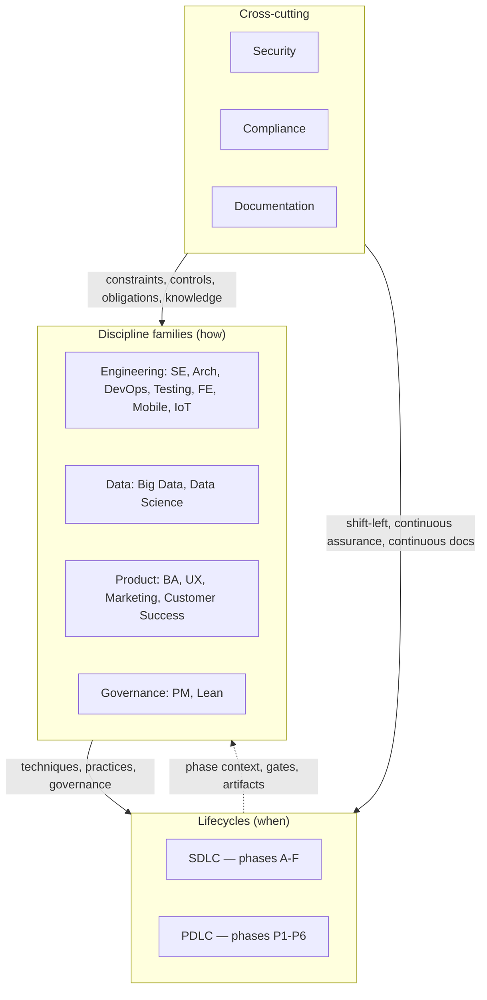

# Disciplines

Reusable, **project-agnostic** blueprints for **cross-cutting professional disciplines** — competency domains that span lifecycle phases (SDLC, PDLC) and complement them with specialized bodies of knowledge.

**Lifecycles** (SDLC, PDLC) answer *when* work happens — phases, gates, ceremonies. **Disciplines** answer *how* a specific competency is practiced — knowledge areas, techniques, approaches, tools — regardless of which lifecycle phase you are in.

Disciplines are organized into **four families** (by domain affinity) plus **three cross-cutting standalone disciplines** that span every family.

---

## Families

### [Engineering](engineering/README.md) — how we build software

| Discipline | Core question | Bridge |
|-----------|---------------|--------|
| [**Software Engineering**](engineering/software-engineering/README.md) | What CS fundamentals, paradigms, and craft practices underpin all engineering work? | [SE-SDLC-PDLC](engineering/software-engineering/SE-SDLC-PDLC-BRIDGE.md) |
| [**Software Architecture**](engineering/software-architecture/README.md) | How are systems structured, and why? | [ARCH-SDLC-PDLC](engineering/software-architecture/ARCH-SDLC-PDLC-BRIDGE.md) |
| [**DevOps**](engineering/devops/README.md) | How do we deliver and operate continuously and reliably? | [DEVOPS-SDLC-PDLC](engineering/devops/DEVOPS-SDLC-PDLC-BRIDGE.md) |
| [**Testing**](engineering/testing/README.md) | Is the software correct, reliable, and fit for purpose? | [TESTING-SDLC-PDLC](engineering/testing/TESTING-SDLC-PDLC-BRIDGE.md) |
| [**Frontend**](engineering/frontend/README.md) | How do we build fast, accessible, maintainable web UIs? | [FE-SDLC-PDLC](engineering/frontend/FE-SDLC-PDLC-BRIDGE.md) |
| [**Mobile**](engineering/mobile/README.md) | How do we build performant, reliable mobile experiences? | [MOB-SDLC-PDLC](engineering/mobile/MOB-SDLC-PDLC-BRIDGE.md) |
| [**Embedded / IoT**](engineering/embedded-iot/README.md) | How do we build reliable, safe software for constrained environments? | [IOT-SDLC-PDLC](engineering/embedded-iot/IOT-SDLC-PDLC-BRIDGE.md) |

### [Data](data/README.md) — how we handle information at scale

| Discipline | Core question | Bridge |
|-----------|---------------|--------|
| [**Big Data & Data Engineering**](data/bigdata/README.md) | How do we engineer, govern, and process data at scale? | [BIGDATA-SDLC-PDLC](data/bigdata/BIGDATA-SDLC-PDLC-BRIDGE.md) |
| [**Data Science & ML**](data/data-science/README.md) | How do we extract knowledge and build predictive models from data? | [DS-SDLC-PDLC](data/data-science/DS-SDLC-PDLC-BRIDGE.md) |

### [Product](product/README.md) — how we understand users, design experiences, and grow

| Discipline | Core question | Bridge |
|-----------|---------------|--------|
| [**Business Analysis**](product/ba/README.md) | What do stakeholders need, and does the solution satisfy those needs? | [BA-SDLC-PDLC](product/ba/BA-SDLC-PDLC-BRIDGE.md) |
| [**UX / UI Design**](product/ux-design/README.md) | Is the product usable, desirable, and accessible? | [UX-SDLC-PDLC](product/ux-design/UX-SDLC-PDLC-BRIDGE.md) |
| [**Marketing**](product/marketing/README.md) | How do we acquire, engage, and retain users? | [MKT-SDLC-PDLC](product/marketing/MKT-SDLC-PDLC-BRIDGE.md) |
| [**Customer Success**](product/customer-success/README.md) | How do we help users achieve their goals and reduce churn? | [CS-SDLC-PDLC](product/customer-success/CS-SDLC-PDLC-BRIDGE.md) |

### [Governance](governance/README.md) — how we manage and improve delivery

| Discipline | Core question | Bridge |
|-----------|---------------|--------|
| [**Project Management**](governance/pm/README.md) | Are we delivering on time, on budget, within scope, with acceptable risk? | [PM-SDLC-PDLC](governance/pm/PM-SDLC-PDLC-BRIDGE.md) |
| **Lean** *(planned)* | How do we continuously improve and eliminate waste? | — |

---

## Cross-cutting disciplines

Standalone disciplines that span every family — they are not grouped under a family because their concerns cut across all of engineering, data, product, and governance.

| Discipline | Core question | Bridge |
|-----------|---------------|--------|
| [**Security**](security/README.md) | Is the product safe from unauthorized access, breaches, and attacks? | [SEC-SDLC-PDLC](security/SEC-SDLC-PDLC-BRIDGE.md) |
| [**Compliance**](compliance/README.md) | Does the product meet regulatory and legal obligations? | [COMP-SDLC-PDLC](compliance/COMP-SDLC-PDLC-BRIDGE.md) |
| [**Documentation**](documentation/README.md) | How do we create, maintain, and deliver effective documentation and content? | [DOC-SDLC-PDLC](documentation/DOC-SDLC-PDLC-BRIDGE.md) |

---

## Relationship to lifecycles

Each discipline has a **bridge document** (`*-SDLC-PDLC-BRIDGE.md`) that maps its practices to SDLC phases A–F and PDLC phases P1–P6. Disciplines are not sequential — they provide expertise that is drawn upon at the right lifecycle moments. See [`BRIDGES.md`](../BRIDGES.md) for the concept, full index, and standard structure.

## Adopt in your repo

These packages ship as part of the `blueprints/` submodule. Reference them from your project documentation (e.g. `docs/INDEX.md`) and use the bridge documents to understand where each discipline's practices apply in your lifecycle.

## Related packages

| Package | Role |
|---------|------|
| [`blueprints/sdlc/`](../sdlc/README.md) | Software delivery lifecycle — phases, DoD, methodologies, ceremonies |
| [`blueprints/pdlc/`](../pdlc/README.md) | Product development lifecycle — discovery, validation, strategy, launch, growth, sunset |
| [`blueprints/product/`](../product/README.md) | Product-functional documentation IA |
| [`blueprints/agents/`](../agents/README.md) | Optional Docker/automation blueprint |
