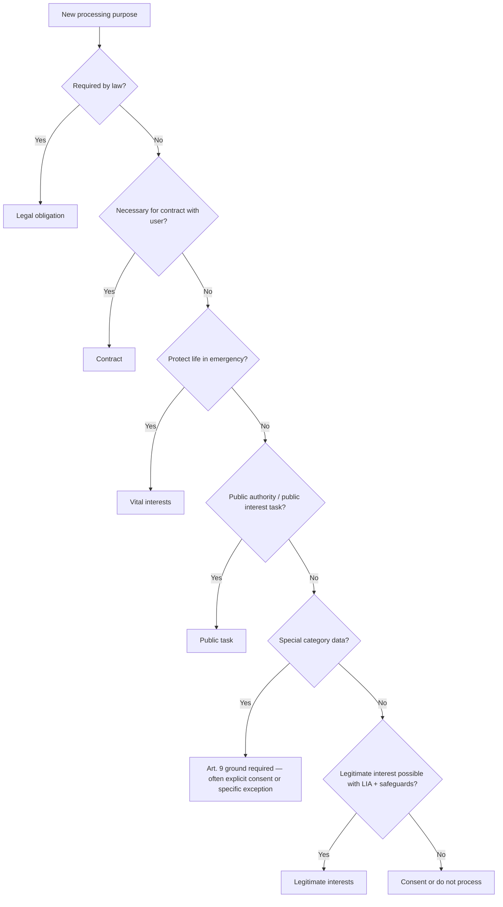
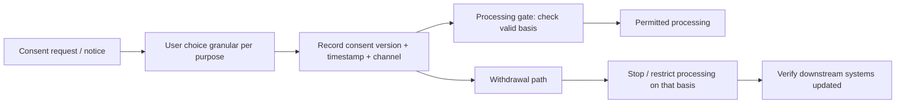

# GDPR: General Data Protection Regulation

**Purpose:** Project-agnostic summary of the EU **General Data Protection Regulation** (Regulation (EU) 2016/679) — the most influential modern privacy law for personal data processing. **Not legal advice**; confirm applicability and interpretation with qualified counsel.

**Audience:** Teams mapping EU/EEA personal data processing to engineering and organizational controls. Cross-ref: [`../COMPLIANCE.md`](../COMPLIANCE.md), [`README.md`](README.md).

---

## Overview

The GDPR governs **processing of personal data** relating to individuals in the EU/EEA. It applies to **controllers** and **processors**, establishes **lawful bases**, **data subject rights**, **accountability** (including DPIAs and ROPA), **cross-border transfers**, and **breach notification**. It has shaped privacy law globally and heavily influences product design, consent UX, and vendor contracts.

---

## Key definitions

| Term | Definition / notes |
|------|-------------------|
| **Personal data** | Any information relating to an identified or identifiable natural person. |
| **Special category data** | Sensitive data (e.g. health, biometrics, racial/ethnic origin, political opinions, religious beliefs, sex life/orientation, genetic data) — stricter rules; often requires explicit consent or specific legal grounds (Art. 9). |
| **Data subject** | The identified or identifiable person to whom personal data relates. |
| **Controller** | Determines **purposes and means** of processing; primary accountability. |
| **Processor** | Processes data **on behalf of** the controller under instructions and a contract (Art. 28). |
| **Sub-processor** | Processor’s further delegate — requires controller authorization (general or specific) and flow-down obligations. |
| **DPO** | **Data Protection Officer** — mandatory in some cases (Art. 37); advises, monitors compliance, cooperates with supervisory authorities. |
| **Supervisory authority** | Independent public authority per Member State; leads investigations, guidance, and some cross-border cases. |
| **BCR** | **Binding Corporate Rules** — approved intra-group transfer mechanism for multinational organizations. |

---

## Lawful bases (Art. 6)

| Basis | When appropriate | Documentation | Withdrawal |
|-------|------------------|---------------|------------|
| **Consent** | Freely given, specific, informed, unambiguous; where no other basis fits or where required (e.g. some marketing, some special categories). | **Record** of consent: what, when, how, version of notice; proof of granularity. | Withdrawal must be as easy as giving consent; must not affect lawfulness **before** withdrawal; stop processing that relied solely on consent. |
| **Contract** | Processing **necessary** for performance of a contract with the data subject or pre-contract steps. | Identify the contract and the **necessary** processing purposes. | N/A as such; if contract ends, retention/ other bases may apply. |
| **Legal obligation** | Processing required to comply with EU/Member State law to which the controller is subject. | Reference specific legal obligation. | N/A. |
| **Vital interests** | Protecting life of data subject or another person (typically emergencies). | Document urgency and why other bases don’t apply. | N/A. |
| **Public task** | Official authority or tasks in the public interest (often public bodies). | Legal basis in law. | N/A for typical public-sector context. |
| **Legitimate interests** | Processing necessary for controller’s or third party’s **legitimate interests**, unless overridden by data subject’s rights (balancing test). | **LIA**: purpose, necessity, balancing, safeguards; not a default for intrusive processing. | Right to **object** (Art. 21) may apply; must stop unless compelling legitimate grounds. |

### Lawful basis selection (decision tree)

---

## Data subject rights — implementation sketch

| Right | Implementation requirements | SLA (typical reference) | Technical considerations |
|-------|----------------------------|-------------------------|---------------------------|
| **Access** | Verify identity; provide copy of data and purposes, recipients, retention, sources. | **Without undue delay**; often **one month** (extensions possible). | Unified export across DBs, object storage, caches; redact others’ data. |
| **Rectification** | Correct inaccurate data; complete incomplete data. | Same as access timeline expectations. | Propagation to derivatives, search indexes, vendors. |
| **Erasure** (“right to be forgotten”) | Where grounds apply (e.g. withdrawal of consent, no overriding grounds). | Same. | **Erasure pipeline**: primary DB, replicas, backups (policy), logs (where feasible), third parties. |
| **Restriction** | Limit processing in defined cases. | Same. | Feature flags, suspend automated processing, mark records “restricted.” |
| **Portability** | Structured, machine-readable, for data **provided by** subject where processing is automated and based on consent or contract. | Same. | Standard formats (e.g. JSON); APIs. |
| **Object** | To processing based on legitimate interests or direct marketing. | Stop without undue delay for marketing; assess for other objections. | Suppression lists; stop profiling segments. |
| **Automated decision-making** | Rights related to solely automated decisions with legal/significant effects (Art. 22 context). | Human review pathway; explain logic in appropriate cases. | Don’t rely on “black box” for in-scope decisions without safeguards. |

---

## Technical implementation themes

- **Consent management:** Granular purposes; **record** who consented, when, to what version; **withdrawal** in preference center and propagation to tags/SDKs/processors.
- **Privacy by design and by default:** Data protection integrated from architecture; default to least data / least access.
- **Data minimization:** Collect and retain only what is needed for specified purposes.
- **Pseudonymization:** Replace identifiers where useful to reduce risk (not a substitute for lawful basis or transfers analysis alone).
- **Encryption:** At rest and in transit; supports confidentiality and may factor into transfer risk assessments.

### Consent management flow

---

## DPIA (Data Protection Impact Assessment)

**When often required (indicative — verify Art. 35 and WP248/EDPB guidance):**

| Trigger theme | Examples |
|---------------|----------|
| Systematic monitoring | Large-scale tracking, workplace monitoring, public area surveillance. |
| Large-scale processing | Vast datasets or many data subjects for sensitive operations. |
| Special categories | Health, biometrics, etc., at scale or with high risk. |
| Scoring / profiling | Automated profiling with legal or similarly significant effects. |
| Automated decision-making | Decisions with legal/significant effect without meaningful human input. |

**Process:** Describe processing → assess necessity/proportionality → identify risks to rights → measures to mitigate → residual risk → DPO advice → supervisory authority consultation if high residual risk.

**Template sections:** Scope; data flows; purposes and lawful bases; categories of data and subjects; retention; recipients; transfers; technologies; security measures; necessity and proportionality; rights impact; risks; mitigations; sign-off.

---

## Cross-border transfers

- **Adequacy decisions:** Transfers to countries deemed adequate by the European Commission.
- **SCCs:** **Standard Contractual Clauses** (current modules for controller-to-controller, controller-to-processor, etc.) with **Transfer Impact Assessment (TIA)** where local law may impinge on importer obligations.
- **BCRs:** For corporate groups, after approval.
- **Schrems II:** Court emphasis on **effective** protection; TIAs and supplementary measures (technical, organizational, contractual) when needed — encryption and key control may be relevant but are not automatic “fixes.”

---

## Breach notification

- **Supervisory authority:** Notify **without undue delay** and where feasible within **72 hours** unless unlikely to result in risk to individuals (Art. 33).
- **Data subjects:** If breach likely to result in **high risk**, communicate **without undue delay** unless exceptions (e.g. subsequent mitigation) (Art. 34).
- **Documentation:** Internal record of breaches, facts, effects, remedial action (Art. 33(5)).

---

## Records of Processing Activities (ROPA)

**Contents (Art. 30):** Controller/processor name and contact; DPO where applicable; purposes; categories of data subjects and personal data; categories of recipients; transfers and safeguards; retention; security measures. **Processors:** also categories of processing on behalf of each controller.

**Maintenance:** Living document updated when processing changes.

**Exemptions:** Organizations with fewer than 250 employees **unless** processing is not occasional, includes special categories, or is likely to result in risk to rights and freedoms — narrow in practice for many digital products.

---

## Penalty framework

Up to **€20 million** or **4% of global annual turnover** (whichever higher) for certain infringements; lower tier **2% / €10M** for other violations. Fines depend on factors in Art. 83.

| Example (illustrative; amounts/timing vary) | Context |
|---------------------------------------------|---------|
| **Meta** | Major fines tied to data protection / transfers / legal basis issues in EU. |
| **Google** | CNIL and other authorities — consent, transparency, ads. |
| **Amazon** | Luxembourg DPA — cookie/consent and processing practices. |

---

## GDPR vs CCPA / CPRA (high level)

| Topic | GDPR | CCPA / CPRA |
|-------|------|-------------|
| **Scope** | EU/EEA-focused; broad extraterritorial effect for offering services/monitoring behavior. | California consumers; business thresholds. |
| **Default model** | Lawful basis required; consent in specific cases. | Notice + opt-out of sale/share; “limit use” for sensitive data; opt-in for minors under 16. |
| **Rights** | Access, rectification, erasure, restriction, portability, objection, etc. | Know, delete, correct, opt-out, limit, portability (CPRA). |
| **Penalties** | Administrative fines (tiers above). | Statutory damages in private actions (some contexts); AG enforcement. |
| **DPO** | Mandatory in prescribed cases. | No DPO; CPRA requires some businesses to conduct risk assessments / cybersecurity reviews. |

---

## Technical controls mapping

| GDPR theme | Engineering implementation |
|------------|---------------------------|
| Confidentiality / integrity | Encryption, access control, secrets management. |
| Accountability / breach detection | Audit logging, SIEM, anomaly detection. |
| Retention limitation | TTL jobs, legal holds, backup rotation policies. |
| Erasure / portability | Idempotent deletion APIs, export jobs, vendor APIs. |
| Minimization | Schema review, feature flags, sampling for analytics. |

---

## Anti-patterns

- **Consent fatigue:** Walls of popups without real choice or clarity.
- **Data hoarding:** “Collect everything” without purpose or retention discipline.
- **Legitimate interest for everything** without documented LIA and balancing.
- **No data map / ROPA** — cannot demonstrate accountability or respond to rights.

---

## External references

- Full text and commentary: [gdpr-info.eu](https://gdpr-info.eu/)
- **EDPB** guidelines: [edpb.europa.eu](https://edpb.europa.eu/)
- **ICO** (UK) guidance: [ico.org.uk](https://ico.org.uk/)
- **IAPP CIPP/E** and training materials for certification prep

---

*Keep project-specific compliance documentation in docs/security/compliance/, DPIAs in docs/security/, and compliance decisions in docs/adr/, not in this file.*
