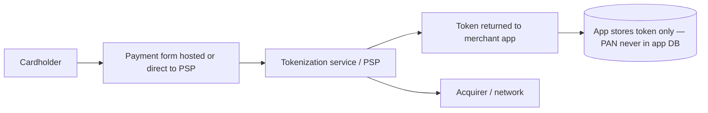
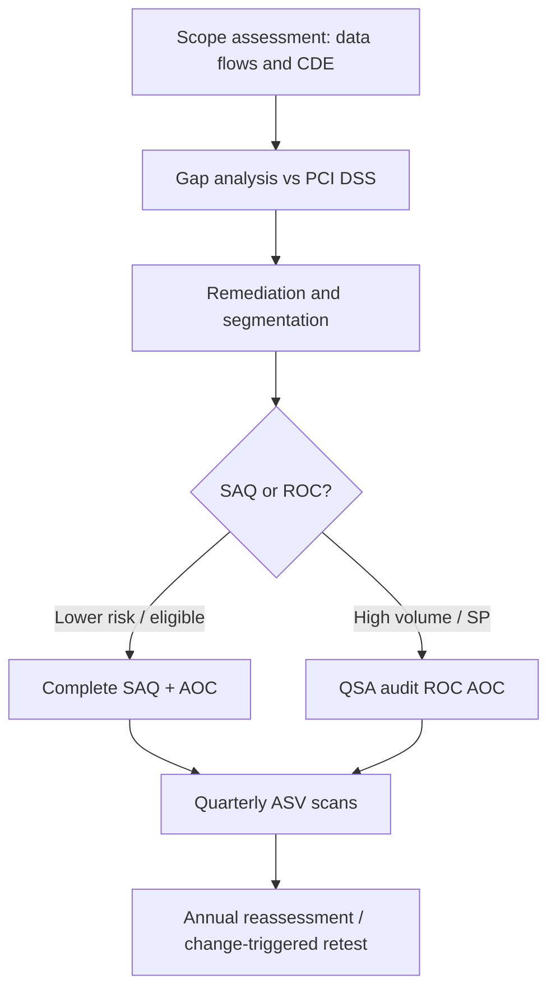

# PCI-DSS: Payment Card Industry Data Security Standard

**Purpose:** Project-agnostic summary of **PCI DSS** for organizations that store, process, or transmit **cardholder data**. **Not legal advice** or a substitute for the official standard, SAQ selection, or QSA engagement.

**Audience:** Architects and security engineers reducing CDE scope and meeting assessment obligations. Cross-ref: [`../COMPLIANCE.md`](../COMPLIANCE.md), [`README.md`](README.md).

---

## Overview

**PCI DSS** is a global standard maintained by the **PCI Security Standards Council**. Any entity handling **cardholder data** (often as a contractual requirement from acquirers/brands) must scope the **CDE**, implement controls, assess (SAQ, ROC, or other as applicable), and maintain continuous compliance — not a one-time checkbox.

---

## Scope definition

| Element | Included / notes |
|---------|------------------|
| **Cardholder data** | **PAN**; **cardholder name**; **expiration**; **service code** — protection requirements vary by element and storage. |
| **Sensitive authentication data** | **Full magnetic stripe**, **CAV2/CVC2/CVV2/CID**, **PIN/PIN block** — **never store** after authorization (retention rules apply to issuers in limited cases per standard). |
| **CDE** | **Cardholder data environment** — people, processes, technology that store, process, or transmit cardholder data or sensitive authentication data. |
| **Connected systems** | Systems connected to or security-impacting the CDE — often **in scope** for segmentation, access, monitoring, and change control. |

---

## The 12 PCI-DSS requirements (v4.0 grouping)

| Req | Group / theme | Key technical notes |
|-----|---------------|---------------------|
| **1** | Network security controls | Firewalls, rules documented and reviewed; deny by default; change management. |
| **2** | Secure configurations | Hardening, no default passwords, inventory, vulnerability management alignment. |
| **3** | Protect stored account data | Minimize storage; strong cryptography for PAN; key management; truncation/hashing/tokenization where applicable. |
| **4** | Protect PAN with strong cryptography during transmission | TLS controls, no weak crypto, certificate management. |
| **5** | Protect against malicious software | Anti-malware where applicable; periodic evaluation for malware risk. |
| **6** | Develop and maintain secure systems | SDLC, patching, secure coding, change control, web app protection. |
| **7** | Restrict access by business need to know | Least privilege, documented access model. |
| **8** | Identify users and authenticate access | Unique IDs; MFA for all access into CDE (v4 emphasis); password/passphrase policies. |
| **9** | Restrict physical access to cardholder data | Media controls, visitor logs, destruction. |
| **10** | Log and monitor all access | Audit trails, time sync, log review, FIM, detection. |
| **11** | Test security regularly | **ASV** scans, **penetration testing**, segmentation tests where applicable. |
| **12** | Support information security with organizational policies | Risk assessment, security policy, vendor management, awareness, incident response. |

### Scope reduction via tokenization

---

## SAQ (Self-Assessment Questionnaire) types (high level)

| SAQ | Typical applicability | Notes |
|-----|----------------------|--------|
| **A** | Card-not-present; **fully outsourced** e-commerce; no electronic storage of card data; eligible redirect/iframe/iFrame to PCI DSS validated third party. | Fewest questions when criteria met. |
| **A-EP** | E-commerce merchant **partially** outsourcing; website **could** affect payment security. | More controls on merchant-managed site. |
| **B** | Imprint or standalone dial-out terminals; no electronic cardholder data storage. | Brick-and-mortar style. |
| **B-IP** | PTS-approved POI devices on IP; no electronic storage. | |
| **C** | Payment application systems **connected to Internet**; no electronic cardholder data storage. | |
| **C-VT** | Virtual terminal on isolated PC; no electronic storage. | |
| **D** | Merchants **not** meeting other SAQs; **service providers** | Largest questionnaires; full DSS. |

**Question counts and exact eligibility** — use current PCI SSC SAQ documents and acquirer rules.

---

## Tokenization and encryption

- **Remove PAN from merchant scope** where the merchant never sees or stores PAN (hosted fields, redirect, server-to-server with PSP holding PAN).
- **Processors:** Stripe, Braintree, Adyen, and others offer patterns that keep PAN off your servers — still verify **your** integration (webhooks, logs, support tools).
- **Hosted payment pages / iframes** — reduce exposure; still validate JavaScript supply chain and parent page security.

---

## Network segmentation

- **Isolate CDE** from corporate LAN, dev laptops, and general SaaS admin paths.
- **Micro-segmentation** and explicit **firewall** rules between tiers.
- **Monitoring** east-west traffic involving CDE assets.

---

## Logging and monitoring

- **Audit trails** for access to cardholder data and privileged actions.
- **Log review** processes (manual and/or automated).
- **File integrity monitoring** on critical files.
- **Intrusion detection** / NDR where required by target requirement and risk.

---

## ASV scans

- **Quarterly** external vulnerability scans by **Approved Scanning Vendor** for in-scope Internet-facing systems.
- **Passing** scan or documented remediation and rescan.
- **Common findings:** TLS misconfigurations, exposed admin interfaces, outdated cipher suites, missing patches.

---

## Penetration testing

- **Annual** internal and external pen tests; **after significant changes** to CDE or segmentation.
- **Segmentation controls** validated if used to reduce scope.
- **Methodology** per PCI SSC pen test guidance (scope, credentials, social engineering rules as specified).

---

## QSA assessment

- Often expected at **high transaction volumes** (historically **>6M** Visa/Mastercard transactions — **confirm current brand/acquirer rules**).
- **ROC** (Report on Compliance) and **AOC** (Attestation of Compliance) produced by QSA.
- **Process:** scoping workshop → evidence collection → onsite/remote testing → remediation → final report.

---

## PCI-DSS v4.0 — selected changes

| Theme | Change |
|-------|--------|
| **Customized approach** | Alternative way to meet objectives with compensating/risk-based design where allowed. |
| **Targeted risk analysis** | For some requirements, entities define frequency/method using documented TRA. |
| **Phishing / social engineering** | Security awareness includes phishing resistance. |
| **MFA** | Expanded emphasis on MFA for access into CDE. |
| **Authenticated scanning** | Internal vulnerability scans with authentication where applicable. |

---

## Common scope reduction strategies

1. **Outsource** card capture to validated PSP with hosted fields or redirect.
2. **Never store** sensitive authentication data; avoid storing PAN if possible.
3. **Tokenize immediately** at PSP; store only tokens.
4. **Segment** aggressively; shrink CDE to smallest subnet and app tier.

### Compliance workflow

---

## Anti-patterns

- **Flat network** — entire corporate org in PCI scope.
- **Storing CVV/CVC** “for convenience” or in logs.
- **PAN in logs, URLs, error messages, support tickets.**
- **“We passed SAQ once”** — without change control, scanning, and monitoring year-round.
- **Equating compliance with absence of breach risk.**

---

## External references

- [PCI Security Standards Council](https://www.pcisecuritystandards.org/)
- **PCI DSS v4.0** document and **Quick Reference Guide**
- **PCI SSC** FAQs and bulletins for SAQ and scoping

---

*Keep project-specific compliance documentation in docs/security/compliance/, DPIAs in docs/security/, and compliance decisions in docs/adr/, not in this file.*
