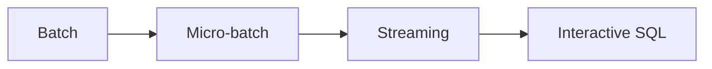

# Data technologies (blueprint)

**Purpose:** Taxonomy and selection guidance for data engineering technologies. Each category describes the problem space, common tools, and selection criteria.

**Why it matters:** Technology selection should be **driven by processing requirements** — latency, throughput, state, semantics, and operational model — not by hype or a single vendor stack. Use the categories below to narrow options, then confirm with proofs of concept and cost models.

**Audience:** Teams adopting [`blueprints/disciplines/data/bigdata/`](../README.md); project-specific tool choices are documented as ADRs in **`docs/adr/`**.

### Processing paradigm spectrum

Interactive analytics often **consumes** outputs of batch or stream pipelines rather than replacing them.

Storage, streaming buses, orchestration, catalogs, and quality tools **compose** with engines: the same Spark or Flink job may land in Delta, register in DataHub, and be scheduled by Airflow. Start from workload shape, then fill in the surrounding toolchain.

---

| Category | Scope | Guide |
|----------|-------|-------|
| **Processing engines & platforms** | Batch (Spark), micro-batch (Spark Structured Streaming), stream (Flink, Kafka Streams), portable pipelines (Beam), interactive SQL warehouses | [`processing-engines.md`](processing-engines.md) |
| **Storage systems** | Relational (PostgreSQL, MySQL), columnar (ClickHouse, DuckDB), object (S3, GCS, Azure Blob), table formats (Delta Lake, Apache Iceberg, Apache Hudi) | — |
| **Streaming platforms** | Apache Kafka, Apache Pulsar, AWS Kinesis, Azure Event Hubs, Google Pub/Sub | — |
| **Orchestration** | Apache Airflow, Dagster, Prefect, Mage — DAG-based pipeline scheduling and monitoring | — |
| **Data catalogs** | DataHub, OpenMetadata, Apache Atlas, Amundsen — metadata management and discovery | — |
| **Data quality** | Great Expectations, dbt tests, Soda, Monte Carlo — automated data quality validation | — |

**Core knowledge:** [`BIGDATA.md`](../BIGDATA.md) — principles, governance, quality, pipeline patterns.

**Architectures:** [`architectures/README.md`](../architectures/README.md) — Lambda, Kappa, data mesh, data lakehouse, medallion; deep dives in [`lambda-kappa.md`](../architectures/lambda-kappa.md) and [`data-mesh.md`](../architectures/data-mesh.md).

**Cross-reference:** [`BIGDATA.md`](../BIGDATA.md) ties principles, governance, quality dimensions, and pipeline patterns to delivery practice; use it when justifying tool choices to stakeholders outside pure engineering.

When a category has no dedicated guide yet, treat [`BIGDATA.md`](../BIGDATA.md) and vendor-neutral overviews as the interim source; prefer ADRs for **versioned** tool pins (e.g., “we use Iceberg + Trino for zone X”).

---

*Keep project-specific data architecture decisions in docs/adr/ and pipeline documentation in docs/development/, not in this file.*
