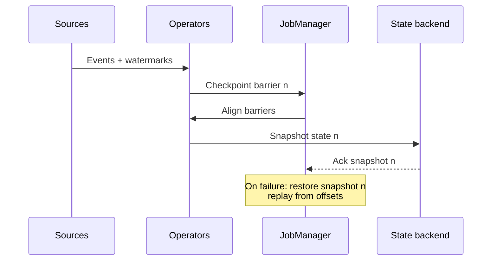
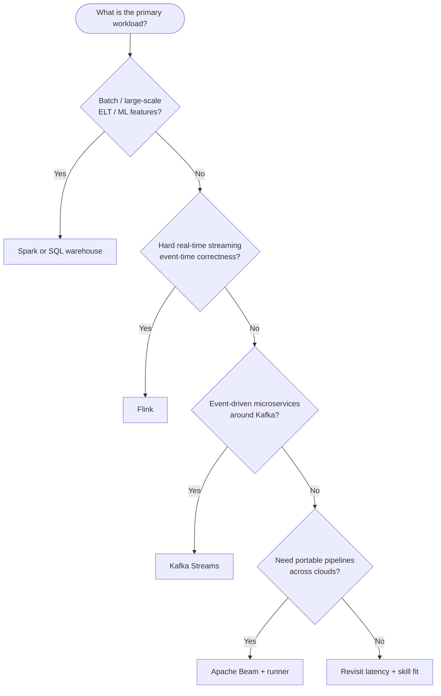

# Data processing engines & platforms

**Purpose:** Project-agnostic guide to selecting and reasoning about **batch**, **stream**, and **interactive** processing engines — Spark, Flink, Kafka ecosystem, Beam, and common cloud managed services.

**Audience:** Teams using [`blueprints/disciplines/data/bigdata/`](../README.md). Align engine choice with architecture patterns in [`architectures/README.md`](../architectures/README.md) and principles in [`BIGDATA.md`](../BIGDATA.md).

---

## 1. Overview

Processing technology should follow **workload shape**: data volume, **latency** target, **state** requirements, **semantics** (at-least-once vs exactly-once), **windowing**, and **operational** constraints (managed vs self-run). No single engine wins all dimensions; the goal is **fit** and **team leverage**.

---

## 2. Processing paradigm comparison

| Paradigm | Examples | Typical latency | Notes |
|----------|----------|-----------------|-------|
| **Batch** | MapReduce, Spark batch | Minutes to days | Full scans, large aggregations, cheap fault tolerance via replay |
| **Micro-batch** | Spark Structured Streaming (default) | Seconds to minutes | Simplicity; “almost streaming” |
| **Stream** | Flink, Kafka Streams | Sub-second to seconds | Event-time, state, complex CEP patterns |
| **Interactive SQL** | Trino/Presto, BigQuery, Redshift | Seconds (varies) | Ad hoc analytics over federated or warehouse data |

---

## 3. Apache Spark (deep dive)

**Architecture:** **Driver** holds the SparkContext / session, schedules **stages** and **tasks**; **executors** run tasks on cluster **workers**. A **cluster manager** (standalone, YARN, Kubernetes) allocates resources.

**APIs (conceptual lineage):** **RDD** (low-level resilience), **DataFrame** (Catalyst-optimized columnar plans), **Dataset** (typed, language-dependent), **Spark SQL** (SQL over DataFrames). Most teams standardize on **DataFrame/SQL**.

**Deployment:** Standalone for dev/small clusters; **YARN** in legacy Hadoop estates; **Kubernetes** for cloud-native; **Databricks** for managed Spark with opinionated lakehouse integration.

**Fit:** Large batch ETL/ELT, ML feature engineering at scale, lakehouse SQL — avoid for **tiny** data where overhead dominates.

---

## 4. Apache Flink (deep dive)

**Architecture:** **JobManager** coordinates execution, checkpoints, recovery; **TaskManagers** run **operators** in parallel **subtasks** with **managed state** backends.

**APIs:** **DataStream** (primary for event-time streaming), **Table API**, **Flink SQL** — unified in planner for many pipelines.

**Exactly-once (typical pattern):** **Checkpointing** persists operator state + source offsets in a **barrier-aligned** snapshot; on failure, replay from last consistent checkpoint with **idempotent sinks** or transactional writes.

**Watermarks** bound event-time progress; **event time** vs **processing time** determines correctness under delay.

**Fit:** Low-latency aggregation, session windows, complex event-time logic, unified batch+stream on one engine.

---

## 5. Apache Kafka & Kafka Streams

**Kafka** is a **durable, partitioned log**: producers append; consumers read with offsets; retention enables **replay**.

**Kafka Streams** embeds stream processing in **JVM applications**: **state stores** (RocksDB), **repartition** topics, **interactive queries** in some setups.

**ksqlDB** (ecosystem) exposes **SQL** over streams and tables for faster path analytics — product positioning evolves; validate against current Confluent/docs.

**Fit:** **Event-driven microservices**, stream processing **co-located** with app deployment, log-centric architectures.

---

## 6. Comparison matrix: Spark vs Flink vs Kafka Streams vs Beam

| Dimension | Spark | Flink | Kafka Streams | Beam |
|-----------|-------|-------|-----------------|------|
| **Latency** | Micro-batch default; continuous modes vary | Strong stream latency story | Low for per-app topologies | Depends on runner (Flink, Dataflow, Spark) |
| **Throughput** | Very high batch | High stream/batch | High per cluster of apps | Runner-dependent |
| **State management** | Structured Streaming state | First-class, rich | Embedded stores | Abstracted; runner implements |
| **Exactly-once** | Sink-dependent; transactional sinks | Strong checkpoint narrative | EOS with idempotent/txn sinks | Runner-dependent |
| **Windowing** | Rich | Rich event-time | Rich for JVM apps | Model portable |
| **Ecosystem** | Massive (SQL, ML, lake) | Strong stream + growing SQL | Kafka-centric | Portable pipelines |
| **Managed offerings** | EMR, Dataproc, Databricks, Glue | Managed Flink (various vendors) | Confluent Cloud patterns | GCP Dataflow, others via runners |

---

## 7. Cloud-managed services (illustrative)

| Provider | Examples | Engine / model notes |
|----------|----------|----------------------|
| **Databricks** | Spark-first lakehouse | Unity Catalog, Delta; premium support for unified analytics |
| **AWS** | EMR, Glue, Kinesis, MSK | Mix of Spark, Flink (where offered), streaming ingestion |
| **GCP** | Dataflow (Beam), Dataproc, BigQuery | Serverless SQL warehouse + Beam runner maturity |
| **Azure** | Synapse, HDInsight, Stream Analytics | SQL + Spark + stream analytics options |

**Pricing models** differ: **per DPU/cu-hour**, **per TB scanned**, **per slot** — normalize to **workload replay** before committing.

---

## 8. Decision flowchart (engine shortlist)

---

## 9. Data serialization formats

| Format | Schema evolution | Compression | Query performance | Human readability |
|--------|------------------|-------------|-------------------|-------------------|
| **Avro** | Strong with compatibility rules | Good | Good in Hadoop/Spark stacks | Binary |
| **Parquet** | Column stats + nested types; often paired with Iceberg/Delta | Excellent | Excellent for analytics | Binary |
| **ORC** | Similar columnar niche | Excellent | Strong in Hive/legacy | Binary |
| **Protobuf** | Strong for services | Compact | Not a lake-first format | Binary |
| **JSON** | Weak without contracts | Poor | Poor at scale | Excellent |

**Practical pattern:** **Protobuf/Avro** on the wire; **Parquet** (or ORC) in the lake.

---

## 10. Anti-patterns

| Anti-pattern | Why it hurts |
|--------------|--------------|
| **Wrong engine for workload** | Paying cluster cost for interactive latency on batch-sized joins |
| **Premature Spark for small data** | Driver/scheduler overhead dominates; use SQL DB or Polars/DuckDB-class tools |
| **Ignoring backpressure** | OOM, lag explosions, cascading failures in streaming |
| **Beam without runner discipline** | “Portable” on paper but only one runner tested in production |

---

## 11. External references

| Resource | URL |
|----------|-----|
| Apache Spark | https://spark.apache.org/ |
| Apache Flink | https://flink.apache.org/ |
| Apache Kafka | https://kafka.apache.org/ |
| Apache Beam | https://beam.apache.org/ |

---

*Keep project-specific data architecture decisions in docs/adr/ and pipeline documentation in docs/development/, not in this file.*
