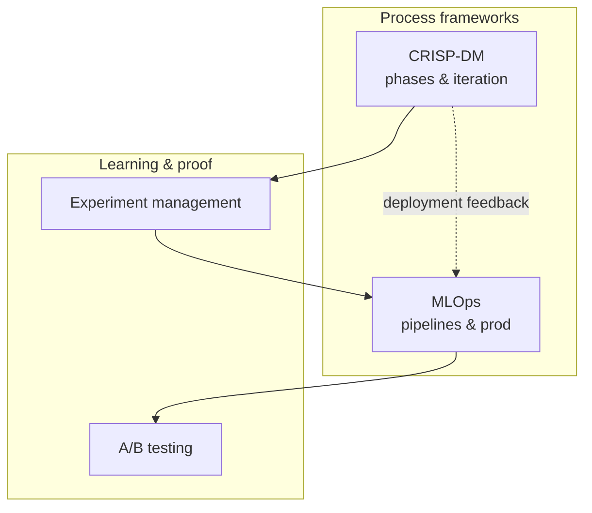

# Data science approaches (blueprint)

**Purpose:** Deeper, **project-agnostic** guides for data science methodologies and process frameworks. Each approach describes its structure, phases, and mapping to the lifecycle.

**Audience:** Teams adopting [`blueprints/disciplines/data/data-science/`](../README.md); project-specific ML decisions stay in **`docs/architecture/`** and **`docs/adr/`**.

## Methodology selection

Pick a **process scaffold** first (goals, data reality, deployment), then layer **operations** (MLOps) when models must live in production under change control. **CRISP-DM** fits most greenfield analytics and ML projects; **MLOps** is not a replacement for CRISP-DM but the **engineering wrapper** around deployment and monitoring. **Experiment management** and **A/B testing** address *how* you learn during development and *how* you prove impact in production — they complement, rather than substitute for, a phase model. If you are unsure where to start, read [`crisp-dm.md`](crisp-dm.md) for phase definitions, then [`mlops.md`](mlops.md) when the path to production is real rather than hypothetical.

**Core knowledge:** [`DATA-SCIENCE.md`](../DATA-SCIENCE.md) — ML lifecycle, statistics, evaluation, MLOps, responsible AI.

**Bridge:** [`DS-SDLC-PDLC-BRIDGE.md`](../DS-SDLC-PDLC-BRIDGE.md) — how data science maps to delivery and product lifecycles.

The diagram is **illustrative**: in practice, experiment tracking starts early (often during Data Preparation / Modeling in CRISP-DM terms), and A/B tests may run only after a first deployment — but the dependencies (sound process → disciplined experiments → reliable production → measured impact) stay the same.

| Approach | Focus | When to use | Guide |
|----------|-------|-------------|-------|
| **CRISP-DM** | Six-phase cross-industry standard process for data mining and ML projects | Default starting point for most ML projects; industry-proven; tool-agnostic | [`crisp-dm.md`](crisp-dm.md) |
| **MLOps** | Operationalizing ML — CI/CD for models, automated retraining, model monitoring | When ML models run in production and require ongoing management | [`mlops.md`](mlops.md) |
| **Experiment management** | Systematic approach to running, tracking, and analyzing ML experiments | During model development; comparing approaches; hyperparameter optimization | [DATA-SCIENCE.md §3](../DATA-SCIENCE.md#3-model-evaluation) |
| **A/B testing** | Controlled online experimentation to measure model impact on product metrics | When validating model impact in production; PDLC P5 outcome measurement | [DATA-SCIENCE.md §3](../DATA-SCIENCE.md#3-model-evaluation) |

**Related techniques:** For encoding, feature stores, and evaluation metrics used inside these phases, see [`../techniques/feature-engineering.md`](../techniques/feature-engineering.md) and [`../techniques/model-evaluation.md`](../techniques/model-evaluation.md).

*Keep project-specific model documentation in docs/product/ and experiment logs in docs/development/, not in this file.*
