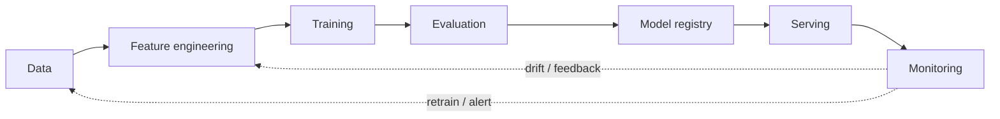
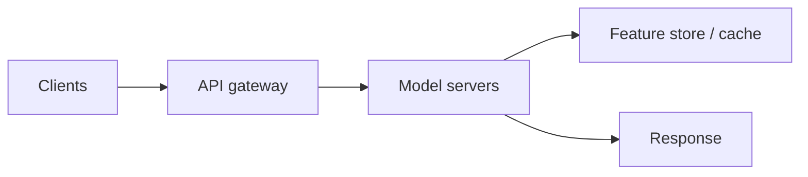
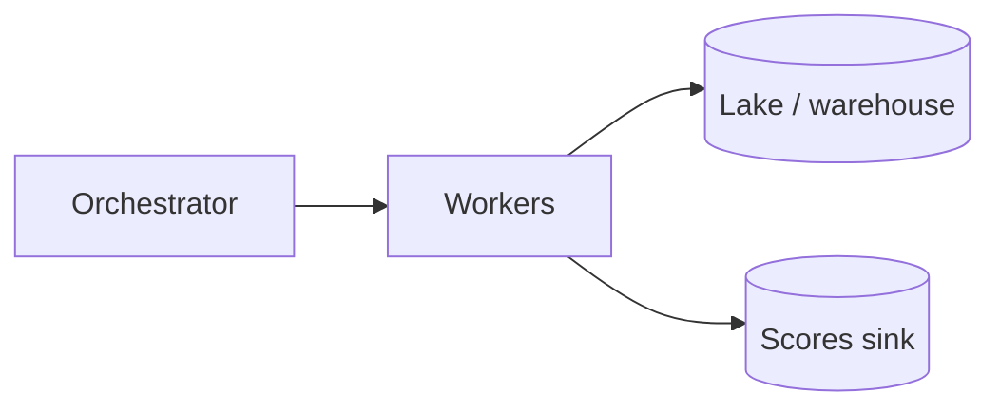
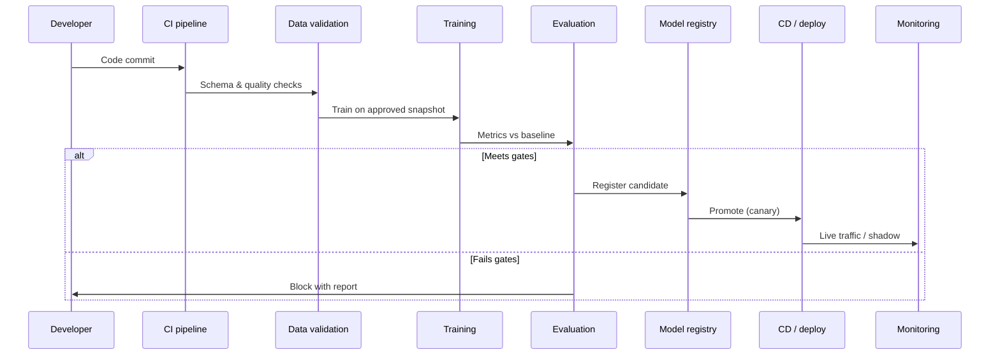

# MLOps: Machine Learning Operations

**Purpose:** Project-agnostic reference for **MLOps** — applying DevOps-style practices to machine learning systems so models are **reproducible, deployable, observable, and maintainable**.

**Audience:** Teams following [`DATA-SCIENCE.md`](../DATA-SCIENCE.md), [`crisp-dm.md`](crisp-dm.md), and [`approaches/README.md`](README.md).

---

## Overview

MLOps bridges **data science** (experimentation, uncertainty) and **software engineering** (reliability, change management). A trained model is not “done” until it can be **versioned**, **served** under SLAs, **monitored** in production, and **updated** without heroics. MLOps formalizes pipelines, ownership, and automation around that lifecycle.

---

## Maturity levels

| Level | Characteristics | Automation | Team skills |
|-------|-----------------|------------|-------------|
| **0 — Manual / notebook-driven** | Ad hoc training; manual copy to production; little reproducibility | Minimal; mostly scripts | Strong modeling; weak production discipline |
| **1 — ML pipeline automation** | Repeatable training pipeline; artifact storage; basic deployment scripts | Scheduled or triggered training; scripted deploy | Pipelines as code; basic CI |
| **2 — CI/CD for ML** | Tests on data and code; gated promotions; environments as code | CI runs unit + data checks; CD to staging/prod with approvals | DevOps + ML; feature flags / canaries |
| **3 — Continuous training + proactive monitoring** | Automated retraining; drift detection; feedback loops into feature and model updates | End-to-end orchestration; policy-driven retrain | SRE + ML platform; strong observability culture |

---

## ML pipeline components

| Component | Role | Example tools (illustrative) |
|-----------|------|------------------------------|
| **Data validation** | Catch schema drift, bad batches, broken upstreams | Great Expectations, Deequ, custom checks |
| **Feature store** | Consistent offline training + online serving features | Feast, Tecton, Databricks Feature Store |
| **Experiment tracking** | Params, metrics, artifacts, lineage | MLflow, Weights & Biases, Neptune |
| **Model registry** | Versioned models, stages, approvals | MLflow Model Registry, cloud registries |
| **Serving** | Low-latency or batch inference | TorchServe, TensorFlow Serving, Ray Serve, SageMaker |
| **Monitoring** | Drift, performance, data quality in prod | Evidently, WhyLabs, cloud APM + custom metrics |

---

## Feature store deep dive

| Concern | Offline store | Online store |
|---------|---------------|--------------|
| **Use case** | Training, batch backfills, analytics | Real-time inference, low-latency features |
| **Latency** | Batch / high throughput | Milliseconds to low seconds |
| **Consistency** | Must align with **point-in-time** joins for training | Must match definitions used at training time |

**Point-in-time correctness:** Features available at prediction time must not include **future information** that was unavailable when the label was generated — critical to avoid train/serve skew and leakage.

**Tools:** **Feast** (open, Kubernetes-friendly), **Tecton** (managed/feature platform), **Databricks Feature Store** (lakehouse integration) — evaluate against your cloud, latency, and governance needs.

---

## Experiment tracking comparison

| Tool | Tracking | Visualization | Collaboration | Deployment integration |
|------|----------|---------------|---------------|------------------------|
| **MLflow** | Params, metrics, artifacts, models | UI + API; basic plots | Multi-user server; Databricks integration | Model registry, REST serving hooks |
| **Weights & Biases** | Rich experiment + system metrics | Strong dashboards, reports | Teams, reports sharing | Registry, launch integrations |
| **Neptune** | Experiments, metadata, images | Flexible UI, comparison | Org/workspaces | CI and orchestration hooks |
| **Comet** | Experiments, panels | Project views | Sharing, comments | Production monitoring options |
| **ClearML** | Experiments + orchestration | Web UI | Multi-user | Agent-based automation, pipelines |

---

## Model serving patterns

| Pattern | Description | When to use |
|---------|-------------|-------------|
| **Batch inference** | Score large volumes on a schedule or trigger | Reporting, nightly scores, ETL downstream |
| **Online inference (REST/gRPC)** | Request/response API behind load balancers | User-facing apps, real-time decisions |
| **Embedded model** | Library or on-device bundle | Mobile, edge, strict latency/isolation |
| **Streaming inference** | Consume event streams; emit scores per event | Fraud, IoT, real-time pipelines |

**Online serving (conceptual):**

**Batch scoring (conceptual):**

---

## CI/CD for ML (sequence)

---

## Model monitoring

| Signal | What to watch | Example metrics / methods |
|--------|---------------|---------------------------|
| **Data drift** | Input distribution changes vs training | PSI, KS tests, embedding distance |
| **Concept drift** | Relationship between X and Y shifts | Rolling accuracy, calibration drift |
| **Performance degradation** | Business or model metrics slip | Latency, error rate, AUC decay over time |
| **Feature importance shifts** | Model relies on different drivers | SHAP stability over windows, tree gain drift |

---

## Infrastructure notes

- **GPU management:** Quotas, autoscaling groups, or Kubernetes device plugins; isolate training from serving clusters when possible.
- **Distributed training:** Horovod, DeepSpeed, or cloud-managed trainers — align checkpointing with registry conventions.
- **Cost:** Spot/preemptible for training; right-size serving; cache hot features; prune stale experiments.

---

## Testing ML systems

| Test type | Focus | Examples |
|-----------|-------|----------|
| **Data tests** | Schema, ranges, null rates, referential integrity | Great Expectations suites in CI |
| **Model tests** | Accuracy floors, fairness constraints, robustness spot checks | Golden sets, adversarial smoke tests |
| **Integration tests** | Pipeline end-to-end with small fixture data | Airflow/Prefect dry runs |
| **A/B tests in production** | Causal impact on business KPIs | Controlled rollout with power analysis |

---

## Anti-patterns

| Anti-pattern | Risk |
|--------------|------|
| “It works on my laptop” | Non-reproducible training and mystery dependencies |
| No model versioning | Cannot roll back or audit decisions |
| Training–serving skew | Different code paths or features offline vs online |
| No monitoring | Silent degradation until business impact |

---

## External references

- [ml-ops.org](https://ml-ops.org/) — community MLOps overview and maturity framing.
- Google — *MLOps* whitepaper and related cloud documentation (continuous delivery for ML).
- Chip Huyen — *Designing Machine Learning Systems* — production patterns and trade-offs.
- [MLflow documentation](https://mlflow.org/docs/latest/index.html) — tracking, registry, projects.

*Keep project-specific model documentation in docs/product/ and experiment logs in docs/development/, not in this file.*
