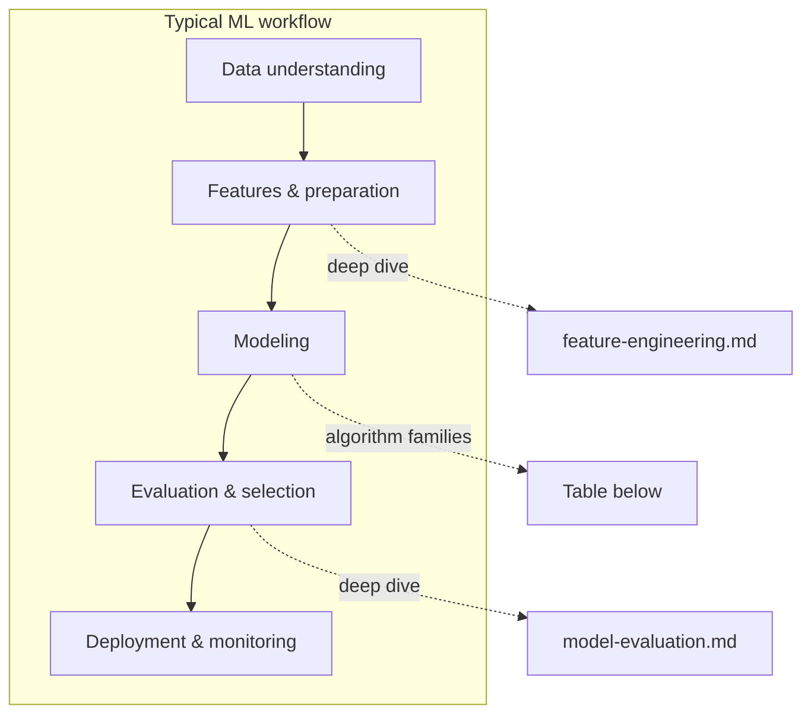

# ML techniques (blueprint)

**Purpose:** Catalog of **machine learning techniques** — algorithm families and deep-dive guides on **features** and **evaluation**. Each category describes the approach, common algorithms, trade-offs, and use cases.

**Audience:** Teams adopting [`blueprints/disciplines/data/data-science/`](../README.md); technique choices for a specific project are documented in experiment logs and model cards.

## Technique selection in the ML workflow

**Algorithm choice** depends on problem type, data scale, interpretability, and latency. **Feature engineering** usually dominates early iteration quality; **evaluation design** (splits, metrics, fairness) decides whether you can trust comparisons. Use this folder to map **where you are in the workflow** to the right reference: encoding and stores before or alongside modeling; metrics and validation while comparing candidates; algorithm rows below when narrowing model families. Deep dives [`feature-engineering.md`](feature-engineering.md) and [`model-evaluation.md`](model-evaluation.md) are intentionally **tool-agnostic** — bind specific libraries and experiment IDs in project docs, not in these blueprints.

**Core knowledge:** [`DATA-SCIENCE.md`](../DATA-SCIENCE.md) — ML lifecycle (CRISP-DM aligned), statistics, model evaluation, MLOps, responsible AI.

| Category | Core idea | Common algorithms | Deep dive |
|----------|-----------|-------------------|-----------|
| **Feature engineering** | Transform raw inputs into model-ready signals; train/serve consistency | Encoding, scaling, temporal & text features, feature stores | [`feature-engineering.md`](feature-engineering.md) |
| **Evaluation & validation** | Metrics, splits, tuning, fairness, explainability, production tests | Cross-validation, hyperparameter search, A/B and shadow tests | [`model-evaluation.md`](model-evaluation.md) |
| **Supervised — classification** | Learn to assign labels from labeled examples | Logistic regression, decision trees, random forests, gradient boosting (XGBoost, LightGBM), SVM, neural networks | — |
| **Supervised — regression** | Learn to predict continuous values from labeled examples | Linear regression, polynomial regression, gradient boosting, neural networks | — |
| **Unsupervised — clustering** | Discover natural groupings in unlabeled data | K-means, DBSCAN, hierarchical clustering, Gaussian mixture models | — |
| **Unsupervised — dimensionality reduction** | Reduce feature space while preserving information | PCA, t-SNE, UMAP, autoencoders | — |
| **Deep learning** | Multi-layer neural networks for complex pattern recognition | CNNs (vision), RNNs/LSTMs (sequences), Transformers (language, multi-modal) | — |
| **Natural language processing** | Understanding and generating human language | Transformer models (BERT, GPT), word embeddings, named entity recognition, sentiment analysis | — |
| **Computer vision** | Understanding and analyzing images and video | CNNs, object detection (YOLO, Faster R-CNN), image segmentation, generative models | — |
| **Time series** | Forecasting and anomaly detection in temporal data | ARIMA, Prophet, LSTM, temporal convolutional networks, state-space models | — |
| **Recommender systems** | Predicting user preferences for items | Collaborative filtering, content-based filtering, matrix factorization, neural collaborative filtering | — |
| **Reinforcement learning** | Learning optimal actions through environment interaction | Q-learning, policy gradient, actor-critic, multi-armed bandits | — |

**Selection guidance:** Technique selection depends on problem type, data volume, interpretability requirements, latency constraints, and team expertise. See [`DATA-SCIENCE.md`](../DATA-SCIENCE.md) §3 (model evaluation) for the evaluation framework.

*Keep project-specific model documentation in docs/product/ and experiment logs in docs/development/, not in this file.*
