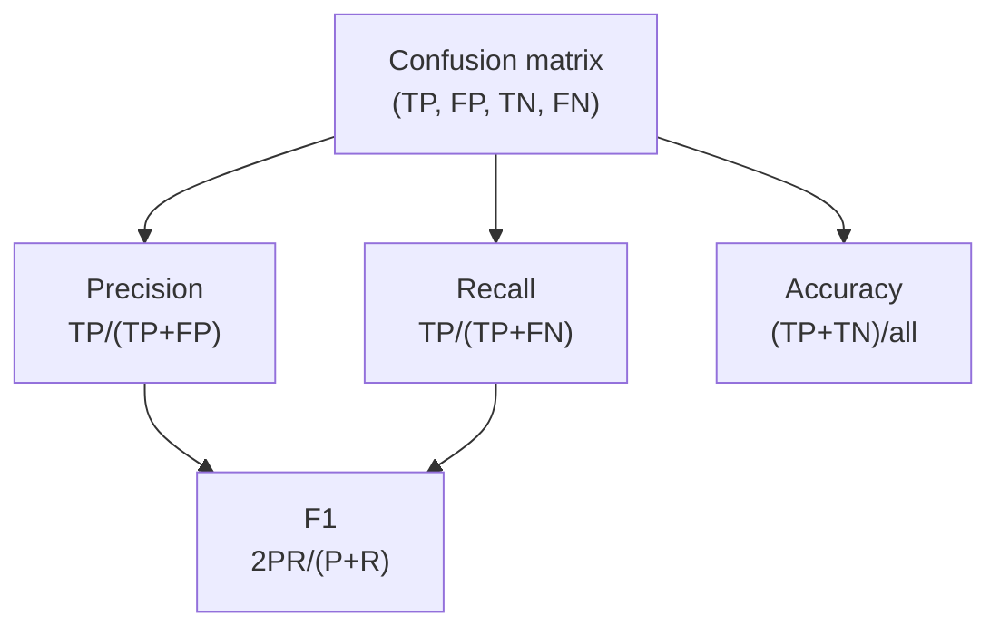
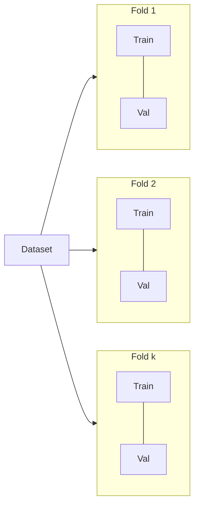

# Model evaluation, selection & validation

**Purpose:** Project-agnostic reference for **measuring**, **comparing**, and **validating** models beyond a single accuracy number — metrics, splits, tuning, fairness, explainability, and production experimentation.

**Audience:** Teams following [`DATA-SCIENCE.md`](../DATA-SCIENCE.md) and [`techniques/README.md`](README.md). Complements [`feature-engineering.md`](feature-engineering.md).

---

## Overview

Evaluation is not a single step at the end of modeling; it is a **system** of choices: what to optimize, how to split data, how to compare candidates, and how to behave under **uncertainty**, **fairness**, and **cost** constraints. The goal is **decisions you can defend** — to stakeholders and to future you.

---

## Classification metrics

| Metric | Definition (intuition) | When to use | Limitations |
|--------|------------------------|-------------|-------------|
| **Accuracy** | Fraction correct | Balanced classes; equal error costs | Misleading under imbalance |
| **Precision** | TP / (TP + FP) | Costly false positives | Ignores false negatives |
| **Recall** | TP / (TP + FN) | Costly false negatives | Ignores false positives |
| **F1** | Harmonic mean of precision & recall | Single score balancing P/R | Hides threshold choice |
| **AUC-ROC** | Rank quality across thresholds | Compare models threshold-free | Can be optimistic if imbalance mishandled |
| **AUC-PR** | Area under precision–recall curve | Imbalanced positives | Less familiar to some stakeholders |
| **Log loss** | Probabilistic calibration penalty | When probabilities matter | Sensitive to extreme miscalibration |
| **Matthews correlation** | Correlation between predicted and actual (binary) | Imbalance-friendly single score | Binary focus |

---

## Regression metrics

| Metric | Notes | Comparison |
|--------|-------|--------------|
| **MAE** | Average absolute error | Robust to outliers vs squared errors |
| **MSE / RMSE** | Penalizes large errors more | RMSE same units as target |
| **MAPE** | Percentage errors | Breaks near zero targets |
| **R²** | Explained variance fraction | Can mislead with bad baselines |
| **Adjusted R²** | Penalizes extra predictors | Model comparison with different feature counts |

---

## Confusion matrix → metrics

For probabilistic classifiers, metrics are computed **at a threshold** or **integrated** over thresholds (ROC/PR).

---

## Validation strategies

| Strategy | When to use | Caveat |
|----------|-------------|--------|
| **Train/test split** | Plenty of i.i.d. data | High variance with small data |
| **K-fold CV** | Stable metric estimates | Leakage if groups/time ignored |
| **Stratified k-fold** | Imbalanced classification | Preserve class ratios per fold |
| **Time-series split** | Temporal data | No random shuffle |
| **Leave-one-out** | Tiny datasets | High variance; expensive |
| **Nested CV** | Tuning + unbiased outer estimate | Costly; gold standard for small data |

Each rotation trains on k−1 folds and validates on the held-out fold; scores are averaged.

---

## Hyperparameter tuning

| Method | Efficiency | Parallelization | Convergence notes |
|--------|------------|-----------------|-------------------|
| **Grid search** | Poor in high dimensions | Embarrassingly parallel | Exhaustive only for small spaces |
| **Random search** | Often better than grid per eval | Easy parallel | No principled stop |
| **Bayesian optimization (Optuna, Hyperopt)** | Sample-efficient | Parallel trials with batches | Needs enough signal per trial |
| **Early stopping** | Saves compute for iterative learners | Built into boosting / NN loops | Tune patience; watch validation leakage |

---

## Model comparison: statistical vs practical significance

| Approach | Role |
|----------|------|
| **Paired t-test / Wilcoxon** | Compare fold-wise or instance-wise scores across models |
| **McNemar** | Paired disagreements on classification outcomes |
| **Bayesian comparison** | Posterior over “probability model A wins” — useful under few runs |

A **statistically significant** 0.1% gain may be **practically irrelevant** if latency, cost, or interpretability regress. Always tie back to **Business Understanding** criteria (see [`crisp-dm.md`](../approaches/crisp-dm.md)).

---

## Fairness metrics (overview)

| Metric | Idea | Typical use case |
|--------|------|------------------|
| **Demographic parity** | Positive rate similar across groups | Equal selection rates |
| **Equalized odds** | TPR/FPR similar across groups | Balance errors across groups |
| **Calibration** | Predicted probabilities match outcomes per group | Risk scores, lending, medicine |
| **Individual fairness** | Similar individuals treated similarly | Hard to operationalize; needs meaningful distance metric |

Fairness metrics **conflict** in general — choosing one is a **policy** decision, not purely technical.

---

## Explainability methods

| Method | Scope | Agnostic? | Notes |
|--------|-------|-----------|-------|
| **SHAP** | Local + global aggregates | Model-agnostic (with appropriate explainers) | Shapley-based attributions |
| **LIME** | Local | Yes | Perturbation around instance |
| **Partial dependence** | Global marginal effects | Usually model-agnostic | Assumes feature independence (watch correlated features) |
| **Feature importance** | Global | Tree-native or permutation | Can hide interaction effects |
| **Attention weights** | Local (tokens/regions) | Transformer-specific | Not always faithful “explanation” |

---

## Model selection trade-offs

| Criterion | Question |
|-----------|----------|
| **Accuracy / calibration** | Does it meet metric bars on valid slices? |
| **Interpretability** | Can operators trust and debug it? |
| **Latency** | p50/p99 within SLA? |
| **Cost** | Training + inference $ acceptable? |

Treat these as a **constraint satisfaction** problem: hard gates (latency, compliance) then optimize within the feasible set.

---

## Production evaluation patterns

| Pattern | Idea | Comparison |
|---------|------|------------|
| **A/B test** | Split users; compare KPIs | Gold standard for causal product impact; needs power |
| **Shadow mode** | New model scores but does not act | Safe comparison of distributions |
| **Interleaving** | Interleave ranked lists | Sensitive ranking comparison |
| **Bandits** | Allocate traffic by ongoing performance | Exploration vs exploitation |

---

## Anti-patterns

| Anti-pattern | Why it hurts |
|--------------|--------------|
| **Single metric obsession** | Hides harm to subgroups or rare failures |
| **Leakage in validation** | Same preprocessing fit on all data; group leakage |
| **Overfitting the validation set** | Repeated peeking drives hyperparameters to noise |
| **Ignoring fairness** | Legal, ethical, and product risk |

---

## External references

- [scikit-learn metrics](https://scikit-learn.org/stable/modules/model_evaluation.html) — classification, regression, scoring API.
- Zheng — *Evaluating Machine Learning Models* — offline vs online evaluation framing.
- Barocas, Hardt, Narayanan — *Fairness and Machine Learning* — limitations of metrics.
- [SHAP documentation](https://shap.readthedocs.io/) — explainers and plots.

*Keep project-specific model documentation in docs/product/ and experiment logs in docs/development/, not in this file.*
