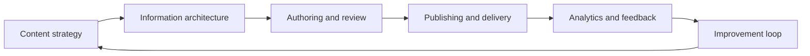

# Documentation practices (index)

**Purpose:** Index of **documentation practices** — repeatable activities that turn documentation from a side-effect into a sustainable, high-quality discipline. Each practice describes its principles, methodology, tooling, and integration with the development lifecycle.

**Audience:** Teams adopting [`blueprints/disciplines/documentation/`](../README.md); project-specific documentation configuration and content stay in **`docs/`**.

---

## Why these practices matter

Documentation practices are **proactive knowledge management**: they turn "someone should write that down" into **repeatable activities** that capture knowledge early, maintain accuracy continuously, and ensure content reaches the right audience in the right format. Together they connect **authoring**, **publishing**, and **measurement** so documentation quality is owned by the whole team, not isolated in a late-stage writing sprint.

The loop closes when analytics and user feedback **feed** updated content plans, restructured navigation, and refreshed content — documented at the project level in **`docs/`** and tracked in the content calendar.

---

## Practice guides

### Content strategy and planning

| Practice | Guide | Focus |
|----------|-------|-------|
| **Content audit** | [DOCUMENTATION.md §5.1](../DOCUMENTATION.md#51-content-strategy) | Inventory existing docs; assess accuracy, completeness, freshness, usage; identify gaps |
| **Content planning** | [DOCUMENTATION.md §5.1](../DOCUMENTATION.md#51-content-strategy) | Align documentation work to product roadmap, lifecycle phases, audience needs |
| **Governance model** | [DOCUMENTATION.md §5.1](../DOCUMENTATION.md#51-content-strategy) | Define ownership, review cadence, archival policy, contribution guidelines |
| **Content calendar** | [DOCUMENTATION.md §5.1](../DOCUMENTATION.md#51-content-strategy) | Schedule blog posts, release notes, newsletters, podcasts, and recurring content |
| **Tone and voice** | [DOCUMENTATION.md §5.1](../DOCUMENTATION.md#51-content-strategy) | Establish consistent personality across all documentation and content |

### Information architecture

| Practice | Guide | Focus |
|----------|-------|-------|
| **Taxonomy and categorization** | [DOCUMENTATION.md §5.2](../DOCUMENTATION.md#52-information-architecture) | Categorize content by type, audience, product area, lifecycle phase |
| **Navigation design** | [DOCUMENTATION.md §5.2](../DOCUMENTATION.md#52-information-architecture) | Structure menus, sidebars, breadcrumbs, cross-references for discoverability |
| **Search optimization** | [DOCUMENTATION.md §5.2](../DOCUMENTATION.md#52-information-architecture) | Metadata, keywords, synonyms, structured data to improve search |
| **URL / path strategy** | [DOCUMENTATION.md §5.2](../DOCUMENTATION.md#52-information-architecture) | Predictable, stable URLs/paths that survive reorganization |
| **Card sorting** | [DOCUMENTATION.md §5.2](../DOCUMENTATION.md#52-information-architecture) | User research technique for validating information architecture decisions |

### Docs-as-code workflow

| Practice | Guide | Focus |
|----------|-------|-------|
| **Version control for docs** | [`docs-as-code-workflow.md`](docs-as-code-workflow.md) | Git-based documentation — branching, history, blame, diffs |
| **PR-based review** | [`docs-as-code-workflow.md`](docs-as-code-workflow.md) | Pull request reviews combining technical accuracy and writing quality |
| **CI/CD for documentation** | [`docs-as-code-workflow.md`](docs-as-code-workflow.md) | Automated builds, link checking, spell checking, style linting, deployment |
| **API doc generation** | [`docs-as-code-workflow.md`](docs-as-code-workflow.md) | OpenAPI/AsyncAPI → rendered reference docs in CI pipeline |
| **Doc site deployment** | [`docs-as-code-workflow.md`](docs-as-code-workflow.md) | Static site generators, preview environments, versioned deployments |

### Style guides and consistency

| Practice | Guide | Focus |
|----------|-------|-------|
| **Adopting a style guide** | [DOCUMENTATION.md §3.8](../DOCUMENTATION.md#38-style-guides-reference) | Selecting and customizing a style guide (Google, Microsoft, custom) |
| **Terminology management** | [DOCUMENTATION.md §3.8](../DOCUMENTATION.md#38-style-guides-reference) | Glossaries, approved terms, consistent naming across docs |
| **Vale configuration** | [`quality-automation.md`](quality-automation.md) | Encoding style rules as automated linting checks |

### Localization and internationalization

| Practice | Guide | Focus |
|----------|-------|-------|
| **Translation management** | [DOCUMENTATION.md §5.3](../DOCUMENTATION.md#53-localization-and-internationalization-l10n--i18n) | TMS integration, translation memory, glossaries, vendor workflows |
| **i18n-ready authoring** | [DOCUMENTATION.md §5.3](../DOCUMENTATION.md#53-localization-and-internationalization-l10n--i18n) | Writing source content that translates well — avoid idioms, culture-specific examples |
| **Continuous localization** | [DOCUMENTATION.md §5.3](../DOCUMENTATION.md#53-localization-and-internationalization-l10n--i18n) | Integrate translation into CI/CD so new content triggers translation workflows |

### Documentation accessibility

| Practice | Guide | Focus |
|----------|-------|-------|
| **Semantic markup** | [DOCUMENTATION.md §5.4](../DOCUMENTATION.md#54-documentation-accessibility) | Correct use of headings, lists, tables, landmarks for screen readers |
| **Alternative text** | [DOCUMENTATION.md §5.4](../DOCUMENTATION.md#54-documentation-accessibility) | Descriptions for images, diagrams, and media |
| **Color and contrast** | [DOCUMENTATION.md §5.4](../DOCUMENTATION.md#54-documentation-accessibility) | WCAG color contrast requirements for doc sites |
| **Keyboard navigation** | [DOCUMENTATION.md §5.4](../DOCUMENTATION.md#54-documentation-accessibility) | Full keyboard accessibility for doc sites and interactive examples |
| **Plain language** | [DOCUMENTATION.md §5.4](../DOCUMENTATION.md#54-documentation-accessibility) | Clear, simple language; defined jargon; appropriate reading level |
| **Captions and transcripts** | [DOCUMENTATION.md §5.4](../DOCUMENTATION.md#54-documentation-accessibility) | Captions for video, transcripts for audio/podcast content |

### Quality and review

| Practice | Guide | Focus |
|----------|-------|-------|
| **Technical review** | [DOCUMENTATION.md §5.5](../DOCUMENTATION.md#55-documentation-quality-and-review) | SME verification of content accuracy |
| **Editorial review** | [DOCUMENTATION.md §5.5](../DOCUMENTATION.md#55-documentation-quality-and-review) | Grammar, style guide conformance, consistency, clarity |
| **Usability testing** | [DOCUMENTATION.md §5.5](../DOCUMENTATION.md#55-documentation-quality-and-review) | Real users attempt tasks using only the documentation |
| **Automated quality checks** | [`quality-automation.md`](quality-automation.md) | Vale, markdownlint, link checkers, spell checkers, readability in CI |
| **Freshness audits** | [DOCUMENTATION.md §5.5](../DOCUMENTATION.md#55-documentation-quality-and-review) | Periodic review for staleness — last-updated tracking, content scoring |

### Analytics and feedback

| Practice | Guide | Focus |
|----------|-------|-------|
| **Page analytics** | [DOCUMENTATION.md §5.6](../DOCUMENTATION.md#56-analytics-and-feedback) | Page views, time on page, search queries, bounce rates |
| **Feedback widgets** | [DOCUMENTATION.md §5.6](../DOCUMENTATION.md#56-analytics-and-feedback) | "Was this helpful?" buttons, inline feedback, comment systems |
| **Support ticket analysis** | [DOCUMENTATION.md §5.6](../DOCUMENTATION.md#56-analytics-and-feedback) | Mine support tickets for documentation gaps |
| **Search analytics** | [DOCUMENTATION.md §5.6](../DOCUMENTATION.md#56-analytics-and-feedback) | No-results queries and low-click results reveal missing content |
| **Satisfaction surveys** | [DOCUMENTATION.md §5.6](../DOCUMENTATION.md#56-analytics-and-feedback) | Periodic NPS/CSAT for documentation |

### SEO for documentation

| Practice | Guide | Focus |
|----------|-------|-------|
| **Structured data** | [DOCUMENTATION.md §5.7](../DOCUMENTATION.md#57-seo-for-documentation) | Schema.org markup for articles, FAQs, how-to content |
| **Meta and canonical** | [DOCUMENTATION.md §5.7](../DOCUMENTATION.md#57-seo-for-documentation) | Meta descriptions, canonical URLs for versioned docs |
| **Internal linking** | [DOCUMENTATION.md §5.7](../DOCUMENTATION.md#57-seo-for-documentation) | Strategic cross-references for authority and navigation |
| **Performance** | [DOCUMENTATION.md §5.7](../DOCUMENTATION.md#57-seo-for-documentation) | Core Web Vitals for doc sites |

### Media production

| Practice | Guide | Focus |
|----------|-------|-------|
| **Presentation design** | [DOCUMENTATION.md §6.2](../DOCUMENTATION.md#62-content-and-media-production) | Creating effective presentations — narrative structure, visual hierarchy, tools |
| **Blog workflow** | [DOCUMENTATION.md §6.2](../DOCUMENTATION.md#62-content-and-media-production) | Ideation, drafting, review, publishing, promotion cycle |
| **Podcast production** | [DOCUMENTATION.md §6.2](../DOCUMENTATION.md#62-content-and-media-production) | Recording, editing, hosting, distribution, transcription |
| **Video production** | [DOCUMENTATION.md §6.2](../DOCUMENTATION.md#62-content-and-media-production) | Scripting, recording, editing, captioning, hosting |
| **Voiceover / narration** | [DOCUMENTATION.md §6.2](../DOCUMENTATION.md#62-content-and-media-production) | Script preparation, recording, editing, integration with video/tutorials |
| **Newsletter management** | [DOCUMENTATION.md §6.2](../DOCUMENTATION.md#62-content-and-media-production) | Content curation, scheduling, subscriber management, analytics |

---

**Core knowledge:** [`DOCUMENTATION.md`](../DOCUMENTATION.md) — principles, types, standards, certifications, tooling, competencies.

**Bridge:** [`DOC-SDLC-PDLC-BRIDGE.md`](../DOC-SDLC-PDLC-BRIDGE.md) — how Documentation maps to delivery and product lifecycles.

---

*Keep project-specific documentation in `docs/`, content plans in `docs/product/`, and documentation decisions in `docs/adr/`, not in this file.*
