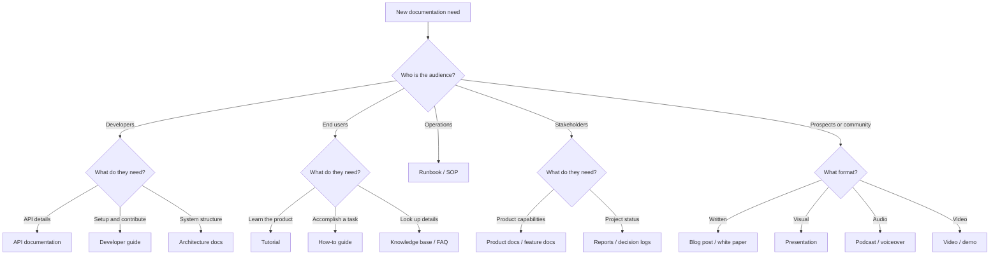

# Documentation and content types (index)

**Purpose:** Index of **documentation and content types** for digital products — technical, user-facing, process, product, content & media, and governance documentation. Each entry summarizes purpose, audience, lifecycle phase, applicable standards, and templates.

**Audience:** Teams using [`../README.md`](../README.md) and [`../DOCUMENTATION.md`](../DOCUMENTATION.md). For the full body of knowledge (principles, standards, certifications, practices), see **[`../DOCUMENTATION.md`](../DOCUMENTATION.md)**.

**Bridge:** [`../DOC-SDLC-PDLC-BRIDGE.md`](../DOC-SDLC-PDLC-BRIDGE.md) — where documentation work lands in PDLC and SDLC.

---

## Why types matter

Different audiences need different documentation forms. A developer consuming an API needs structured reference docs; an end user needs a task-oriented tutorial; a conference attendee needs a compelling presentation; an auditor needs traceable evidence. Mixing these purposes in a single document serves nobody well. Use this index to identify **which** documentation types your project needs; use the type guides and [`../standards/README.md`](../standards/README.md) for **how** to create them.

### Choosing the right type

---

## Type guides

### Technical documentation

| Type | Guide | Audience | Lifecycle phase | Standards |
|------|-------|----------|-----------------|-----------|
| **API documentation** | [`api-documentation.md`](api-documentation.md) | Developers (internal/external) | D Build, F Release | OpenAPI, AsyncAPI, Diátaxis (reference) |
| **System / infrastructure docs** | [DOCUMENTATION.md §2.1](../DOCUMENTATION.md#21-technical-documentation) | Engineers, SREs | C Design, D Build | arc42, C4 |
| **Developer guides** | [DOCUMENTATION.md §2.1](../DOCUMENTATION.md#21-technical-documentation) | Developers, new contributors | D Build (ongoing) | Diátaxis (tutorial + how-to) |
| **Architecture documentation** | [`architecture-documentation.md`](architecture-documentation.md) | Architects, senior engineers | C Design | arc42, C4, ADRs |
| **Code documentation** | [DOCUMENTATION.md §2.1](../DOCUMENTATION.md#21-technical-documentation) | Developers maintaining code | D Build | Language-specific conventions (JSDoc, docstrings, Javadoc) |
| **SDK / library docs** | [DOCUMENTATION.md §2.1](../DOCUMENTATION.md#21-technical-documentation) | Library consumers | D Build, F Release | Diátaxis, API doc tools |

### User-facing documentation

| Type | Guide | Audience | Lifecycle phase | Standards |
|------|-------|----------|-----------------|-----------|
| **User guides** | [DOCUMENTATION.md §2.2](../DOCUMENTATION.md#22-user-facing-documentation) | End users | P4 Launch, P5 Grow | Diátaxis (how-to), Information Mapping |
| **Tutorials** | [DOCUMENTATION.md §2.2](../DOCUMENTATION.md#22-user-facing-documentation) | Beginners | P4 Launch, P5 Grow | Diátaxis (tutorial) |
| **How-to guides** | [DOCUMENTATION.md §2.2](../DOCUMENTATION.md#22-user-facing-documentation) | Experienced users | P5 Grow | Diátaxis (how-to) |
| **FAQs** | [DOCUMENTATION.md §2.2](../DOCUMENTATION.md#22-user-facing-documentation) | All users | P4 Launch, P5 Grow | Schema.org FAQPage |
| **Knowledge bases** | [DOCUMENTATION.md §2.2](../DOCUMENTATION.md#22-user-facing-documentation) | All users, support | P5 Grow | IA best practices |
| **Release notes / changelogs** | [`release-notes.md`](release-notes.md) | Users, stakeholders | F Release | Keep a Changelog convention |
| **Interactive documentation** | [DOCUMENTATION.md §2.2](../DOCUMENTATION.md#22-user-facing-documentation) | Developers, evaluators | P4 Launch | — |

### Process documentation

| Type | Guide | Audience | Lifecycle phase | Standards |
|------|-------|----------|-----------------|-----------|
| **Runbooks** | [`runbooks.md`](runbooks.md) | SREs, on-call engineers | D Build, P5 Grow | SRE practices |
| **SOPs** | [DOCUMENTATION.md §2.3](../DOCUMENTATION.md#23-process-documentation) | Operations, compliance | All phases | ISO 9001, Information Mapping |
| **Playbooks** | [DOCUMENTATION.md §2.3](../DOCUMENTATION.md#23-process-documentation) | Cross-functional teams | P4 Launch, P5 Grow | — |
| **Post-mortems** | [DOCUMENTATION.md §2.3](../DOCUMENTATION.md#23-process-documentation) | Engineering, management | P5 Grow | Blameless post-mortem format |
| **Onboarding guides** | [DOCUMENTATION.md §2.3](../DOCUMENTATION.md#23-process-documentation) | New hires | Ongoing | — |
| **Decision logs** | [DOCUMENTATION.md §2.3](../DOCUMENTATION.md#23-process-documentation) | Team leads, architects | A–F | ADR format |

### Product documentation

| Type | Guide | Audience | Lifecycle phase | Standards |
|------|-------|----------|-----------------|-----------|
| **Product specifications** | [DOCUMENTATION.md §2.4](../DOCUMENTATION.md#24-product-documentation) | Product trio, engineering | A Discover, B Specify | — |
| **Feature documentation** | [DOCUMENTATION.md §2.4](../DOCUMENTATION.md#24-product-documentation) | Users, support, sales | P4 Launch | Diátaxis (reference) |
| **Journey maps** | [DOCUMENTATION.md §2.4](../DOCUMENTATION.md#24-product-documentation) | UX, product, engineering | P1 Discover, B Specify | — |
| **Data dictionaries** | [DOCUMENTATION.md §2.4](../DOCUMENTATION.md#24-product-documentation) | Data engineers, analysts | B Specify, C Design | DMBOK |
| **Capability docs** | [DOCUMENTATION.md §2.4](../DOCUMENTATION.md#24-product-documentation) | Stakeholders, sales | P3 Strategize | — |

### Content and media

| Type | Guide | Audience | Lifecycle phase | Standards |
|------|-------|----------|-----------------|-----------|
| **Websites / landing pages** | [`websites-landing-pages.md`](websites-landing-pages.md) | Prospects, users | P4 Launch, P5 Grow | WCAG, SEO best practices |
| **Blog posts** | [`blog-posts.md`](blog-posts.md) | Community, users, prospects | P4 Launch, P5 Grow | SEO, style guide |
| **Presentations / slide decks** | [`presentations.md`](presentations.md) | Stakeholders, conference attendees | All phases | Visual communication principles |
| **Podcasts / audio** | [`podcasts-audio.md`](podcasts-audio.md) | Community, users | P5 Grow | Audio accessibility (transcripts) |
| **Voiceovers / narration** | [`voiceovers.md`](voiceovers.md) | Users, learners | P4 Launch, P5 Grow | Audio accessibility (transcripts) |
| **Video scripts** | [`video-scripts.md`](video-scripts.md) | Users, prospects | P4 Launch, P5 Grow | Captions, accessibility |
| **Newsletters** | [DOCUMENTATION.md §2.5](../DOCUMENTATION.md#25-content-and-media) | Users, community | P5 Grow | CAN-SPAM, GDPR consent |
| **Social media content** | [DOCUMENTATION.md §2.5](../DOCUMENTATION.md#25-content-and-media) | Community, prospects | P4 Launch, P5 Grow | Platform guidelines |
| **White papers / case studies** | [DOCUMENTATION.md §2.5](../DOCUMENTATION.md#25-content-and-media) | Decision-makers, enterprise buyers | P3 Strategize, P5 Grow | — |

### Governance and compliance documentation

| Type | Guide | Audience | Lifecycle phase | Standards |
|------|-------|----------|-----------------|-----------|
| **Policy documents** | [DOCUMENTATION.md §2.6](../DOCUMENTATION.md#26-governance-and-compliance-documentation) | All teams, auditors | All phases | ISO 27001, SOC 2 |
| **Audit evidence** | [DOCUMENTATION.md §2.6](../DOCUMENTATION.md#26-governance-and-compliance-documentation) | Auditors, compliance | E Verify, P5 Grow | AICPA TSC, ISO 27001 Annex A |
| **Compliance reports** | [DOCUMENTATION.md §2.6](../DOCUMENTATION.md#26-governance-and-compliance-documentation) | Customers, auditors | F Release, P5 Grow | SOC 2, VPAT/ACR |
| **Privacy notices** | [DOCUMENTATION.md §2.6](../DOCUMENTATION.md#26-governance-and-compliance-documentation) | Users, regulators | P4 Launch | GDPR Art. 13/14, CCPA |
| **Accessibility statements** | [DOCUMENTATION.md §2.6](../DOCUMENTATION.md#26-governance-and-compliance-documentation) | Users, procurement | P4 Launch | W3C model, EN 301 549 |
| **Risk registers** | [DOCUMENTATION.md §2.6](../DOCUMENTATION.md#26-governance-and-compliance-documentation) | Management, auditors | All phases | ISO 31000 |

---

*Keep project-specific documentation in `docs/`, content plans in `docs/product/`, and documentation decisions in `docs/adr/`, not in this file.*
