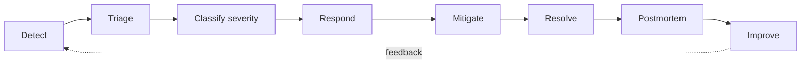
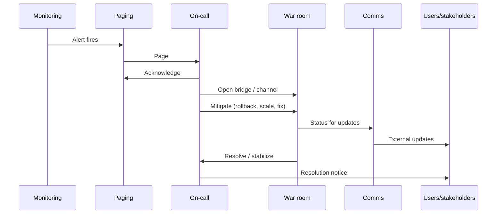

# Incident management & response (blueprint)

**Incident management** is the disciplined process for detecting, responding to, and learning from production-impacting events. Organizational readiness — clear severity, roles, communication, and follow-through — matters as much as tooling. This guide complements observability and SLO practices in [`sre-observability.md`](sre-observability.md) and the cultural framing in [`DEVOPS.md`](../DEVOPS.md).

---

## 1. Overview: lifecycle and readiness

Effective response depends on **preparedness** (runbooks, dashboards, escalation paths) and **learning** (blameless postmortems, tracked actions). Incidents are normal at scale; the system is how you shorten impact and prevent recurrence.

**Lifecycle (simplified):** detect → triage → classify → respond → mitigate → resolve → postmortem → improve.

---

## 2. Severity classification (example framework)

Adjust SLAs to your domain; tables below are **illustrative**.

| Level | Definition | Example response-time target | Communication cadence | Escalation | Example |
|-------|------------|------------------------------|------------------------|------------|---------|
| **SEV1** | Critical user/business impact; service down or major data risk | Minutes | Frequent (e.g. every 15–30 min) | Exec + legal if needed | Payments unavailable globally |
| **SEV2** | Major degradation; significant subset of users | Tens of minutes | Regular (e.g. hourly) | Service owner → manager | Elevated error rate in core API |
| **SEV3** | Moderate impact; workaround exists | Hours | As material changes | On-call → secondary | Slow dashboard; alternate UI path |
| **SEV4** | Minor; cosmetic or internal-only | Best effort | On resolution or daily digest | Team queue | Typo in admin tool |

---

## 3. Incident roles (ICS-inspired)

| Role | Responsibilities during incident |
|------|----------------------------------|
| **Incident Commander (IC)** | Owns overall response; sets priorities; declares severity; coordinates handoff |
| **Communications Lead** | Status page, stakeholders, customer messaging; filters noise from IC |
| **Operations Lead** | Technical mitigation path; delegates tasks; tracks hypothesis and changes |
| **Subject Matter Expert (SME)** | Deep system knowledge; implements fixes; advises on risk |

Small incidents may **collapse roles** onto one person; SEV1 should **explicitly assign** IC and comms.

---

## 4. On-call practices

| Topic | Patterns | Notes |
|-------|----------|-------|
| **Rotation** | Weekly primary/secondary; follow-the-sun for global teams | Secondary handles overflow |
| **Escalation tiers** | L1 → L2 → engineering manager → exec | Document phone vs ticket |
| **Fatigue management** | Max weekly hours; post-incident rest; veto on unsafe pages | Burnout drives attrition and mistakes |
| **Compensation** | Stipend, time off in lieu, or both | Align with labor norms |
| **Tooling** | PagerDuty, Opsgenie, Grafana OnCall — routing, schedules, overrides | Integrate with [`sre-observability.md`](sre-observability.md) alerts |

---

## 5. Communication templates (outline)

| Template | Purpose | Key contents |
|----------|---------|--------------|
| **Initial notification** | Acknowledge and set expectations | Impact, scope, SEV, next update time |
| **Status update** | Transparency during response | Current hypothesis, mitigation, ETA if known |
| **Resolution** | Close the loop | Cause summary (preliminary OK), customer impact duration, follow-up |
| **Postmortem invite** | Schedule learning | Link to doc, attendees, no-blame framing |

---

## 6. Postmortem / retrospective structure

| Section | Intent |
|---------|--------|
| **Summary** | What broke, for whom, how long |
| **Blameless timeline** | Factual sequence; no individual blame |
| **Contributing factors** | Multiple factors (not a single “root cause”) — people, process, tech, external |
| **What went well / poorly** | Honest assessment |
| **Action items** | Owner, due date, tracking link (ticket) |
| **Follow-through** | Review completion in operational forums |

---

## 7. SEV1 response sequence (illustrative)

---

## 8. Chaos engineering integration

| Activity | Goal |
|----------|------|
| **Game days** | Rehearse incident roles and tooling with controlled scenarios |
| **Fault injection** | Validate detection, runbooks, and graceful degradation |
| **Hypothesis-driven experiments** | “If we kill X, latency stays within SLO” — ties to SRE error budgets |

Chaos is **not** random breakage in prod without safeguards; it follows steady-state hypotheses and blast-radius limits (see also [`sre-observability.md`](sre-observability.md)).

---

## 9. Metrics

| Metric | Definition | Use |
|--------|------------|-----|
| **MTTA** | Mean time to **acknowledge** alert | On-call health, routing quality |
| **MTTD** | Mean time to **detect** incident | Monitoring and SLO coverage |
| **MTTR** | Mean time to **resolve** / restore | Operational effectiveness |
| **MTTF** | Mean time between failures | Reliability engineering input |
| **Incidents by severity** | Count over window | Trend risk and investment |
| **Postmortem completion rate** | % incidents with closed actions | Learning culture indicator |

---

## 10. Anti-patterns

| Anti-pattern | Effect |
|--------------|--------|
| **Blame culture** | Hides facts; repeats failures |
| **Hero-dependent response** | Bus factor; inconsistent outcomes |
| **No postmortems** | Same outages recur |
| **Alert fatigue** | Real incidents missed; see observability guide for alert design |

---

## 11. Readiness checklist (before the pager fires)

| Area | Question |
|------|----------|
| **Runbooks** | Is there a first-response doc for top alert types? |
| **Dashboards** | Can on-call see golden signals and deploy correlation in one place? |
| **Ownership** | Is every critical path service mapped to a team and escalation? |
| **Drills** | When did we last run a tabletop or game day? |

---

## 12. External references

| Resource | Notes |
|----------|--------|
| *Incident Management for Operations* — O’Reilly | Process and tooling for ops incidents |
| [PagerDuty incident response guides](https://response.pagerduty.com/) | Practical response patterns |
| *Site Reliability Engineering* (Google) — online book | Incident response and postmortem chapters |

---

*Keep project-specific DevOps configuration in docs/development/CI-CD.md and infrastructure documentation in docs/operations/, not in this file.*
