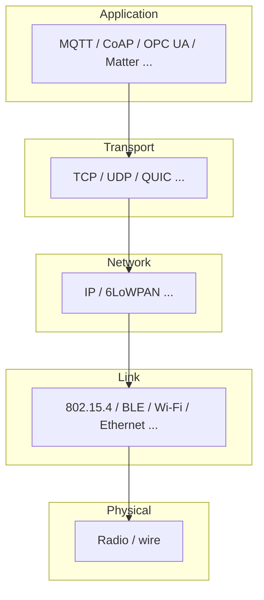

# IoT communication protocols (blueprint)

**Purpose:** Protocol selection guidance and implementation considerations for IoT device communication. Each protocol entry covers its architecture, message format, QoS, security, power profile, and best-fit scenarios.

**Why protocol selection matters:** The application protocol (and its transport) constrains **latency**, **duty cycle**, **security posture**, **NAT behavior**, and **operational cost**. Committing late often forces gateways, duplicate stacks, or non-interoperable silos. Treat protocol choice as an **architecture decision** tied to power budgets, update strategy, and cloud or on-prem integrations — see [`EMBEDDED-IOT.md`](../EMBEDDED-IOT.md) for the embedded/IoT map and [`IOT-SDLC-PDLC-BRIDGE.md`](../IOT-SDLC-PDLC-BRIDGE.md) for lifecycle impact.

**Audience:** Teams adopting [`blueprints/disciplines/engineering/embedded-iot/`](../README.md); project-specific protocol configuration stays in **`docs/development/embedded/protocols/`**.

### Protocol stack (reference layers)

| Protocol | Layer | Focus | Deep dive |
|----------|-------|-------|-----------|
| **MQTT** & **CoAP** | Application | Pub/sub vs REST-like constrained apps — QoS, observe, brokers | [`mqtt-coap.md`](mqtt-coap.md) |
| **BLE** & **Zigbee** | Link + network / app | GATT, mesh, Thread/Matter context, coexistence | [`ble-zigbee.md`](ble-zigbee.md) |
| **LoRaWAN** | Network | LPWAN — spreading factors, ADR, class A/B/C, join procedures, fair-use policy | [EMBEDDED-IOT.md §3](../EMBEDDED-IOT.md#3-communication-protocols) |
| **Modbus** | Application (Serial/TCP) | Industrial — RTU vs TCP, function codes, register mapping, polling vs event | [EMBEDDED-IOT.md §3](../EMBEDDED-IOT.md#3-communication-protocols) |
| **OPC UA** | Application (TCP) | Industrial interoperability — information model, security, pub/sub, companion specifications | [EMBEDDED-IOT.md §3](../EMBEDDED-IOT.md#3-communication-protocols) |
| **CAN bus** | Data link | Automotive/industrial — message arbitration, error handling, CANopen, J1939 | [EMBEDDED-IOT.md §3](../EMBEDDED-IOT.md#3-communication-protocols) |
| **Matter** | Application | Smart home — Thread/Wi-Fi transport, device types, commissioning, multi-admin | (see [`ble-zigbee.md`](ble-zigbee.md)) |

**Core knowledge:** [`EMBEDDED-IOT.md`](../EMBEDDED-IOT.md) — communication protocol overview and selection criteria.

**Bridge:** [`IOT-SDLC-PDLC-BRIDGE.md`](../IOT-SDLC-PDLC-BRIDGE.md) — protocol choices across the lifecycle.

---

*Keep project-specific safety documentation in docs/safety/ and hazard analyses in docs/security/, not in this file.*
