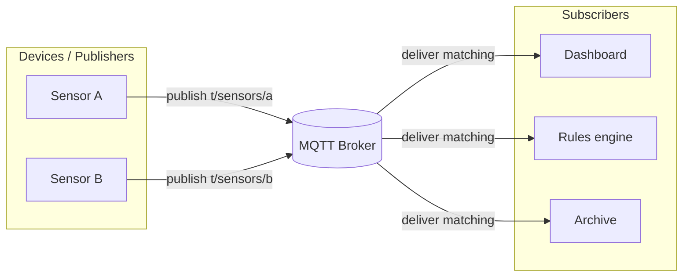
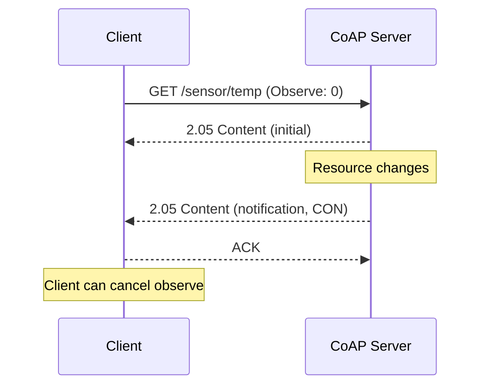

# MQTT & CoAP: Application-Layer IoT Protocols

**Purpose:** Compare the two dominant **application-layer** protocols for IoT — **MQTT** (pub/sub over TCP) and **CoAP** (REST-like over UDP) — so teams can choose transports, QoS, and security patterns that match device constraints and traffic shape.

**Audience:** Teams using [`protocols/README.md`](README.md) and [`EMBEDDED-IOT.md`](../EMBEDDED-IOT.md).

---

## Overview

| Aspect | MQTT | CoAP |
|--------|------|------|
| **Paradigm** | Publish/subscribe via a broker | Request/response (like HTTP), optional observe |
| **Typical transport** | TCP (TLS); MQTT-SN uses UDP | UDP (often DTLS) |
| **Message style** | Topic-based fan-out | Resource URIs (`coap://host/path`) |
| **Sweet spot** | Event telemetry, many subscribers, cloud integration | Constrained nodes, REST semantics, multicast (where supported) |

The protocols are **complementary**: many gateways speak CoAP to devices and MQTT upstream to the cloud.

---

## MQTT deep dive

### Publish/subscribe model

Producers **publish** to **topics**; consumers **subscribe** to topic filters. A **broker** routes messages — clients do not address each other directly. This decouples senders and receivers and simplifies fan-out.

### QoS levels

| QoS | Name | Delivery guarantee | Broker/store behavior | Relative overhead |
|-----|------|-------------------|------------------------|-------------------|
| **0** | At most once | Fire-and-forget; may be lost | No persistence for delivery | Lowest |
| **1** | At least once | Arrives ≥1×; duplicates possible | Store until ACK from subscriber | Medium |
| **2** | Exactly once | Arrives exactly once (handshake) | Four-part handshake, stateful | Highest |

Use **QoS 0** for high-volume telemetry where loss is acceptable; **QoS 1** for commands or state where duplicates can be handled idempotently; reserve **QoS 2** for financial or safety-adjacent messaging where duplicates are unacceptable and cost is justified.

### Topics and wildcards

- Hierarchical paths: `factory/line3/press/temperature`.
- **`+`** single-level wildcard: `factory/+/press/#`.
- **`#`** multi-level (must be last segment).

Plan a **topic taxonomy** early: versioning (`v1/…`), environment (`dev`/`prod`), and ACL boundaries often follow topic prefixes.

### Sessions and broker features

| Feature | Role |
|---------|------|
| **Retained message** | Last message on a topic kept; new subscribers get immediate state (e.g. current setpoint). |
| **Last Will and Testament (LWT)** | Broker publishes a defined message if client disconnects unexpectedly. |
| **Clean session / persistent session** | v3.1.1: clean flag clears state; persistent subscriptions and unacked QoS may be stored. |
| **MQTT v5** | Session expiry, message expiry, shared subscriptions, user properties, reason codes, flow control. |

### MQTT v3.1.1 vs v5 (selected)

| Capability | v3.1.1 | v5 |
|------------|--------|-----|
| **Shared subscriptions** | Not in spec | `$share/group/topic` load-balancing across consumer group |
| **Message expiry** | No | `Message Expiry Interval` — broker can drop stale messages |
| **Response / correlation** | Convention only | `Response Topic`, `Correlation Data` |
| **User properties** | No | Key/value metadata per message |
| **Flow control** | No | `Receive Maximum` limits in-flight QoS > 0 |
| **Reason codes** | Limited | Rich ACK disambiguation (auth, quota, etc.) |

---

## CoAP deep dive

CoAP ([RFC 7252](https://www.rfc-editor.org/rfc/rfc7252.html)) maps **HTTP verbs** onto compact binary messages over **UDP**: `GET`, `POST`, `PUT`, `DELETE` with methods, options, and optional payload.

| Message type | Behavior |
|--------------|----------|
| **CON (Confirmable)** | Reliable-ish: receiver must ACK or reset; retransmission with backoff. |
| **NON (Non-confirmable)** | Best effort; no ACK required. |

### Observe pattern ([RFC 7641](https://www.rfc-editor.org/rfc/rfc7641.html))

Client registers interest; server pushes **notifications** when a resource changes — pub/sub-like semantics on top of request/response.

### Block-wise transfers ([RFC 7959](https://www.rfc-editor.org/rfc/rfc7959.html))

Large payloads split into **blocks** (numbered); supports reliable reassembly on constrained links.

### Security

**DTLS** secures CoAP (`coaps://`). Pre-shared keys, raw public keys, and certificates are common; certificate size and handshake cost matter on Class 0/1 devices.

---

## MQTT vs CoAP comparison matrix

| Dimension | MQTT | CoAP |
|-----------|------|------|
| **Transport** | TCP (typical) | UDP |
| **Paradigm** | Pub/sub | Request/response + observe |
| **Typical message size** | Small to large headers; payload flexible | Very compact headers; ~4 KiB practical ceiling without blocks |
| **Protocol overhead** | CONNECT, keepalive, QoS handshakes | Tiny base; CON retransmits add load |
| **Reliability** | QoS 0–2; TCP ordering | CON + ACK; no native exactly-once |
| **NAT traversal** | Long-lived outbound TCP to broker | UDP NAT issues; may need keepalives / TURN-like patterns |
| **Proxy / caching** | Broker-centric | Proxies in spec; caching similar to HTTP |
| **Security** | TLS on TCP | DTLS on UDP |
| **Power** | Keepalive cost; TLS session | Bursty UDP can be lower duty cycle |
| **Browser** | WebSockets + MQTT in JS | Limited native; gateways common |

### Decision guidance

- **Prefer MQTT** when: events stream to many consumers; cloud MQTT is first-class; you need durable subscriptions and clear topic ACLs; TCP + TLS fits your network.
- **Prefer CoAP** when: devices are **very constrained**; you want **REST** resource semantics; **UDP** and multicast fit the LAN; integration with HTTP proxies matters.

---

## Broker landscape (MQTT)

| Product / service | Deployment | Notes |
|-------------------|------------|--------|
| **Eclipse Mosquitto** | Self-hosted, lightweight | Ubiquitous for dev/small fleets; plug-ins for auth |
| **EMQX** | Self-hosted / cloud | High scale, clustering, rule engine |
| **HiveMQ** | Enterprise / cloud | Strong enterprise MQTT story, MQTT 5 |
| **AWS IoT Core** | Managed cloud | Device registry, rules, jobs; MQTT 3.1.1 & 5 |
| **Azure IoT Hub** | Managed cloud | MQTT device endpoints + AMQP/HTTP for services |

Evaluate: **MQTT 5** support, **multi-tenancy**, **metrics**, **rate limits**, **geo-replication**, and **disaster recovery** (broker **SPOF** mitigation via clustering or failover).

---

## MQTT-SN

**MQTT for Sensor Networks** ([MQTT-SN](https://mqtt.org/mqtt/mqtt-sn/)) adapts MQTT for **non-TCP** transports (UDP, Zigbee, etc.): shorter IDs, gateway to MQTT broker. Use when TCP stacks are too heavy or the radio stack is non-IP.

---

## Security considerations

| Topic | Guidance |
|-------|----------|
| **TLS vs DTLS overhead** | Measure handshake and session resume; use **session tickets** / **PSK** where appropriate |
| **Certificates at scale** | Automated enrollment (EST, CMP), short-lived certs, cloud CA integration |
| **Token auth** | **JWT** or vendor tokens in username/password or custom properties (v5 user properties) |
| **ACLs** | Topic prefix per tenant/device class; principle of least privilege on publish/subscribe |

---

## Anti-patterns

| Anti-pattern | Why it hurts |
|--------------|--------------|
| **QoS 2 everywhere** | Throughput collapse; use only where duplicates are truly unacceptable |
| **Flat or ad hoc topics** | ACL sprawl, naming collisions, impossible governance |
| **Single broker instance in production** | No HA; plan clustering, backup, and observability |

---

## External references

| Resource | URL |
|----------|-----|
| MQTT.org | https://mqtt.org/ |
| OASIS MQTT standard | https://www.oasis-open.org/committees/tc_home.php?wg_abbrev=mqtt |
| RFC 7252 (CoAP) | https://www.rfc-editor.org/rfc/rfc7252.html |
| Eclipse Paho | https://www.eclipse.org/paho/ |
| libcoap | https://libcoap.net/ |

---

*Keep project-specific safety documentation in docs/safety/ and hazard analyses in docs/security/, not in this file.*
