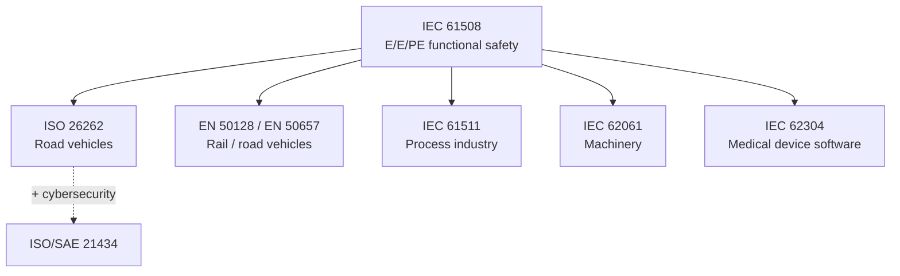

# Safety-critical standards (blueprint)

**Purpose:** Guidance on safety-critical engineering standards and their impact on software development practices. Each standard entry covers scope, safety integrity levels, required activities, and engineering constraints.

**Why functional safety is non-negotiable:** For systems where failure can harm people or the environment, **process and evidence** matter as much as code. Standards such as IEC 61508 and ISO 26262 define **lifecycle activities**, **independence**, and **integrity levels** so claims about risk reduction are **auditable**. Skipping them shifts unbounded liability to the organization and blocks market access in regulated domains. Align blueprint reading with [`EMBEDDED-IOT.md`](../EMBEDDED-IOT.md) for real-time and firmware context, and [`IOT-SDLC-PDLC-BRIDGE.md`](../IOT-SDLC-PDLC-BRIDGE.md) for certification impact on phases.

**Audience:** Teams adopting [`blueprints/disciplines/engineering/embedded-iot/`](../README.md) for safety-critical applications; project-specific safety documentation stays in **`docs/safety/`**.

### Safety standard family (conceptual)

| Standard | Domain | Focus | Deep dive |
|----------|--------|-------|-----------|
| **IEC 61508** | General | Functional safety of E/E/PE safety-related systems — SIL 1–4, V-model, failure modes | [`iec-61508.md`](iec-61508.md) |
| **ISO 26262** | Automotive | Road vehicle functional safety — ASIL A–D, HARA, HSI, FMEA, production | [`iso-26262.md`](iso-26262.md) |
| **DO-178C** | Aerospace | Software considerations in airborne systems — DAL A–E, objectives, verification, tool qualification | [EMBEDDED-IOT.md](../EMBEDDED-IOT.md) |
| **IEC 62304** | Medical devices | Medical device software lifecycle — safety classes A/B/C, risk management integration, maintenance | [EMBEDDED-IOT.md](../EMBEDDED-IOT.md) |
| **MISRA C / C++** | Coding standards | Safe subset of C/C++ for critical systems — rule categories (mandatory, required, advisory), deviation process | [EMBEDDED-IOT.md §2](../EMBEDDED-IOT.md#2-firmware-development) |
| **EN 50128** | Railway | Railway software — SIL allocation, coding standards, formal methods, independent verification | [EMBEDDED-IOT.md](../EMBEDDED-IOT.md) |

**For each standard, guides cover:**
- Scope and applicability criteria
- Safety integrity / assurance levels and their engineering implications
- Required activities by SDLC phase (analysis, design, coding, testing, traceability)
- Tool qualification requirements
- Common pitfalls and practical guidance

**Core knowledge:** [`EMBEDDED-IOT.md`](../EMBEDDED-IOT.md) — real-time systems, firmware development, safety engineering competency.

**Bridge:** [`IOT-SDLC-PDLC-BRIDGE.md`](../IOT-SDLC-PDLC-BRIDGE.md) — safety certification impact on lifecycle phases.

---

*Keep project-specific safety documentation in docs/safety/ and hazard analyses in docs/security/, not in this file.*
