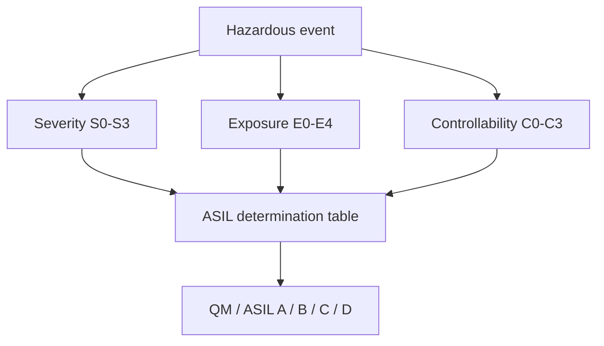
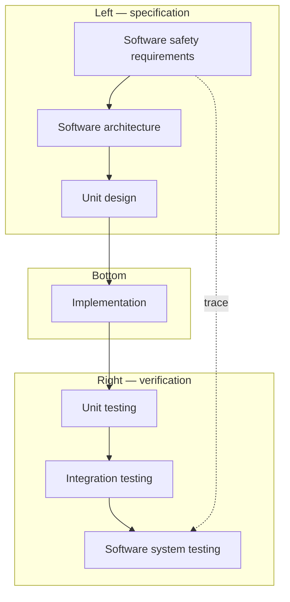

# ISO 26262: Road Vehicles — Functional Safety

**Purpose:** Orient teams to **ISO 26262** — automotive **functional safety** derived from IEC 61508 — covering **ASIL**, lifecycle, software/hardware metrics, and links to **AUTOSAR** and **ISO/SAE 21434**.

**Audience:** Teams using [`safety/README.md`](README.md) and [`EMBEDDED-IOT.md`](../EMBEDDED-IOT.md).

---

## Overview

ISO 26262 applies to **safety-related E/E systems** in series production road vehicles (exclusions include mopeds and some special vehicles — see scope). It defines **management**, **concept**, **product development** (system, hardware, software), **production**, **operation**, and supporting processes with **ASIL-dependent** rigor.

---

## Parts overview (ISO 26262:2018 structure)

| Part | Title (abbrev.) |
|------|-----------------|
| **1** | Vocabulary |
| **2** | Management of functional safety |
| **3** | Concept phase |
| **4** | Product development — system level |
| **5** | Product development — hardware |
| **6** | Product development — software |
| **7** | Production, operation, service, decommission |
| **8** | Supporting processes |
| **9** | ASIL-oriented safety analyses |
| **10** | Guideline (ISO 26262 overview) |
| **11** | Guideline on semiconductors |
| **12** | Adaptation for motorcycles |

---

## ASIL (Automotive Safety Integrity Level)

Derived from **Severity (S)**, **Exposure (E)**, **Controllability (C)** of hazardous events.

| ASIL | Interpretation (informal) | Example classes (illustrative only) |
|------|---------------------------|-------------------------------------|
| **QM** | Quality management; no ASIL | Low S/E/C — manage via QMS |
| **A** | Lowest ASIL | Limited harm, rare exposure, or controllable |
| **B** | Medium | More severe or more frequent scenarios |
| **C** | High | Serious harm, common exposure, harder control |
| **D** | Highest | Life-threatening, common exposure, difficult control |

*Examples are pedagogical — actual rating requires item-specific HARA.*

---

## Concept phase artifacts

| Activity | Key artifacts |
|----------|----------------|
| **Item definition** | Boundaries, interfaces, operating modes |
| **HARA** | Hazards, ASIL, safety goals |
| **Functional safety concept** | Safety requirements, preliminary architecture |

---

## V-model — automotive software (simplified)

**ASIL** increases requirements for **notation**, **methods**, **structural coverage**, **resource estimation**, and **freedom from interference** between partitions.

---

## ASIL decomposition

Split a high-ASIL requirement across **redundant** elements with **sufficient independence** so each carries a **lower ASIL** with claims of **coexistence** (e.g. **ASIL D** → **ASIL B(D)** + **ASIL B(D)** with independence evidence). Requires **dependent failure analysis** to support the claim.

---

## Software development by ASIL (selected techniques)

| Practice | QM / A | B | C | D |
|----------|--------|---|---|---|
| **Coding guidelines (e.g. MISRA C)** | Strongly recommended | Required | Required | Required |
| **Static analysis** | Rec | Rec | Req | Req |
| **Statement coverage** | — | Req | Req | Req |
| **Branch coverage** | — | Rec | Req | Req |
| **MC/DC** | — | — | Rec | Req (context) |
| **Formal verification** | Opt | Opt | Rec | Rec |

*Use Part 6 tables for authoritative “required / highly recommended” lists.*

---

## Hardware metrics (Part 5)

| Metric | Meaning (brief) |
|--------|----------------|
| **SPFM** | Single-point fault metric — coverage of single faults |
| **LFM** | Latent-fault metric — multi-point faults with latent detection |
| **PMHF** | Probabilistic metric for hardware failures (FIT budget) |

Targets vary by **ASIL**; FMEDA and safety manuals from semiconductors feed analysis.

---

## Confirmation measures

| Measure | Role |
|---------|------|
| **Confirmation review** | Work product check |
| **Functional safety audit** | Process vs ISO 26262 |
| **Assessment** | Evidence for functional safety |

**Independence** of assessor/auditor from work product author scales with **ASIL**.

---

## AUTOSAR and ISO 26262

| Platform | Safety relevance |
|----------|------------------|
| **Classic AUTOSAR** | Partitioning, RTE, WdgM, E2E, deterministic BSW configuration |
| **Adaptive AUTOSAR** | POSIX-like processes, service-oriented; safety use cases emerging with OEM-specific patterns |

AUTOSAR does not “certify” your item — it provides **implementable architecture** and libraries that can be argued within a safety case.

---

## ISO 26262 vs IEC 61508

| Aspect | IEC 61508 | ISO 26262 |
|--------|-----------|-----------|
| **Scope** | General E/E/PE | Road vehicles |
| **Levels** | SIL 1–4 | QM, ASIL A–D |
| **Hazard basis** | Generic process | Item + vehicle context |
| **Lifecycle** | Similar V-model | Tailored to automotive supply chain |
| **Hardware metrics** | Route 1H/2H concepts | SPFM, LFM, PMHF |

---

## Cybersecurity integration

**ISO/SAE 21434** (cybersecurity engineering) complements 26262: perform **TARA** (Threat Analysis and Risk Assessment), define cybersecurity goals, and align with safety **when safety depends on security**. Coordinate **CAL** / cybersecurity claims with the safety case.

---

## External references

| Resource | URL / note |
|----------|------------|
| ISO 26262:2018 | https://www.iso.org/standard/68383.html |
| MISRA C:2012 | https://www.misra.org.uk/ |
| AUTOSAR | https://www.autosar.org/ |
| ISO/SAE 21434 | Automotive cybersecurity standard |

---

*Keep project-specific safety documentation in docs/safety/ and hazard analyses in docs/security/, not in this file.*
