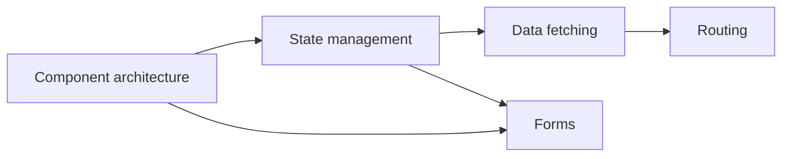

# Frontend patterns (blueprint)

**Purpose:** Deep, **project-agnostic** guides for frontend component, state management, and data-fetching patterns. Each pattern describes its intent, implementation, trade-offs, and testing strategy.

**Audience:** Teams adopting [`blueprints/disciplines/engineering/frontend/`](../README.md); project-specific component documentation stays in **Storybook** and **`docs/development/frontend/`**.

UI pattern thinking means naming recurring structures—composition, state ownership, data flow—so teams can reuse solutions deliberately instead of reinventing ad hoc trees and stores. Start from the **component boundary**, then decide **where state lives**, then **how data crosses the network**; routing and forms sit on top of those choices.

**Core knowledge:** [`FRONTEND.md`](../FRONTEND.md) — component architecture, rendering, state management, CSS.

**Bridge:** [`FE-SDLC-PDLC-BRIDGE.md`](../FE-SDLC-PDLC-BRIDGE.md) — how frontend patterns apply across the lifecycle.

## Deep guides

| Guide | Focus |
|-------|-------|
| [**Component architecture**](component-architecture.md) | Taxonomy, composition APIs, state ownership, design systems, testing, framework comparison |
| [**State management**](state-management.md) | Categories, decision tree, Flux/Redux, library matrix, server cache, machines, forms, URL state |

## Pattern categories (overview)

| Pattern category | Focus |
|-----------------|-------|
| **Component patterns** | Compound components, render delegation, controlled vs uncontrolled, polymorphic components, error boundaries |
| **State management patterns** | State colocation, derived state, optimistic updates, state machines for complex flows |
| **Data fetching patterns** | Cache-and-network, stale-while-revalidate, infinite scroll, polling, real-time subscriptions |
| **Routing patterns** | File-based routing, nested layouts, route-level code splitting, prefetching, auth guards |
| **Form patterns** | Multi-step forms, field-level validation, server-side validation integration, autosave |
| **Error handling patterns** | Error boundaries, toast notifications, retry UI, graceful degradation, offline fallbacks |
| **Internationalization patterns** | ICU message format, locale-aware formatting, RTL layout, translation workflow integration |

---

*Keep project-specific performance budgets in `docs/development/` and optimization decisions in `docs/adr/`, not in this file.*
