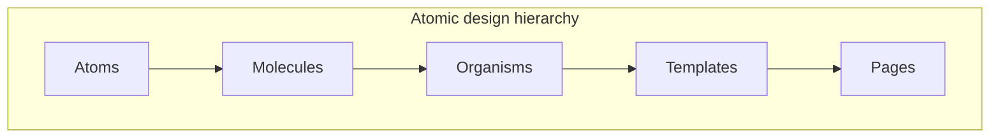
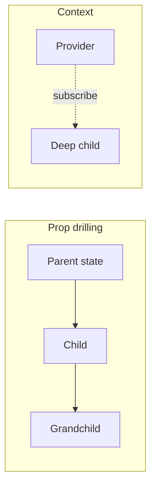

# Component architecture patterns

**Purpose:** Project-agnostic guidance on treating the **component** as the fundamental unit of UI composition: taxonomy, composition APIs, state ownership, design-system integration, testing, and framework comparisons.

**Audience:** Teams aligning with [`FRONTEND.md`](../FRONTEND.md) and [`patterns/README.md`](README.md).

---

## Overview

In modern frontends, a **component** is a reusable boundary that encapsulates markup, behavior, and (optionally) styling. Composition—how components nest and communicate—determines scalability, testability, and design-system fit more than any single framework feature.

---

## Component taxonomy

| Axis | Category | Role | Typical signals |
|------|----------|------|-----------------|
| **Data vs presentation** | **Presentational** | Renders UI from props; minimal logic | No stores, no side effects beyond display |
| | **Container** | Loads data, wires callbacks, passes props | Connects to APIs, router, global state |
| **Behavior** | **Smart** | Knows *how* to fetch/transform/coordinate | Hooks, services, context consumers |
| | **Dumb** | Knows only *what* to render from inputs | Pure render from props/slots |
| **Atomic Design** | **Atom** | Smallest UI unit (button, label, icon) | No business meaning |
| | **Molecule** | Simple group of atoms (search field + button) | Single local concern |
| | **Organism** | Distinct section (header, product card) | May compose molecules and atoms |
| | **Template** | Page-level layout without real content | Structure and regions |
| | **Page** | Template + real data | Route-level instance |

---

## Composition patterns

| Pattern | Example use case | Pros | Cons |
|---------|------------------|------|------|
| **Children / slots** | Layout shell with arbitrary main content | Maximum flexibility; matches platform idioms | Harder to document “allowed” children |
| **Render props** | List that delegates row rendering | Full control at call site | Verbose; nesting can hurt readability |
| **Higher-order components (HOC)** | Inject auth, analytics, or theming | Cross-cutting reuse without changing tree shape | Indirection; display names; ref forwarding |
| **Hooks / composables** | Shared pagination, keyboard shortcuts | Colocated logic; tree stays flat | Rules of hooks; not a visual component API |
| **Compound components** | Tabs, dialogs, menus with coordinated state | Encapsulated implicit state; ergonomic API | Requires clear context/subcomponent docs |

---

## Component API design principles

| Principle | Practice |
|-----------|----------|
| **Props contract** | Prefer small, named props; use discriminated unions for variants; document required vs optional clearly. |
| **Events / callbacks** | Name by user intent (`onSubmit`) not implementation; keep arity stable; avoid leaking raw DOM unless intentional. |
| **Slots / children** | Default slot for primary content; named slots for chrome (header, footer) when the framework supports it. |
| **Defaults** | Sensible defaults reduce configuration; document overrides in Storybook or equivalent. |

---

## State ownership patterns

| Pattern | When | Trade-off |
|---------|------|-----------|
| **Local state** | UI-only ephemeral state (open/closed, draft input) | Simple; invisible to siblings |
| **Lifted state** | Siblings need the same value | Clear data flow; can cause prop drilling |
| **Context / provide-inject** | Many descendants need theme, locale, auth shell | Avoids drilling; easy to overuse |
| **External store** | Cross-cutting app state with clear update rules | Predictable updates; adds global mental model |

---

## Design system integration

| Concern | Guidance |
|---------|----------|
| **Tokens** | Map design tokens (color, space, type) to component props or CSS variables; avoid magic numbers in components. |
| **Theming** | Prefer token-driven themes over one-off overrides; document contrast and modes (light/dark/high-contrast). |
| **Variants** | Encode visual/behavior variants in a small matrix (e.g. `size` × `variant`); avoid boolean prop explosion. |
| **Documentation** | Storybook (or equivalent) for states, a11y notes, and composition examples—not only happy path. |

---

## Testing component architecture

| Layer | Focus | Examples |
|-------|-------|----------|
| **Unit (isolated)** | Props in → render/assert; hooks/composables in isolation | Testing Library, component harness |
| **Integration (composed)** | Parent + children + router/context stubs | User-centric queries, realistic trees |
| **Visual regression** | Pixel/story snapshots for design drift | Chromatic, Percy, Loki |
| **Accessibility** | Roles, labels, keyboard, focus | axe, manual keyboard passes |

---

## Framework comparison (component model)

| Framework | Component shape | Reuse mechanism | Notable traits |
|-----------|-----------------|-----------------|----------------|
| **React** | JSX + function/class components | Hooks, HOCs, render props | Explicit rerenders; large ecosystem |
| **Vue** | SFC + Composition API / Options | Composables, slots | Reactivity built-in; templates optional |
| **Svelte** | `.svelte` files, compiled | Stores, snippets (v5+) | Compile-time optimizations; less runtime |
| **Angular** | Decorators, modules/standalone | DI, directives | Strong structure; enterprise defaults |

---

## Anti-patterns

| Anti-pattern | Why it hurts | Mitigation |
|--------------|--------------|------------|
| **Prop drilling hell** | Every intermediate component knows unrelated props | Context, composition, or colocated state |
| **God components** | One file does data, layout, and business rules | Split container/presentational; extract hooks |
| **Premature abstraction** | Third use case imagined, not observed | Wait for two real call sites; extract then |
| **Breaking composition** | Internal structure exposed or fixed | Stable public API; slots over fixed children |

---

## Server vs client component boundaries

Align public component APIs with **where work runs**. Server-first frameworks (e.g. React Server Components, meta-frameworks) reward components that fetch on the server and pass serializable props to small client islands.

| Boundary | Responsibility | Client bundle impact |
|----------|----------------|----------------------|
| **Server component / island** | Data fetch, heavy markdown, static structure | None or minimal for that subtree |
| **Client component** | Interactivity, browser APIs, subscriptions | Pays parse/hydration cost |

Document which components are safe to import into client trees versus server-only modules.

---

## Accessibility as part of the component API

Treat a11y as **contract**, not polish: consumers should not have to guess labels and keyboard behavior.

| Concern | Component API implication |
|---------|---------------------------|
| **Keyboard** | Document focus order, roving tabindex if used, shortcut conflicts |
| **Focus** | Expose `ref` or focus helpers for dialogs, traps, and return focus |
| **ARIA** | Prefer composition patterns that set `role`, `aria-*`, and labelled-by consistently |
| **Reduced motion** | Respect `prefers-reduced-motion` in motion variants |

---

## External references

- [Atomic Design](https://atomicdesign.bradfrost.com/) — Brad Frost; hierarchy from atoms to pages.
- [Component-Driven Development](https://www.componentdriven.org/) — workflow and culture around building UIs from components.
- [Storybook documentation](https://storybook.js.org/docs) — documenting and testing components in isolation.

---

*Keep project-specific performance budgets in `docs/development/` and optimization decisions in `docs/adr/`, not in this file.*
