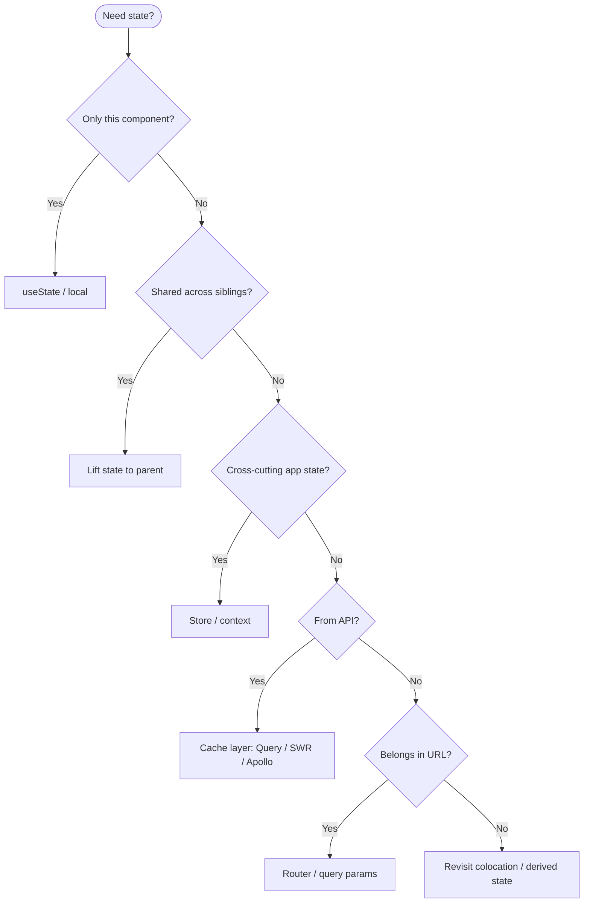
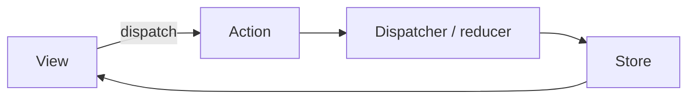
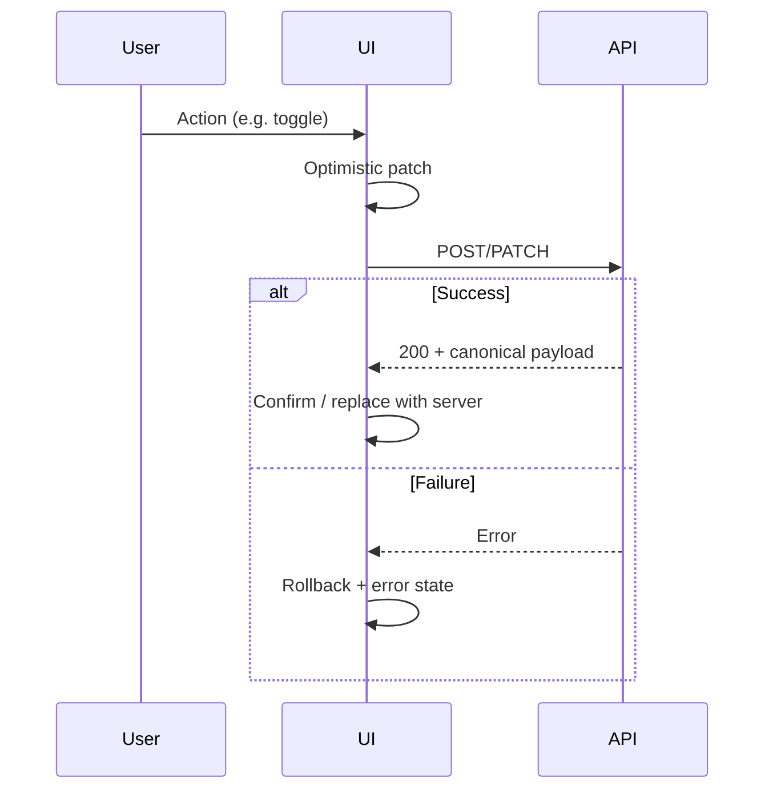
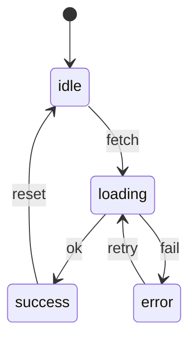

# State management patterns

**Purpose:** Project-agnostic map of **where state lives**, how to choose local vs shared vs server state, and how common libraries and patterns fit together.

**Audience:** Teams aligning with [`FRONTEND.md`](../FRONTEND.md) and [`patterns/README.md`](README.md).

---

## Overview

State management is often the hardest problem in UI development because it couples **correctness** (single source of truth), **performance** (who rerenders when), and **ergonomics** (how easy it is to change behavior). The goal is not one global store—it is **the smallest correct scope** for each piece of data, with clear update paths.

---

## State categories

| Category | Ownership | Lifecycle | Typical home |
|----------|-----------|-----------|--------------|
| **Local / component** | Component instance | Mount → unmount | `useState`, refs, Svelte `$state` |
| **Shared / application** | App or feature module | Session / app lifetime | Context, Pinia, Zustand, Redux |
| **Server / remote** | Backend + client cache | TTL, invalidation, background refresh | TanStack Query, SWR, Apollo |
| **URL / navigation** | Browser + router | Survives refresh; shareable | Route params, query strings |
| **Form** | Form subtree | Until submit or reset | Controlled fields, form libraries |
| **Derived / computed** | Derived from source state | Recomputed on dependency change | Selectors, `useMemo`, computed refs |

**Ownership rule of thumb:** if only one subtree needs it, keep it there; if the server is the authority, treat the client as a cache with a defined invalidation story.

---

## Flux / Redux-style cycle

Unidirectional data flow: actions describe *what happened*; the store holds *state*; views read and dispatch.

**When this shines:** predictable updates, time-travel debugging, large teams needing conventions. **Cost:** ceremony unless you standardize selectors and slice patterns.

---

## Library comparison matrix

| Library | Paradigm | Boilerplate | Devtools | Learning curve | Bundle (rough) |
|---------|----------|-------------|----------|----------------|----------------|
| **Redux** | Explicit actions + reducers | High | Excellent | Medium | Small core + ecosystem |
| **MobX** | Observable / reactive | Low | Good | Medium | Moderate |
| **Zustand** | Minimal store + selectors | Very low | Add-on | Low | Small |
| **Recoil** | Atoms + selectors (React) | Medium | Good | Medium | Moderate |
| **Jotai** | Atomic bottom-up (React) | Low | Add-on | Low–medium | Small |
| **Pinia** | Stores (Vue) | Low | Good (Vue) | Low | Small |
| **NgRx** | Redux-like (Angular) | High | Excellent | Steeper | Larger |
| **Svelte stores** | Writable/readable/derived | Low | Browser | Low | Tiny (framework) |

*Bundle sizes vary by version and tree-shaking—treat as relative guidance.*

---

## Server state management

| Concern | Practice |
|---------|----------|
| **Cache invalidation** | Invalidate by key, tag, or mutation success; prefer stale-while-revalidate for reads. |
| **Optimistic updates** | Update UI immediately; roll back on error; reconcile with server truth. |
| **Background refetch** | Refetch on focus, reconnect, or interval for data that goes stale. |
| **Deduplication** | Same key in flight should share one request. |

| Library | Strength |
|---------|----------|
| **TanStack Query** | Normalized patterns, mutations, devtools |
| **SWR** | Simple API, Vercel ecosystem |
| **Apollo Client** | GraphQL cache, normalized entities |

---

## State machines and statecharts

Finite states reduce impossible UI combinations (e.g. loading + error + success at once). **XState** and similar libraries model **states**, **events**, and **guards** explicitly—ideal for wizards, checkout, and async workflows with retries.

| Signal to use a machine | Example |
|-------------------------|---------|
| Mutually exclusive phases | Upload: selecting → uploading → done |
| Retries and backoff | Payment submission |
| Parallel regions | Editor with autosave + collaboration |

---

## Form state

| Style | Description | Trade-off |
|-------|-------------|-----------|
| **Controlled** | Value from state; every keystroke updates | Predictable; more rerenders if not batched |
| **Uncontrolled** | DOM holds value; read on submit | Less React/Vue churn; harder cross-field rules |

| Library | Ecosystem | Notes |
|---------|-----------|-------|
| **React Hook Form** | React | Uncontrolled-friendly; low rerenders |
| **Formik** | React | Controlled; familiar API |
| **VeeValidate** | Vue | Schema + composition integration |
| **Angular Reactive Forms** | Angular | Strong typing with typed forms |

---

## URL as state

| Pattern | Use when |
|---------|----------|
| **Route params** | Identity of resource (`/users/:id`) |
| **Query params** | Filters, sort, pagination, shareable views |
| **Deep linking** | Restore full UI from URL; document which keys are stable |

**Caveat:** sensitive data does not belong in query strings; prefer server session or secure storage patterns per product requirements.

---

## Anti-patterns

| Anti-pattern | Problem | Prefer |
|--------------|---------|--------|
| **Global state for everything** | Coupling; hard testing; unnecessary subscriptions | Colocate; server cache for remote data |
| **Global store to avoid drilling** | Hides data flow; same as above | Lift, composition, or narrow context |
| **Stale closures** | Handlers see old state in async/effects | Correct dependency arrays; functional updates |
| **Unnecessary rerenders** | Wide subscriptions, unstable object identities | Selectors, memoization, split stores |
| **Duplicated server truth** | Two caches disagree | Single query layer; derive view state |

---

## External references

- [TkDodo — Practical React Query](https://tkdodo.eu/blog/practical-react-query) — server state, caching, and mental model.
- [XState documentation](https://stately.ai/docs) — state machines and statecharts.
- [Redux Style Guide](https://redux.js.org/style-guide/) — patterns and priorities for Redux-style apps.

---

*Keep project-specific performance budgets in `docs/development/` and optimization decisions in `docs/adr/`, not in this file.*
