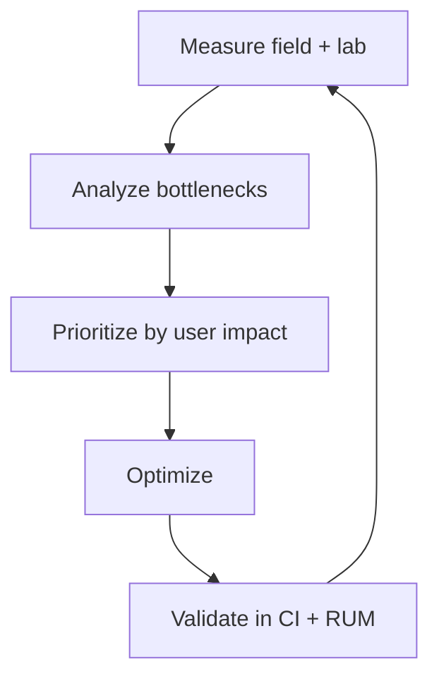

# Frontend performance (blueprint)

**Purpose:** Deep, **project-agnostic** guidance for web performance optimization. Covers measurement, analysis, and optimization strategies tied to Core Web Vitals and user experience.

**Audience:** Teams adopting [`blueprints/disciplines/engineering/frontend/`](../README.md); project-specific performance budgets and reports stay in **`docs/development/frontend/performance/`**.

Performance is **user experience**: latency, stability, and loading behavior shape trust, task completion, and accessibility. These blueprints separate **how to think** about metrics and optimization from **where this repo records** concrete budgets and regressions.

**Core knowledge:** [`FRONTEND.md`](../FRONTEND.md) — web performance fundamentals, rendering strategies.

**Bridge:** [`FE-SDLC-PDLC-BRIDGE.md`](../FE-SDLC-PDLC-BRIDGE.md) — where performance work fits in the lifecycle.

## Deep guides

| Guide | Focus |
|-------|-------|
| [**Core Web Vitals and metrics**](web-vitals.md) | LCP, INP, CLS, related lab metrics, optimization tables, tooling, budgets, framework notes |
| [**Optimization strategies**](optimization-strategies.md) | Loading, rendering, images, JS, caching layers, CSS/fonts, network, monitoring, anti-patterns |

## Topic map (overview)

| Topic | Focus |
|-------|-------|
| **Core Web Vitals** | LCP, INP, CLS — measurement, diagnosis, optimization strategies |
| **Bundle optimization** | Code splitting, tree shaking, dynamic imports, dependency audit, compression |
| **Image and media** | Format selection (WebP, AVIF), responsive images, lazy loading, CDN transforms |
| **Font optimization** | `font-display` strategies, subsetting, preloading, self-hosting vs CDN |
| **Caching strategies** | Cache-Control, CDN configuration, service worker caching, stale-while-revalidate |
| **Rendering performance** | Main-thread optimization, virtual scrolling, Web Workers, `requestIdleCallback` |
| **Performance budgets** | Setting, enforcing, and evolving budgets; Lighthouse CI integration |
| **Real User Monitoring (RUM)** | Collecting field data; correlating performance with business metrics |

---

*Keep project-specific performance budgets in `docs/development/` and optimization decisions in `docs/adr/`, not in this file.*
