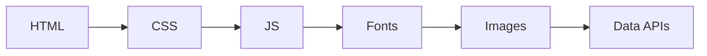
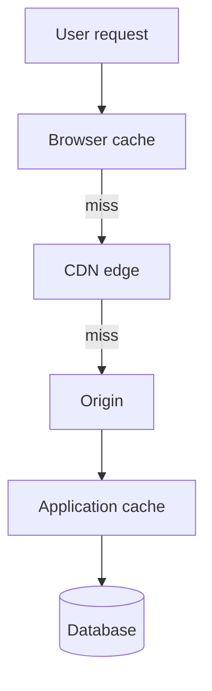

# Frontend optimization strategies

**Purpose:** Systematic, **project-agnostic** catalog of loading, rendering, asset, cache, and network optimizations—with workflow, tooling, and anti-patterns.

**Audience:** Teams aligning with [`FRONTEND.md`](../FRONTEND.md) and [`performance/README.md`](README.md).

---

## Overview

Treat optimization as a **closed loop**: measure, find the bottleneck, change one thing, validate, then monitor. Random micro-optimizations without profiling often waste effort and complicate code. Pair lab tools (Lighthouse, DevTools) with field data (RUM, CrUX) when you can.

---

## Loading optimization

| Technique | What it does | When it helps |
|-----------|--------------|---------------|
| **Code splitting** | Separate bundles per route/feature | Large apps; unused code off critical path |
| **Tree shaking** | Drop unused exports at build | Libraries with side-effect-free ESM |
| **Lazy loading** | Load modules/components on demand | Below-fold routes, heavy widgets |
| **Preload / prefetch** | Hint browser to fetch early | Next route, critical fonts, hero assets |
| **Compression** | gzip/Brotli for text assets | HTML, JS, CSS, SVG |
| **HTTP/2** | Multiplexing over one connection | Many small assets |
| **HTTP/3 / QUIC** | UDP-based; better loss recovery | High-latency or lossy networks |

*Real waterfalls parallelize per HTTP/2/3—this is a logical dependency sketch.*

---

## Rendering optimization

| Topic | Guidance |
|-------|----------|
| **Virtual DOM** | Batch updates; profile—diff cost still exists on large trees |
| **Repaint vs reflow** | Reflow reads layout; avoid forced sync layout in loops |
| **CSS containment** | `contain: layout paint` isolates subtree work |
| **content-visibility** | Skip rendering off-screen subtrees (with care for scroll height) |
| **will-change** | Hint GPU layers sparingly; remove when done |
| **requestAnimationFrame** | Align visual updates to frames; avoid layout reads in rAF storms |

| Trigger | Typical reflow cost |
|---------|---------------------|
| Geometry reads (`offsetWidth`, `getBoundingClientRect`) after writes | High—forces layout |
| Changing `width`, `top`, `font-size` on many nodes | High |
| `transform` / `opacity` | Lower—often compositor-friendly |

---

## Image optimization matrix

| Dimension | Options |
|-----------|---------|
| **Format** | WebP/AVIF for photos; SVG for icons/simple shapes; JPEG fallback strategy where needed |
| **Loading** | `loading="lazy"` below fold; `eager` + `fetchpriority="high"` for LCP candidate |
| **Sizing** | `srcset`, `sizes`, `<picture>` for art direction |
| **CDN** | On-the-fly resize/format negotiation; cache keys per variant |

| Scenario | Recommendation |
|----------|------------------|
| Hero photo | AVIF/WebP + explicit dimensions + preload only if LCP |
| Icons | SVG sprite or icon font with subsetting |
| User avatars | Small fixed sizes; CDN transforms |

---

## JavaScript optimization

| Technique | Notes |
|-----------|-------|
| **Bundle analysis** | `webpack-bundle-analyzer`, Rollup/Vite visualizers—find duplicates and heavy deps |
| **Dynamic import** | `import()` for routes and heavy optional features |
| **Web Workers** | Parse, crypto, big transforms off main thread |
| **SharedArrayBuffer** | Shared memory; strict cross-origin isolation requirements |
| **WebAssembly** | Compute-heavy kernels (codecs, simulations) |

**Profiling first:** use Performance panel long-task markers before rewriting hot paths.

---

## Caching strategy

| Layer | Mechanism | Invalidation |
|-------|-----------|--------------|
| **Browser** | `Cache-Control`, `ETag`, `Last-Modified` | Versioned filenames; short `max-age` + immutable for hashed assets |
| **Service worker** | Precache + runtime caches | Versioned SW; skip waiting; cleanup old caches |
| **CDN** | Edge TTL, stale-while-revalidate | Purge API; cache keys |
| **Application** | In-memory + HTTP cache (TanStack Query, etc.) | Keys, TTL, mutation invalidation |

**Stale-while-revalidate:** serve stale at edge while refreshing in background—good for read-heavy public content with clear freshness rules.

---

## CSS optimization

| Concern | Approach |
|---------|----------|
| **Critical CSS** | Inline critical path; defer rest |
| **CSS-in-JS** | Runtime cost—prefer zero-runtime or extracted CSS at scale |
| **Containment / layers** | Reduce scope of style recalc |
| **Cascade layers** | Order and override control without specificity wars |

---

## Font optimization

| Practice | Detail |
|----------|--------|
| **Subsetting** | Ship only glyphs needed per script |
| **Preload** | Critical WOFF2 only; avoid preload storms |
| **font-display** | `swap` / `optional` trade FOIT vs CLS |
| **Variable fonts** | One file, many axes—smaller than many static files when used well |
| **System stack** | Fastest first paint for low-brand-risk UI |

---

## Network optimization

| Topic | Guidance |
|-------|----------|
| **API responses** | Smaller payloads; field selection; compression |
| **GraphQL** | Avoid over-fetching; batching; persisted queries |
| **Pagination / virtualization** | Limit rows rendered and transferred |
| **WebSocket** | Real-time with less polling overhead when appropriate |

---

## Monitoring and alerting

| Activity | Tooling |
|----------|---------|
| **RUM** | Vendor or open SDK; sample rate; P75/P95 |
| **CI regression** | Lighthouse CI, bundle size gates |
| **Alerts** | Thresholds on field CWV or proxy metrics |

Document who owns triage when budgets fail (frontend platform vs feature teams).

---

## Anti-patterns

| Anti-pattern | Risk |
|--------------|------|
| **Premature optimization** | Complexity before profiling |
| **Over-splitting** | Too many tiny chunks → request overhead |
| **Render-blocking** | CSS/JS in head without strategy |
| **Layout thrashing** | Read/write layout interleaved in loops |
| **Cache without policy** | Stale UI or unbounded growth in SW |

---

## External references

- [web.dev — Performance](https://web.dev/performance) — guides and patterns.
- [Chrome DevTools — Performance panel](https://developer.chrome.com/docs/devtools/performance) — deep dives.
- [Webpack — build performance](https://webpack.js.org/guides/build-performance/) / [Vite — performance](https://vitejs.dev/guide/performance.html) — bundler-specific optimization docs.

---

*Keep project-specific performance budgets in `docs/development/` and optimization decisions in `docs/adr/`, not in this file.*
