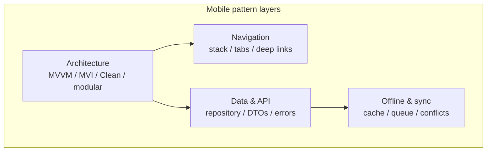

# Mobile patterns (blueprint)

**Purpose:** Deep, **project-agnostic** guides for mobile-specific patterns. Each pattern describes its intent, platform considerations, implementation approaches, and testing.

**Audience:** Teams adopting [`blueprints/disciplines/engineering/mobile/`](../README.md); project-specific mobile architecture stays in **`docs/development/mobile/`**.

Mobile patterns sit at the intersection of **threading and lifecycle** (main-thread UI, process death), **navigation graphs** (deep links, restoration), and **data contracts** (offline queues, sync). Treat patterns as a **stack**: pick an **architecture** first, then align **navigation**, **data/API boundaries**, and **offline** behavior so they compose without leaking concerns across layers.

## Pattern guides

| Guide | Focus |
|-------|-------|
| [**Mobile application architecture**](mobile-architecture.md) | MVC–Clean–TCA comparison, MVVM and Clean diagrams, navigation table, DI, modularization, API/data layers, testing, anti-patterns |
| [**Offline-first mobile patterns**](offline-first.md) | Connectivity states, local storage, sync strategies, conflict resolution, queues, caching, background sync, UX, testing, anti-patterns |

## Pattern categories (topic index)

| Pattern category | Focus |
|-----------------|-------|
| **Navigation patterns** | Stack, tab, drawer, modal; coordinator/router pattern; deep link routing; state restoration |
| **Push notification patterns** | Token lifecycle, channel management, rich notifications, silent push, deep link from notification |
| **Deep linking patterns** | Universal Links / App Links, deferred deep links, attribution, navigation resolution |
| **Background processing** | Background tasks, WorkManager/BGTaskScheduler, geofencing, silent push triggers |
| **Authentication patterns** | Biometric auth, secure token storage, session management, single sign-on |
| **Data sync patterns** | Incremental sync, full sync, delta sync, pagination, cursor-based sync |

Architecture, navigation, data, and offline guidance are expanded in the two guides above; the rows in this table remain a **roadmap** for additional deep-dive documents.

**Core knowledge:** [`MOBILE.md`](../MOBILE.md) — platform strategy, architecture summary, app lifecycle, performance, and app store concerns.

**Bridge:** [`MOB-SDLC-PDLC-BRIDGE.md`](../MOB-SDLC-PDLC-BRIDGE.md) — how mobile patterns apply across the lifecycle.

---

*Keep project-specific mobile architecture decisions in docs/adr/ and platform documentation in docs/development/, not in this file.*
