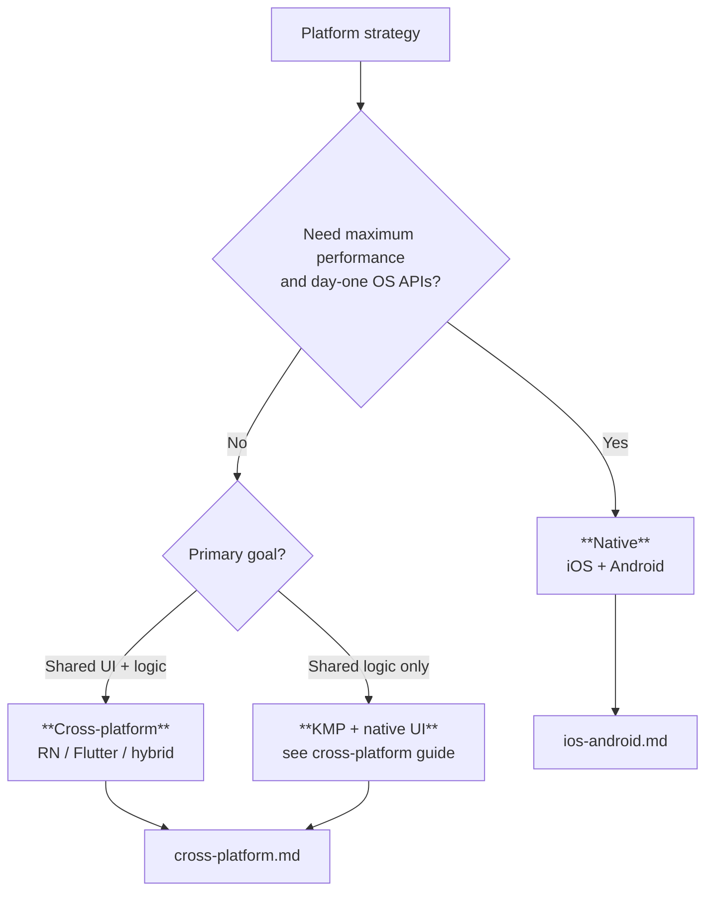

# Mobile platforms (blueprint)

**Purpose:** Platform-specific guidance for mobile development. Each platform guide covers setup, architecture conventions, tooling, and ecosystem-specific best practices.

**Audience:** Teams adopting [`blueprints/disciplines/engineering/mobile/`](../README.md); project-specific platform configuration stays in **`docs/development/mobile/`**.

**Platform strategy** is a product and staffing decision, not only a technical one: native stacks optimize **fidelity and OS access**; cross-platform stacks optimize **shared velocity** at the cost of integration depth and occasional framework lag. Use the guides below to align engineering leads, mobile chapter leads, and architects before locking choices in ADRs.

## Platform guides

| Guide | Focus |
|-------|-------|
| [**Native iOS and Android**](ios-android.md) | Swift/Kotlin, SwiftUI/Compose vs UIKit/Views, security, lifecycle state diagrams, distribution, HIG vs Material, profiling |
| [**Cross-platform mobile**](cross-platform.md) | RN / Flutter / KMP / hybrid / PWA taxonomy, decision flowchart, framework deep dives, comparison matrix, testing and migration |

## Platform stacks (topic index)

| Platform | Focus |
|----------|-------|
| **iOS / Swift** | SwiftUI vs UIKit, Combine/async-await, Swift Package Manager, Xcode configuration, App Clips, Widgets |
| **Android / Kotlin** | Jetpack Compose vs XML Views, Kotlin coroutines/Flow, Gradle, Android App Bundle, Instant Apps |
| **React Native** | New Architecture (Fabric, TurboModules), Metro bundler, native module bridging, Expo, CodePush |
| **Flutter** | Widget tree, Dart isolates, platform channels, Impeller renderer, Dart packages |
| **Kotlin Multiplatform (KMP)** | Shared module structure, expect/actual, Compose Multiplatform, Kotlin/Native interop |

Native and cross-platform dimensions are expanded in the two guides above; this table remains a **quick map** of ecosystem topics.

**Core knowledge:** [`MOBILE.md`](../MOBILE.md) — platform strategy decision framework, architecture patterns, lifecycle, and performance.

**Bridge:** [`MOB-SDLC-PDLC-BRIDGE.md`](../MOB-SDLC-PDLC-BRIDGE.md) — how platform choices affect the lifecycle.

---

*Keep project-specific mobile architecture decisions in docs/adr/ and platform documentation in docs/development/, not in this file.*
