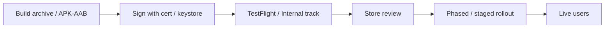
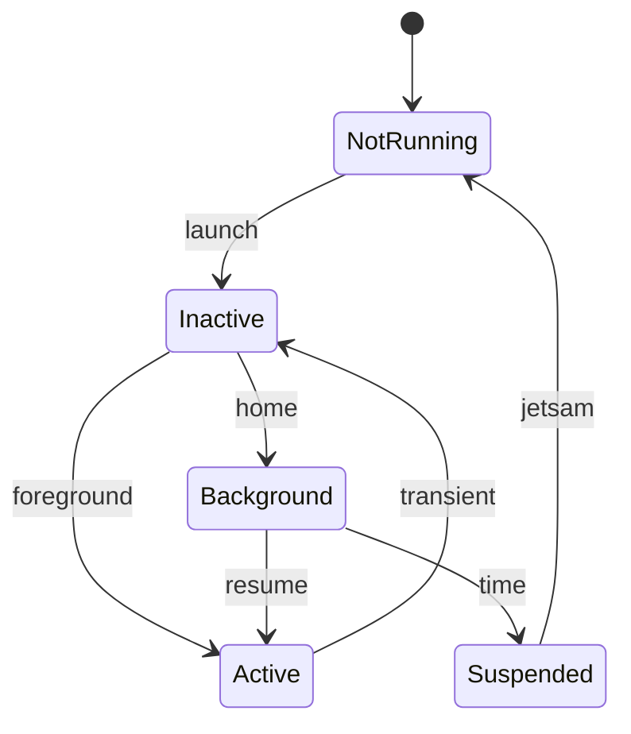
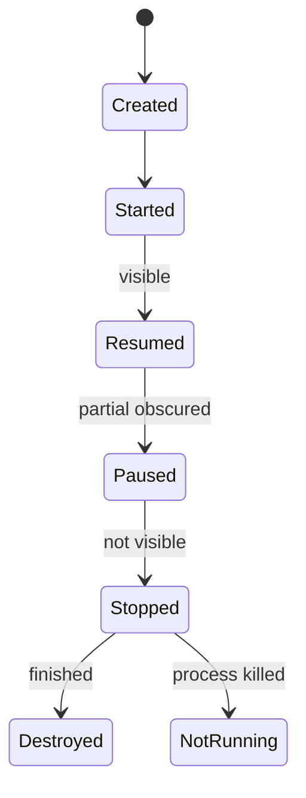

# Native iOS and Android development (blueprint)

**Purpose:** High-level comparison of **native** mobile stacks — languages, UI frameworks, architecture norms, security, lifecycle, distribution, and profiling. Use for staffing, platform strategy, and onboarding; project setup lives in repo docs.

**Audience:** Teams adopting [`blueprints/disciplines/engineering/mobile/`](../README.md). Strategy context: [`MOBILE.md`](../MOBILE.md).

---

## Overview

Native development targets **one platform** with first-class APIs and tooling. You trade **duplicate codebases** for **maximum performance**, **immediate OS feature access**, and **platform-native UX**. This guide contrasts iOS and Android along dimensions that affect architecture and delivery.

---

## Platform comparison matrix

| Dimension | iOS | Android |
|-----------|-----|---------|
| **Language** | Swift (Objective-C legacy) | Kotlin (Java interop) |
| **Declarative UI** | SwiftUI | Jetpack Compose |
| **Imperative UI** | UIKit | XML Views / View system |
| **Architecture norms** | MVVM, TCA, Coordinator | AAC + MVVM, MVI, Clean |
| **Reactive / async** | Combine, async/await, Swift concurrency | Coroutines, Flow, Rx (legacy) |
| **Unit / UI test** | XCTest, XCUITest | JUnit, Espresso, Compose UI tests |
| **CI/CD** | Xcode Cloud, Fastlane, Bitrise | Gradle, Fastlane, GitHub Actions |
| **Distribution** | App Store | Google Play |
| **Fragmentation** | Few OS versions/devices to target | Wide OEM/OS matrix |

---

## iOS ecosystem (selected)

| Technology | Role |
|------------|------|
| **SwiftUI** | Declarative UI, state, navigation |
| **UIKit** | Mature imperative UI, interop with SwiftUI |
| **Combine** | Reactive streams (bridging to async) |
| **async/await** | Structured concurrency for networking and UI |
| **Core Data / SwiftData** | Persistence frameworks |
| **Keychain** | Secure credential storage |
| **App Clips** | Lightweight on-demand app slice |
| **Widgets / Live Activities** | Home screen and Dynamic Island surfaces |

---

## Android ecosystem (selected)

| Technology | Role |
|------------|------|
| **Jetpack Compose** | Declarative UI |
| **Views** | XML + ViewBinding; interop with Compose |
| **Coroutines / Flow** | Async and cold/hot streams |
| **Room** | SQLite abstraction |
| **DataStore** | Typed preferences replacement |
| **WorkManager** | Deferrable guaranteed background work |
| **App Bundles** | Dynamic delivery, size optimization |
| **Instant Apps** | Try without full install (where supported) |
| **Widgets** | Glance / RemoteViews app surfaces |

---

## Build, sign, distribute lifecycle

---

## UI framework evolution

| Aspect | Imperative (UIKit / Views) | Declarative (SwiftUI / Compose) |
|--------|----------------------------|----------------------------------|
| **State** | Manual sync to views | State drives UI |
| **Reuse** | Inheritance, composition | Composable functions / views |
| **Learning** | Long history, many patterns | Steeper for complex custom UI |
| **Interop** | N/A | `UIViewRepresentable`, `AndroidView` |

---

## Platform-specific security

| Concern | iOS | Android |
|---------|-----|---------|
| **Secure storage** | Keychain | Keystore / EncryptedSharedPreferences |
| **Biometrics** | Face ID / Touch ID (`LocalAuthentication`) | `BiometricPrompt` |
| **TLS pinning** | `URLSession` delegate / Alamofire | OkHttp `CertificatePinner` |
| **Obfuscation** | Bitcode deprecated; strip symbols | R8 / ProGuard |

---

## App lifecycle (conceptual)

**iOS — scene / app states:**

**Android — activity / process:**

Handle **process death** on Android and **suspension** on iOS — persist navigation and form state.

---

## Distribution comparison

| Topic | App Store | Google Play |
|-------|-----------|-------------|
| **Review** | Human review; variable time | Automated + policy; generally faster |
| **Guidelines** | Strict on payments, metadata, privacy | Policy on permissions, deceptive behavior |
| **Rollout** | Phased release (7-day typical) | Staged rollout by percentage |
| **Metadata** | Screenshots per device class | Similar; localized listings |

---

## Design guidelines

| Topic | Apple | Google |
|-------|-------|--------|
| **System** | Human Interface Guidelines | Material Design 3 |
| **Navigation** | Tab bar, large titles, back swipe | Predictive back, bottom bar |
| **Motion** | Subtle, purposeful | Emphasis on shared axis transitions |
| **Theming** | Semantic colors, Dynamic Type | Material color roles, shape |

---

## Performance profiling

| Goal | iOS | Android |
|------|-----|---------|
| **CPU / time** | Instruments (Time Profiler) | Android Studio Profiler (CPU) |
| **Memory** | Leaks, allocations | Memory Profiler, Heap Dump |
| **GPU / UI** | Core Animation, SwiftUI instruments | GPU rendering, Layout Inspector |
| **Energy** | Energy Impact gauge | Battery Profiler |

Measure **startup**, **frame time**, **memory peaks**, and **network** on **low-end reference devices**.

---

## External references

| Resource | URL |
|----------|-----|
| Apple Developer | https://developer.apple.com/ |
| Android Developers | https://developer.android.com/ |
| Swift | https://www.swift.org/ |
| Kotlin | https://kotlinlang.org/ |

---

*Keep project-specific mobile architecture decisions in docs/adr/ and platform documentation in docs/development/, not in this file.*
