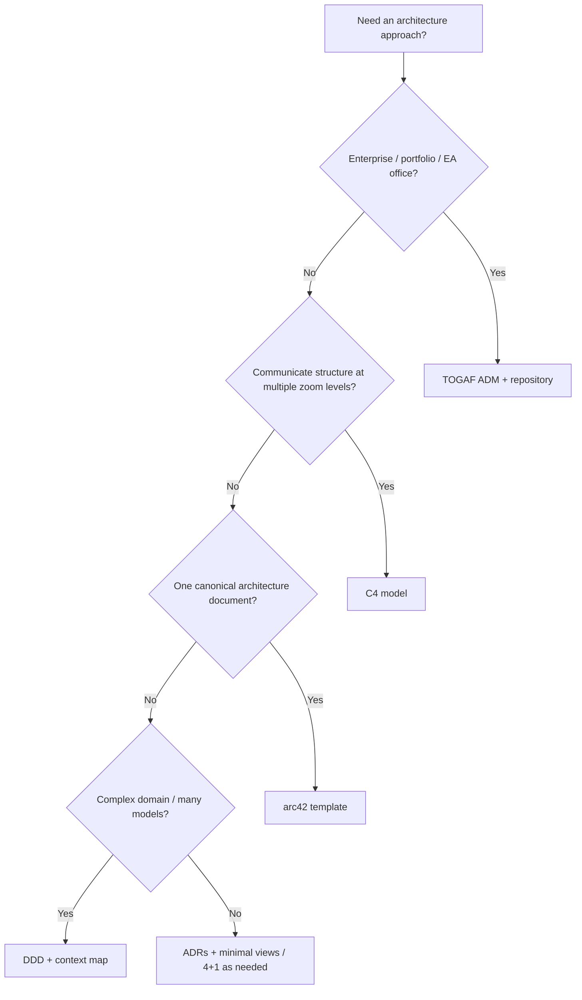

# Architecture approaches (blueprint)

**Purpose:** Deeper, **project-agnostic** guides for architecture documentation and reasoning approaches. Each approach describes its structure, when to use it, and how it maps to the lifecycle.

**Why approach selection matters:** The right framing cuts wasted debate, matches artifacts to audience, and keeps documentation proportional to risk. Enterprise portfolios and single-product teams rarely need the same package; using a heavy enterprise method without delivery-facing diagrams—or only C4 without decision traceability—creates gaps. Pick one **primary** approach (or a **deliberate combo**, e.g. arc42 + C4 + ADRs) so every diagram and section has an owner, refresh trigger, and reader.

**Audience:** Teams adopting [`blueprints/disciplines/engineering/software-architecture/`](../README.md). Project-specific architecture lives in **`docs/architecture/`**; decisions belong in **`docs/adr/`**.

| Approach | Guide | Focus | When to use |
|----------|-------|-------|-------------|
| **C4 model** | [c4-model.md](c4-model.md) | Context → container → component → code | Default for most teams; lightweight, tool-agnostic diagrams |
| **arc42** | [arc42.md](arc42.md) | 12-section documentation template | Thorough single-system doc: regulated, complex, or audit-friendly |
| **4+1 views** | [SOFTWARE-ARCHITECTURE.md §2](../SOFTWARE-ARCHITECTURE.md#2-architectural-viewpoints) | Logical, development, process, physical + scenarios | Stakeholders need explicit viewpoint separation |
| **TOGAF ADM** | [togaf.md](togaf.md) | ADM cycle, EA repository, governance | Enterprise transformation, portfolio architecture, EA function |
| **Domain-Driven Design** | [ddd.md](ddd.md) | Bounded contexts, ubiquitous language, tactical patterns | Rich domain, multiple teams, integration complexity |
| **API design & integration** | [api-design.md](api-design.md) | REST/GraphQL/gRPC, versioning, contracts, events | Multi-component systems, public APIs, microservices |

**Core knowledge:** [`SOFTWARE-ARCHITECTURE.md`](../SOFTWARE-ARCHITECTURE.md) — quality attributes, viewpoints, ADRs, governance, technical debt.

**Bridge to SDLC and PDLC:** [`ARCH-SDLC-PDLC-BRIDGE.md`](../ARCH-SDLC-PDLC-BRIDGE.md) — architecture work mapped to delivery (SDLC) and product strategy (PDLC).

**Related:** For quality attributes, ADR practice, and IEEE / Kruchten viewpoint summaries, start from [`SOFTWARE-ARCHITECTURE.md`](../SOFTWARE-ARCHITECTURE.md) and drill into the guides above as needed.

**Combining approaches:** C4 diagrams often live inside arc42 §3/§5; DDD context maps complement C4 context/container views; TOGAF can govern *which* system gets an arc42 doc—use one source of truth per concern to avoid duplicate maintenance.

*Keep project-specific architecture decisions in docs/adr/ and system documentation in docs/architecture/, not in this file.*
