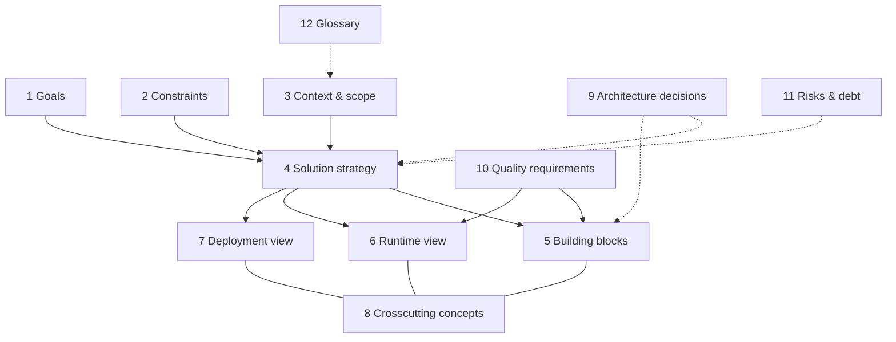
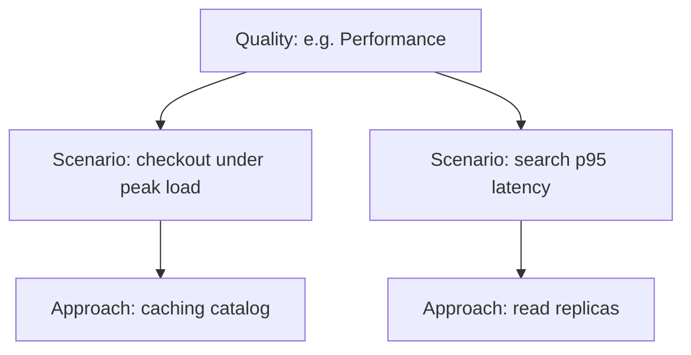

# arc42 architecture documentation template

**arc42** is a **pragmatic, open template** for documenting software and system architectures in 12 sections. It balances **structure** (so readers find information) with **freedom** (any notation: C4, UML, prose). It is widely used in German-speaking industry and increasingly in docs-as-code pipelines worldwide.

| Property | arc42 emphasis |
|----------|----------------|
| **Scope** | Single system or product architecture description |
| **Style** | Template + guidance; not a full enterprise framework |
| **Output** | One coherent document (or site) maintained with the system |

---

## The 12 sections

| # | Section | Purpose | Typical content |
|---|---------|---------|-----------------|
| 1 | **Introduction and goals** | Why the system exists | Requirements, stakeholders, quality goals (top-level) |
| 2 | **Constraints** | Hard limits on design | Technical, organizational, legal, standards |
| 3 | **Context and scope** | System in its environment | Context diagram, external interfaces, scope boundaries |
| 4 | **Solution strategy** | Big-picture technical approach | Key decisions, patterns, platform choices |
| 5 | **Building block view** | Static decomposition | Level 0/1/2 breakdown, interfaces between blocks |
| 6 | **Runtime view** | Dynamic behavior | Key scenarios, sequences, end-to-end flows |
| 7 | **Deployment view** | Physical/runtime mapping | Nodes, networks, environments, replication |
| 8 | **Crosscutting concepts** | Shared concerns | Security, logging, error handling, persistence style |
| 9 | **Architecture decisions** | Decision log | ADRs or embedded decisions with rationale |
| 10 | **Quality requirements** | NFRs made concrete | Quality tree, scenarios, metrics |
| 11 | **Risks and technical debt** | Honest risk register | Risks, debt items, mitigation |
| 12 | **Glossary** | Terms and abbreviations | Ubiquitous language, acronyms |

Sections **build on each other**: constraints and context inform solution strategy; building blocks and runtime views explain how quality goals are met.

---

## arc42 structure — relationships (overview)

---

## Building block view — depth levels

| Level | Typical scope | Example content |
|-------|----------------|-----------------|
| **Level 0** | System in context | One “black box” plus external actors/systems (often mirrors §3) |
| **Level 1** | Top-level decomposition | Major subsystems, applications, or layers |
| **Level 2** | Internal structure of a Level-1 block | Components, packages, modules — stop when useful detail ends |

Deeper levels are possible but often better served by linking to **code structure** or **C4 L3** diagrams.

---

## Comparison: arc42 vs C4 vs 4+1 vs IEEE 42010

| Dimension | **arc42** | **C4** | **4+1 views** | **IEEE 42010** |
|-----------|-----------|--------|---------------|----------------|
| **Scope** | Full architecture doc template | Diagram levels + notation | Five viewpoints + scenarios | Architecture description standard (meta) |
| **Formality** | Structured sections; content flexible | Light rules for diagrams | Classic academic/industry framing | Conceptual framework; AD is conformant instance |
| **Tooling** | AsciiDoc/Markdown/Confluence + any diagram tool | Structurizr, PlantUML, Mermaid | Any UML/modeling tool | Depends on chosen notation |
| **Learning curve** | Moderate (template to fill) | Low for basics | Moderate | Steep if reading the standard itself |

**Combining:** Many teams use **C4 diagrams inside arc42** §3 and §5, and **ADRs** in §9.

---

## Quality tree and scenarios (§10)

arc42 encourages tying **quality attributes** to **measurable scenarios**:

| Step | Question |
|------|----------|
| **Quality attribute** | What “-ility” matters? |
| **Scenario** | Stimulus, environment, measure? |
| **Architecture** | Which building blocks or decisions realize it? |

This connects §1 goals, §5–§7 views, and §9 decisions in one traceable story.

---

## Tooling

| Tool | Role with arc42 |
|------|-----------------|
| **AsciiDoc** | Native arc42 split includes; strong PDF/HTML toolchains |
| **Markdown** | Simple; use includes or static site generators |
| **Confluence** | Wikis with macros; good for non-dev stakeholders |
| **docToolchain** | Gradle-based docs pipeline; arc42 integration examples |
| **Structurizr** | Model + views; export into arc42 sections |

---

## When to choose arc42

| Situation | Fit |
|-----------|-----|
| **Greenfield** | Establish one canonical architecture doc from day one |
| **Legacy** | Reverse-document structure; §11 captures debt explicitly |
| **Compliance / audits** | Clear section map for reviewers |
| **Distributed teams** | Single template reduces “where do I look?” |

---

## Anti-patterns

| Anti-pattern | Problem | Fix |
|--------------|---------|-----|
| **Blank template worship** | Filling sections with “TBD” | Start minimal: §1, §3, §9 only; grow with risk |
| **Copy-paste from vendor PDFs** | Noise, no decision content | Replace with decisions, interfaces, and scenarios |
| **Orphan diagrams** | Pretty pictures without § cross-links | Caption + reference in building block or runtime section |

---

## External references

- [arc42.org](https://arc42.org/) — template downloads, FAQ, license (CC).
- Gernot Starke & Peter Hruschka, *arc42 in Practice* — template applied to real projects.
- [docs-as-code.org](https://docs-as-code.org/) — philosophy aligned with maintaining arc42 in version control.

*Keep project-specific architecture decisions in docs/adr/ and system documentation in docs/architecture/, not in this file.*
