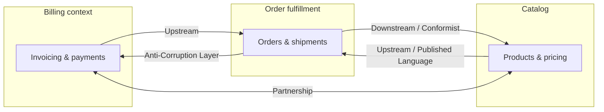
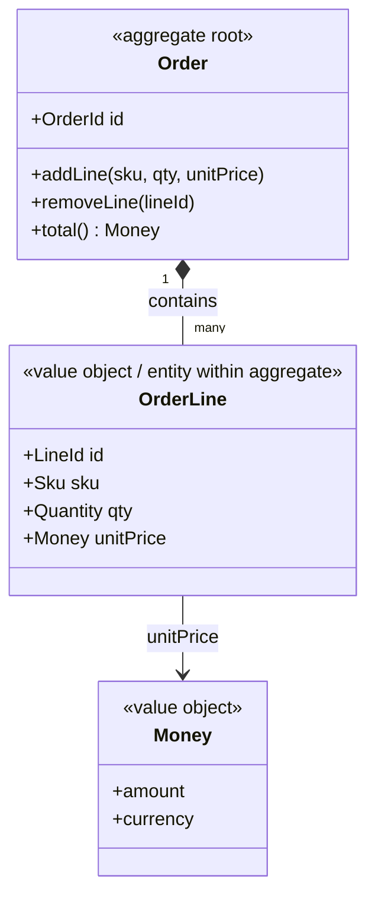

# Domain-Driven Design (DDD)

**Domain-Driven Design** is an approach to building software for **complex domains** by centering design on a deep model of the business, explicit **bounded contexts**, and a shared **ubiquitous language** between domain experts and developers. Eric Evans articulated the foundation; Vaughn Vernon and others extended tactical and strategic patterns for modern distributed systems.

| Lens | Question it answers |
|------|---------------------|
| **Strategic design** | Where to split the system, how teams and models align, how contexts integrate |
| **Tactical design** | How to express the model in code (entities, aggregates, repositories, etc.) |

---

## Strategic patterns (summary)

| Pattern | Definition / use |
|---------|------------------|
| **Bounded context** | Explicit boundary within which a domain model is consistent; owns its vocabulary |
| **Ubiquitous language** | Shared, precise terms used in code, speech, and docs inside a context |
| **Context map** | Diagram of contexts and their relationships (integration + power dynamics) |
| **Domain vision statement** | Short narrative of what the core domain is and why it matters |
| **Core / supporting / generic subdomains** | Invest modeling effort in the **core**; buy or simplify **generic** areas |

---

## Context map (example relationships)

Illustrative **context map** — not a specific notation standard, but shows upstream/downstream and integration styles:

**Reading guide:** *Upstream* teams’ models influence *downstream* consumers. **Conformist** accepts the upstream model as-is. **Anti-corruption layer (ACL)** translates foreign concepts. **Partnership** is tight coordination between two teams.

---

## Context mapping patterns

| Pattern | Meaning | When it tends to apply |
|---------|---------|-------------------------|
| **Shared kernel** | Shared subset of model/code between two contexts | Small, high-trust teams; tight coupling accepted |
| **Customer–supplier** | Downstream priorities influence upstream roadmap | Internal platform + product consumers |
| **Conformist** | Downstream adopts upstream model fully | Vendor or dominant team; low negotiation power |
| **Anti-corruption layer** | Translation boundary protects your model | Legacy or messy external API |
| **Open host service** | Expose integration-friendly API with published language | Many consumers, stable façade |
| **Published language** | Shared interchange format (e.g. JSON schema, events) | Cross-context integration |
| **Separate ways** | No integration; duplicate or manual bridge | Cost of integration exceeds value |
| **Partnership** | Joint success dependency | Mutual critical path |

---

## Tactical patterns

| Pattern | Definition | When to use | Common mistake |
|---------|------------|-------------|----------------|
| **Entity** | Object with identity that persists over time | Anything tracked as “the same thing” despite attribute changes | Confusing identity with natural keys only |
| **Value object** | Immutable descriptor without identity; equality by attributes | Money, address ranges, quantities | Mutable “value” holding references that change |
| **Aggregate** | Consistency cluster rooted on one entity (aggregate root) | Enforce invariants in one transactional boundary | Huge aggregates → contention and failure blast radius |
| **Repository** | Collection-like access to aggregates | Hide persistence from domain layer | Leaking ORM details into domain |
| **Domain service** | Stateless domain operation that doesn’t fit one entity | Cross-aggregate rules that still belong to domain | Putting application orchestration here |
| **Application service** | Use-case orchestration, transactions, no business rules | Coordinate domain + infrastructure | Fat “god services” with all logic |
| **Domain event** | Something meaningful that happened in the domain | Decouple contexts; audit; async reactions | Anemic events with no domain meaning |
| **Factory** | Encapsulate complex creation of aggregates/entities | Invariants at construction time | Static util soup without language alignment |

---

## Aggregate example (order)

**Rule of thumb:** External references to this aggregate go through **Order** only; `OrderLine` IDs are scoped inside the aggregate unless your model explicitly promotes them (rare).

---

## Event Storming (overview)

**Event Storming** (Brandolini) is a workshop format, not “DDD syntax,” but it aligns discovery with bounded contexts and aggregates.

| Color / lane (typical convention) | Represents |
|-----------------------------------|------------|
| **Orange** | Domain events (“something happened”) |
| **Blue** | Commands (intent to change state) |
| **Yellow** | Aggregates (consistency boundaries) |
| **Green** | Read models / queries / UIs |
| **Purple** | Policies / reactions (“when X then command Y”) |

Flow: timeline of **events** → attach **commands** and **aggregates** → identify **policies** and **read models** → cluster into **bounded contexts**.

---

## DDD and microservices

| Principle | Implication |
|-----------|-------------|
| **Bounded context ≈ service boundary (often)** | One team owns one language per service; avoid “distributed monolith” sharing one DB schema |
| **Not 1:1 by default** | Small contexts might share a deployable until load/ownership splits justify separation |
| **Integration** | Prefer explicit patterns (ACL, OHS, events) over shared tables |

---

## Anti-patterns

| Anti-pattern | Description | Direction |
|--------------|-------------|-----------|
| **Anemic domain model** | Entities are getters/setters; logic in “service layer” only | Move behavior into domain objects; use domain services sparingly |
| **Big ball of mud** | No boundaries; one global model | Strategic refactor; extract contexts incrementally |
| **Premature decomposition** | Microservices before boundaries are understood | Start modular monolith or well-partitioned monolith; extract when stable |

---

## External references

- Eric Evans, *Domain-Driven Design* — foundational strategic + tactical catalog.
- Vaughn Vernon, *Implementing Domain-Driven Design* — practical patterns, context mapping, aggregates in depth.
- Vlad Khononov, *Learning Domain-Driven Design* — accessible modern introduction.
- [ddd-crew on GitHub](https://github.com/ddd-crew) — community resources, context mapping, starter kits.

*Keep project-specific architecture decisions in docs/adr/ and system documentation in docs/architecture/, not in this file.*
