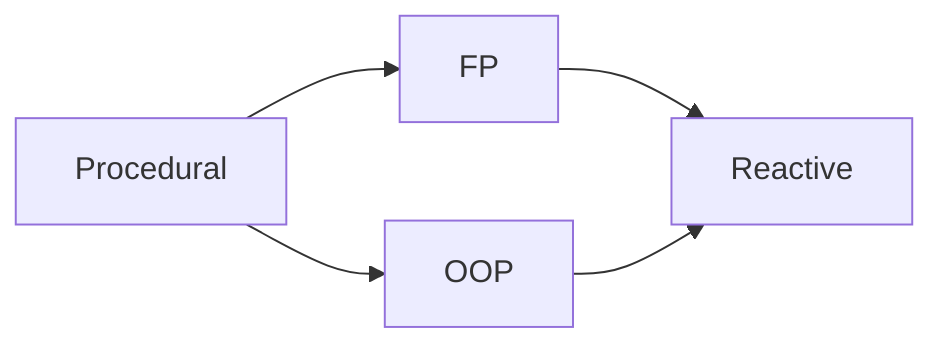

# Programming paradigms — index

**Paradigm literacy** helps teams choose structure before frameworks: whether work is naturally **object-shaped**, **function-shaped**, or **stream-shaped**. Paradigms combine in production; the goal is deliberate composition, not purity contests.

**Cross-references:** [`../SOFTWARE-ENGINEERING.md`](../SOFTWARE-ENGINEERING.md) § **1. Programming paradigms** maps strengths; § **4. Principles** (SOLID, composition) supports OO-heavy designs.

---

## Paradigm relationships (mental model)

Teams often layer **FP cores**, **OO boundaries**, and **reactive IO**; arrows suggest common teaching lineage, not hard dependencies.

---

## Which paradigm for which problem domain?

| Problem domain | Favor | Why |
|----------------|-------|-----|
| Rich business rules with invariants | **OOP** (+ DDD tactics) | Identity, lifecycle, collaboration |
| Deterministic transforms / batch analytics | **FP** | Local reasoning; parallel maps |
| Real-time UI, sockets, market data | **Reactive** | Async composition; cancellation |
| Scripts, firmware, tight kernels | **Procedural** | Low ceremony; explicit control flow |
| Long-lived distributed services | **Multi-paradigm** | Split domain core from integration edges |

---

## Guides

| Guide | Focus | See |
|-------|--------|-----|
| [**OOP**](oop.md) | Encapsulation, polymorphism, composition vs inheritance, language notes, anti-patterns | |
| [**Functional**](functional.md) | Purity, ADTs, FP/OOP matrix, practical functors/monads, ecosystems | |
| [**Reactive**](reactive.md) | Observables, operators, backpressure, Manifesto pillars, frameworks | |
| **Procedural** *(planned)* | Procedures, scripts, CLIs, embedded-style sequencing | [SOFTWARE-ENGINEERING.md §1](../SOFTWARE-ENGINEERING.md#1-programming-paradigms) |
| **Multi-paradigm** *(planned)* | Layering styles and team conventions | [SOFTWARE-ENGINEERING.md §1](../SOFTWARE-ENGINEERING.md#1-programming-paradigms) |

---

*Keep project-specific engineering standards in `docs/development/` and architecture decisions in `docs/adr/`, not in this file.*
