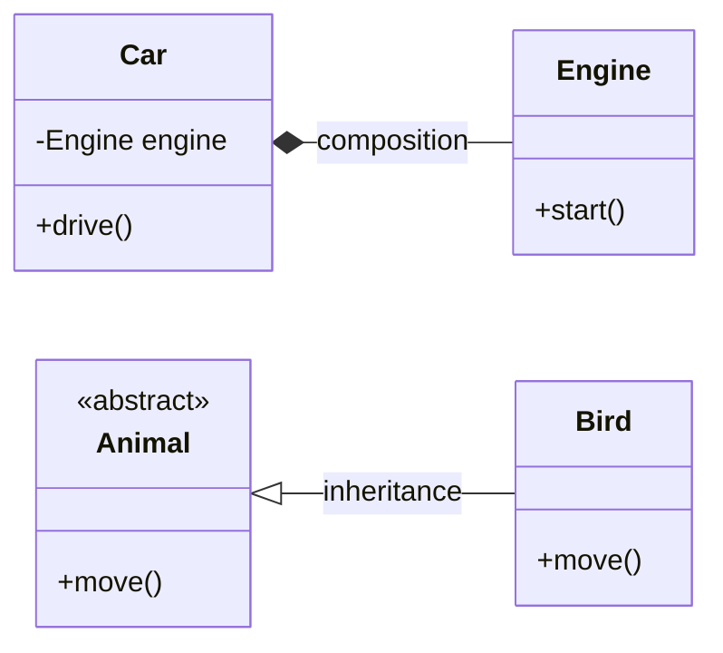

# Object-Oriented Programming (OOP)

Object-oriented programming organizes programs as **collaborating objects** that encapsulate state and expose behavior through messages (method calls). It remains the default shape of many application frameworks and enterprise codebases because it maps cleanly onto stable domain nouns and plugin boundaries.

**Parent context:** See the paradigm overview and principles in [`../SOFTWARE-ENGINEERING.md`](../SOFTWARE-ENGINEERING.md) (sections **1. Programming paradigms** and **4. Principles**, including SOLID).

---

## Core concepts

| Concept | Definition | Benefit | Risk |
|---------|------------|---------|------|
| **Encapsulation** | Hide internal representation; expose a small, stable API | Invariants stay local; implementation can evolve | Getters/setters that leak structure (“leaky abstraction”) |
| **Inheritance** | Subtype extends supertype; share and override behavior | Reuse of protocol and shared code | Deep hierarchies; fragile base class; Liskov violations |
| **Polymorphism** | One interface, many implementations; dispatch by runtime type | Replaceable strategies; framework extension points | Hidden control flow; debugging indirection |
| **Abstraction** | Model essentials; omit incidental detail | Readable domain vocabulary; separation of concerns | Wrong abstractions that ossify early |

---

## SOLID — quick reference

SOLID names five design pressures that keep object graphs maintainable. **Full tables and violation examples** live in the parent doc.

| Principle | One-line intent |
|-----------|-----------------|
| **S** — Single Responsibility | One reason to change per unit of design |
| **O** — Open/Closed | Extend behavior without editing stable core |
| **L** — Liskov Substitution | Subtypes honor supertype contracts |
| **I** — Interface Segregation | Small, focused interfaces |
| **D** — Dependency Inversion | Depend on abstractions; wire concretes at edges |

→ **Detail:** [`../SOFTWARE-ENGINEERING.md` § 4. Principles — SOLID](../SOFTWARE-ENGINEERING.md#4-principles)

---

## Composition vs inheritance (class view)

Prefer **composition** when behavior is assembled from capabilities; reserve **inheritance** for true taxonomic “is-a” relationships and framework template hooks.

**Reading the diagram:** `Car` **has-a** `Engine` (composition). `Bird` **is-a** `Animal` (inheritance). Mixing “is-a” and reuse-of-implementation without a clear taxonomy usually signals composition or delegation instead.

---

## When OOP shines vs when it struggles

| OOP tends to fit well | OOP tends to fit poorly |
|------------------------|-------------------------|
| Rich **domain models** with invariants and lifecycle | Pure **data transformation** (ETL, batch transforms) |
| **GUI** and component frameworks (widgets, trees) | **Stateless** HTTP handlers that are thin over SQL |
| **Enterprise** boundaries (accounts, orders, policies) | **Numerical / vector** kernels where objects add overhead |
| **Plugin** architectures and replaceable policies | **Pipelines** where the dominant metaphor is functions over immutable data |

Use OOP where **identity, state machines, and collaboration** between entities are central; prefer functions or data-oriented layouts where **throughput and algebraic transforms** dominate.

---

## Language landscape (OOP feature comparison)

Rough comparison of how mainstream languages express OOP — not a quality ranking.

| Language | Classes / objects | Inheritance | Interfaces / protocols | Notable OOP notes |
|----------|-------------------|-------------|-------------------------|-------------------|
| **Java** | Classes, single inheritance | `extends` / `implements` | Interfaces, default methods since 8 | Strong OOP culture; records for data |
| **C#** | Classes, structs, records | Single inheritance | Interfaces, default impl | Properties, partial classes, rich BCL |
| **Python** | Classes; everything is an object | Multiple inheritance, MRO | ABCs, protocols (typing) | Duck typing + optional nominal checks |
| **TypeScript** | Structural typing + `class` | `extends` | `interface` / type aliases | Erased types; patterns vary by team |
| **Kotlin** | Classes, data classes | Single inheritance | Interfaces | Sealed hierarchies; delegation |
| **Swift** | Classes, structs, enums | Single inheritance (classes) | Protocols | Value vs reference split is idiomatic |

---

## Common anti-patterns

| Anti-pattern | Symptom | Remedy direction |
|--------------|---------|------------------|
| **God class** | One type knows everything; high churn | Split by responsibility; extract services |
| **Anemic domain model** | Entities are bags of data; logic in “services” only | Push invariants into domain types where it clarifies |
| **Deep inheritance** | Many levels; overrides interact unpredictably | Favor composition, strategy, or small hierarchies |
| **Circular dependencies** | Packages/types reference each other in cycles | Introduce interfaces, events, or dependency inversion |

---

## Design decision cues (within an OO codebase)

Use this matrix when **choosing object boundaries** — it complements the parent doc’s paradigm table by focusing on OO-specific forces.

| Force | Lean toward | Avoid |
|-------|-------------|--------|
| **Invariant-heavy aggregate** | Entity with constructors/factories enforcing rules | Anemic structs + scattered validation |
| **Volatile algorithm** | Strategy / policy object behind an interface | Switch statements duplicated everywhere |
| **Cross-cutting instance behavior** | Decorator chain or small aspect at boundary | Subclass explosion for every combination |
| **Stable taxonomy + shared protocol** | Shallow inheritance or sealed hierarchy | Deep trees mixing reuse and subtyping |
| **Integration with functional core** | OO shell for IO; pure functions for transforms | OO everywhere “because that’s the style” |

---

## Identity, equality, and mutability

| Topic | Guidance |
|-------|----------|
| **Entity vs value object** | Entities have stable identity (`userId`); value objects compare by structure (`Money`) |
| **Equality** | Override `equals`/`hashCode` (Java), `Equatable` (Dart), or use records — consistently with invariants |
| **Mutability** | Prefer immutability for value types even in OO languages; constrain mutation to aggregates that own consistency |
| **Concurrency** | Shared mutable objects need clear ownership; otherwise favor messages, actors, or copies |

---

## Testing object-oriented designs

| Technique | When it helps |
|-----------|----------------|
| **Collaborator doubles** | Isolate unit under test from databases, clocks, and remote clients |
| **Contract tests for interfaces** | Several implementations share one behavioral spec |
| **Object mother / builder (test)** | Readable fixture setup without giant constructors |
| **Characterization tests** | Lock behavior before refactors on legacy OO balls of mud |

Over-mocking every private method is a smell: tests should observe **behavior through the public surface** you intend to support.

---

## Related paradigms in the same folder

- [Functional programming](functional.md) — pure transforms and explicit effects alongside OO boundaries  
- [Reactive programming](reactive.md) — stream-shaped collaboration, often wrapping OO UI frameworks  

---

## External references

| Resource | Why read it |
|----------|-------------|
| Gamma, Helm, Johnson, Vlissides — *Design Patterns: Elements of Reusable Object-Oriented Software* | Canonical pattern vocabulary and trade-offs |
| Sierra & Bates — *Head First Object-Oriented Analysis and Design* | Gentle introduction to thinking in objects and domains |
| Martin — *Clean Code* | Naming, functions, and OO-friendly structure at the line level |

---

*Keep project-specific engineering standards in `docs/development/` and architecture decisions in `docs/adr/`, not in this file.*
