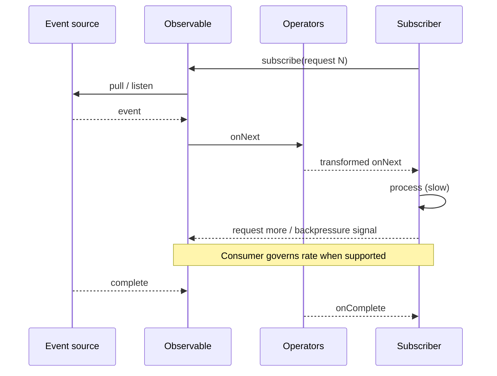

# Reactive Programming

Reactive programming models programs as **flows of events over time**: producers emit values, operators transform and combine streams, and subscribers observe outcomes. It pairs naturally with UIs, sockets, and message brokers where **asynchrony, cancellation, and backpressure** are first-class concerns.

**Parent context:** See [`../SOFTWARE-ENGINEERING.md`](../SOFTWARE-ENGINEERING.md) § **1. Programming paradigms** (Reactive row) and § **6. Concurrency and parallelism** for failure modes that reactive stacks must still respect.

---

## Core concepts

| Concept | Definition | Why it matters |
|---------|------------|----------------|
| **Observable / stream** | Typed sequence of events (next, error, complete) | Unified model for clicks, HTTP, logs, ticks |
| **Subscriber** | Consumer that reacts to stream lifecycle | Where side effects usually live |
| **Operators** | Pure(ish) transforms on streams (`map`, `switchMap`, …) | Composable async logic without nested callbacks |
| **Backpressure** | Slow consumer signals producer to slow or buffer | Prevents unbounded memory under burst load |
| **Schedulers** | Execution context (thread pool, main thread, …) | Controls where work runs and hop boundaries |
| **Cold observable** | New subscription → new producer run (per-subscriber) | File reads, single HTTP calls |
| **Hot observable** | Broadcast shared source to many subscribers | Mouse moves, market ticks, Kafka partitions |

---

## Cold vs hot — decision cues

| Signal | Prefer **cold** | Prefer **hot** |
|--------|-----------------|----------------|
| **Each subscriber needs full history from start** | Yes (e.g., replay on subscribe) | Rarely — add `replay` operator if needed |
| **Shared expensive source** (socket, sensor) | Duplicate work risk | Share multicast / `publish` |
| **Testing determinism** | Easier to reason per-subscription | Requires virtual time / shared scheduler discipline |
| **Late subscribers** | OK to miss prior events | Must use `BehaviorSubject` / replay buffer explicitly |

Misclassifying cold/hot is a top source of “works in dev, duplicates work in prod” bugs.

---

## Error propagation and termination

| Strategy | Meaning | Good for |
|----------|---------|----------|
| **Propagate `onError`** | Stream ends with failure | Fatal faults, contract violations |
| **`retry` / backoff** | Transient network blips | IO-heavy graphs |
| **`onErrorReturn` / fallback** | Substitute value or alternate stream | Degraded read models |
| **Global handler** | Central logging + metrics | Never swallow — always observe |

Reactive errors are **not** exceptions floating through random stack frames: they travel the **same channel** as values, which is powerful if you do not scatter empty `catch` blocks in subscribers.

---

## Multicast, subjects, and discipline

| Construct | Use carefully because |
|-----------|----------------------|
| **`Subject` / `BehaviorSubject`** | Easy to create hot mutable hubs that leak subscriptions |
| **`share` / `publish` + `connect`** | Multicast must match expected replay and refcount semantics |
| **Nested subscriptions** | Prefer higher-order operators (`switchMap`, `mergeMap`) over manual inner `subscribe` |

Code review hint: any **manual `subscribe` inside `subscribe`** deserves a second look — usually an operator already expresses it.

---

## Sequence: source → operators → subscriber (with backpressure)

Exact backpressure APIs differ by library (Reactive Streams `request(n)`, Kotlin `Flow` collectors, etc.), but the **contract** is the same: *don’t outrun the sink unless you explicitly buffer and accept memory risk*.

---

## Reactive Manifesto — pillars

| Pillar | Meaning for builders |
|--------|----------------------|
| **Responsive** | Time-bounded reactions; degrade gracefully under load |
| **Resilient** | Failure is modeled; recovery paths exist (retry, fallback, circuit break) |
| **Elastic** | Scale out/in under demand; no single choke point by design |
| **Message-driven** | Async, non-blocking boundaries; explicit messaging between components |

Source: [The Reactive Manifesto](https://www.reactivemanifesto.org/).

---

## Operator categories (with examples)

| Category | Role | Example operators (names vary by lib) |
|----------|------|--------------------------------------|
| **Creation** | Start a stream | `from`, `interval`, `defer`, `just` |
| **Transformation** | Map events | `map`, `scan`, `buffer`, `window` |
| **Filtering** | Drop or take | `filter`, `takeUntil`, `distinctUntilChanged` |
| **Combination** | Merge many sources | `merge`, `zip`, `combineLatest`, `withLatestFrom` |
| **Error handling** | Survive faults | `retry`, `catchError`, `onErrorResumeNext` |
| **Utility** | Lifecycle / timing | `delay`, `timeout`, `subscribeOn`, `observeOn` |

---

## Reactive vs imperative — comparison matrix

| Concern | Imperative (callbacks, loops) | Reactive (streams) |
|---------|------------------------------|---------------------|
| **Composition** | Nested callbacks; shared flags | Operator chains |
| **Cancellation** | Manual flags; easy to leak | Subscription disposal |
| **Async errors** | Inconsistent propagation | `onError` channel |
| **Testing** | Mock timers and callbacks | Marble tests, schedulers |
| **Learning curve** | Familiar to beginners | Operator vocabulary + cold/hot mental model |

---

## Framework landscape

| Technology | Ecosystem | Notes |
|------------|-----------|--------|
| **RxJS** | Browser / Node | De facto for complex Angular/async UIs |
| **RxJava** | JVM / Android | Mature operator set; integrates with Reactive Streams |
| **Project Reactor** | Spring | `Mono`/`Flux`; first-class in Spring WebFlux |
| **Akka Streams** | JVM | Backpressured graphs; fits actor systems |
| **Combine** | Apple platforms | Swift-native; iOS/macOS reactive glue |
| **Kotlin Flow** | Kotlin coroutines | Cold streams; structured concurrency alignment |
| **Mutiny (Quarkus)** | Reactive Java on Vert.x | Small-step reactive APIs for microservices |
| **RSocket** | Duplex reactive streams | Service-to-service streaming with backpressure |

---

## Testing reactive pipelines

| Approach | Notes |
|----------|--------|
| **TestScheduler / virtual time** | Deterministic time-based operators (`debounce`, `interval`) |
| **Marble diagrams** | Visual specs for operator chains (RxJS/Marble testing culture) |
| **Step verifiers (Reactor)** | Assert signals in order for `Flux`/`Mono` |
| **Record + replay** | Capture production streams for regression fixtures (privacy permitting) |

Invest in **one** team-wide style — mixed ad-hoc `Thread.sleep` in tests becomes flaky CI noise.

---

## When reactive fits

- **Real-time UIs** with many event sources (input, network, storage)  
- **Event-driven microservices** and stream edges (fan-out, merge, retry)  
- **IoT** and telemetry pipelines  
- **Financial tickers** and market data fan-in  

---

## Anti-patterns

| Anti-pattern | Symptom | Direction |
|--------------|---------|-----------|
| **Callback hell recreation** | Giant `subscribe` blocks with side effects | Push logic into pure operators + thin subscribers |
| **Unbounded streams** | No buffer caps; JVM heap grows | Bounded queues, drop/latest strategies, or pull |
| **Operator overuse** | 40-operator chain nobody can trace | Break into named stages; document marble behavior |

---

## External references

| Resource | URL / note |
|----------|------------|
| ReactiveX | [https://reactivex.io/](https://reactivex.io/) — cross-language operator docs |
| Reactive Manifesto | [https://www.reactivemanifesto.org/](https://www.reactivemanifesto.org/) |
| Vernon, Piovesan, Harrington — *Reactive Design Patterns* | Messaging, resilience, and stream-shaped architectures |

---

*Keep project-specific engineering standards in `docs/development/` and architecture decisions in `docs/adr/`, not in this file.*
