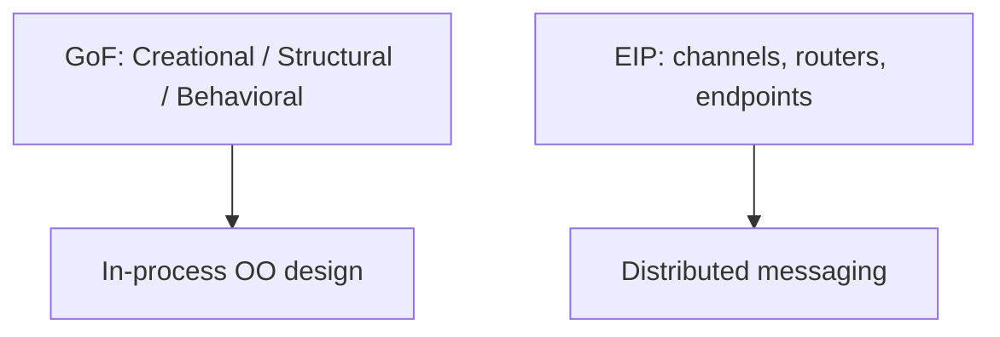

# Design patterns — index

**Pattern thinking** means naming recurring **forces** (change, scale, integration) and matching proven structures — without using the catalog as a mandatory checklist. Prefer simple modules until **duplication proves the force**.

**Cross-reference:** Parent summaries for GoF and enterprise patterns: [`../SOFTWARE-ENGINEERING.md`](../SOFTWARE-ENGINEERING.md) § **3. Design patterns**.

---

## Pattern categories (overview)

GoF addresses **single-process** collaboration; EIP addresses **cross-service** messaging and evolution.

---

## Selection guidance

| Situation | Start here | Escalate when |
|-----------|------------|----------------|
| Variable object creation | [GoF creational](gof-patterns.md#creational-patterns) | Many product families need registries |
| Compose or wrap types | [GoF structural](gof-patterns.md#structural-patterns) | Adapters absorb domain rules |
| Vary algorithms or notifications | [GoF behavioral](gof-patterns.md#behavioral-patterns) | Cross-service sagas dominate |
| Decouple services / absorb bursts | [Enterprise integration](enterprise-integration.md) | Ordering, idempotency, schema contracts |
| Shared-memory parallelism | **Concurrency patterns** *(planned)* | Locks/races drive the design |

---

## Guides

| Guide | Focus |
|-------|--------|
| [**GoF design patterns**](gof-patterns.md) | 23 patterns, selection flowchart, modern relevance |
| [**Enterprise integration**](enterprise-integration.md) | Channels, routing, transformation, sagas, platforms |
| **Concurrency patterns** *(planned)* | Active object, monitor, fork-join, pipeline |

---

*Keep project-specific engineering standards in `docs/development/` and architecture decisions in `docs/adr/`, not in this file.*
