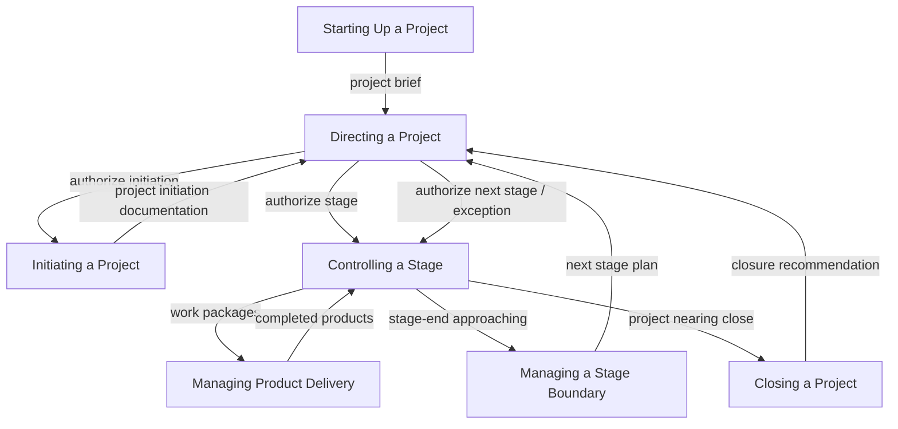

# PRINCE2

## What it is

**PRINCE2** (PRojects IN Controlled Environments, version 2) is a **process-based** project management method originally developed by the UK government (OGC) and now owned by **PeopleCert** (acquired from AXELOS in 2021). It provides a structured framework built on **7 principles**, **7 themes**, and **7 processes** that define how a project is directed, managed, and delivered.

PRINCE2's distinguishing characteristics:

- **Business case–driven:** Every project must have a continuously justified business case. If justification disappears, the project should stop.
- **Management by exception:** Each management level sets tolerances (time, cost, scope, quality, risk, benefit); the level below manages within those tolerances and only escalates when tolerances are forecast to be exceeded.
- **Product-based planning:** Planning focuses on **products** (deliverables and their quality criteria) rather than activities.
- **Defined roles and responsibilities:** Clear separation between directing (Project Board), managing (Project Manager), and delivering (Team Manager / teams).
- **Stage-based:** The project is divided into management stages with explicit go/no-go decisions at each boundary.

PRINCE2 is the **dominant PM method** in UK government, widely adopted across Europe, Australia, and parts of Asia. It is less common in North America, where PMI/PMBOK dominates. The **PRINCE2 Agile** extension (2015, updated 2018) integrates PRINCE2 governance with Agile delivery methods (Scrum, Kanban, Lean Startup).

**When to use:** PRINCE2 is the right choice when your context demands **formal governance**, **stage-based control**, and **clear role separation** — particularly in government projects, regulated industries, multi-vendor environments, or organizations already aligned with PeopleCert/AXELOS standards. The Agile variant makes it compatible with iterative delivery.

---

## Authoritative sources (external)

| Resource | Executive summary (why it's linked here) |
|----------|------------------------------------------|
| [PeopleCert — PRINCE2](https://www.peoplecert.org/prince2) | **Official** PRINCE2 home — certification, training, and method overview. PeopleCert acquired the PRINCE2 IP from AXELOS in 2021. |
| [Wikipedia — PRINCE2](https://en.wikipedia.org/wiki/PRINCE2) | **Stable overview** of PRINCE2 history, structure, and adoption — entry point before the official manual. |
| [PeopleCert — PRINCE2 Agile](https://www.peoplecert.org/prince2-agile) | **Official** PRINCE2 Agile guidance — how to combine PRINCE2 governance with Agile delivery frameworks. |
| [ILX Group — PRINCE2 Wiki](https://www.prince2.com/prince2-methodology) | **Community** resource with method summaries, process diagrams, and study materials — good for quick reference. |

**Certification:** PRINCE2 Foundation and PRINCE2 Practitioner are the primary certifications. PRINCE2 Agile Foundation and Practitioner extend into Agile contexts. This document summarizes concepts for adoption, not certification prep.

---

## Core structure

### 7 Principles

Principles are **universal obligations** — a project is not "doing PRINCE2" unless all seven are observed.

| # | Principle | Essence |
|---|-----------|---------|
| 1 | **Continued business justification** | The project must have and maintain a valid business case. If the business case fails, the project stops. |
| 2 | **Learn from experience** | Seek, record, and act on lessons from previous projects and from within this project. |
| 3 | **Defined roles and responsibilities** | Clear accountability for directing, managing, and delivering. No ambiguity about who decides what. |
| 4 | **Manage by stages** | Plan, monitor, and control one management stage at a time. Stage boundaries are decision points. |
| 5 | **Manage by exception** | Set tolerances for each authority level. Escalate only when tolerances are forecast to be exceeded. |
| 6 | **Focus on products** | Define products (deliverables) with clear descriptions and quality criteria before starting work. |
| 7 | **Tailor to suit the project environment** | Adapt the method's processes, themes, and roles to the project's size, complexity, and context. |

### 7 Themes

Themes are **aspects of PM** that must be continuously addressed throughout the project. They parallel PMI knowledge areas but are structured differently.

| Theme | Core question | PRINCE2 answer |
|-------|---------------|----------------|
| **Business Case** | Why are we doing this? | Maintained throughout; drives stage-boundary go/no-go decisions. |
| **Organization** | Who is involved and what are their responsibilities? | Project Board (Executive, Senior User, Senior Supplier), PM, Team Manager. |
| **Quality** | What quality is expected and how do we verify it? | Product descriptions with quality criteria; quality register; quality review. |
| **Plans** | How, how much, and when? | Project plan, stage plans, team plans — product-based planning. |
| **Risk** | What if things don't go as planned? | Risk register, risk management strategy, probability × impact assessment. |
| **Change** | What is the impact of changes? | Change authority, issue register, change budget. |
| **Progress** | Where are we, where should we be, and can we still make it? | Tolerances, stage-boundary assessments, exception reports, highlights. |

### 7 Processes

Processes describe the **flow of activities** from project start to close. Each process has defined inputs, activities, and outputs.

| Process | Who leads | Purpose |
|---------|-----------|---------|
| **Starting Up a Project (SU)** | Executive + PM | Verify the project is worthwhile and viable before committing resources. Produce project brief and stage plan for initiation. |
| **Directing a Project (DP)** | Project Board | Authorize initiation, stages, and closure. Make go/no-go decisions. Provide ad-hoc direction. Runs throughout the project. |
| **Initiating a Project (IP)** | PM | Create the Project Initiation Documentation (PID): business case, project plan, risk strategy, quality strategy, communication strategy. |
| **Controlling a Stage (CS)** | PM | Day-to-day management within a stage: authorize work, monitor progress, manage issues, report to the board. |
| **Managing Product Delivery (MP)** | Team Manager | Accept, execute, and deliver work packages. Interface between PM and delivery teams. |
| **Managing a Stage Boundary (SB)** | PM | Review the completed stage, update the business case, plan the next stage, report to the board for go/no-go. |
| **Closing a Project (CP)** | PM | Verify deliverables accepted, hand over products, capture lessons, release resources, recommend closure to board. |

### Tolerances and management by exception

| Tolerance | Set by | Managed by |
|-----------|--------|------------|
| **Project-level** (total cost, timeline, benefits) | Corporate / programme management | Project Board |
| **Stage-level** (stage cost, stage timeline) | Project Board | Project Manager |
| **Work-package-level** (task cost, task timeline) | Project Manager | Team Manager |

When a tolerance is forecast to be exceeded, the managing level creates an **exception report** and escalates to the level above for direction.

---

## Mapping to PM.md

| PRINCE2 process | PM.md process group | Relationship |
|-----------------|---------------------|--------------|
| **Starting Up a Project** | **Initiating** | Pre-project verification: is this worth doing? Produces project brief (lighter than full charter). |
| **Initiating a Project** | **Initiating + Planning** | Full project setup: PID = charter + plans + strategies. More detailed than PM.md initiating. |
| **Controlling a Stage** | **Executing + Monitoring & Controlling** | Day-to-day management within a stage: work authorization, progress monitoring, issue management. |
| **Managing Product Delivery** | **Executing** | Team-level execution: accept work packages, build products, report completion. |
| **Managing a Stage Boundary** | **Monitoring & Controlling** | Stage-end review, business case update, next-stage authorization. Maps to milestone gates in PM.md. |
| **Closing a Project** | **Closing** | Formal handover, lessons learned, resource release. |
| **Directing a Project** | (spans all) | Board-level governance throughout. PM.md distributes this across sponsor and steering committee. |

| PRINCE2 theme | PM.md knowledge area |
|---------------|---------------------|
| Business Case | Integration (charter, business justification) |
| Organization | Resources, Stakeholders |
| Quality | Quality |
| Plans | Scope, Schedule, Cost |
| Risk | Risk |
| Change | Scope (change control), Integration |
| Progress | Communications, Integration (monitoring) |

---

## Mapping to SDLC and PDLC

### PRINCE2 ↔ SDLC

| PRINCE2 element | SDLC connection |
|-----------------|-----------------|
| **Management stages** | Stages can align with SDLC phases (A–F), sprints, or releases. In PRINCE2 Agile, a management stage may contain multiple sprints. |
| **Controlling a Stage (CS)** | Wraps around SDLC execution. PM authorizes work packages that correspond to SDLC stories or epics. |
| **Managing Product Delivery (MP)** | This is where SDLC lives. The Team Manager (or Scrum Master in PRINCE2 Agile) manages delivery using whatever SDLC methodology the team uses. |
| **Product descriptions** | Map to SDLC Phase B (Specify) — quality criteria in product descriptions become acceptance criteria for stories. |
| **Quality theme** | Complements SDLC DoD. PRINCE2 quality review technique can serve as an additional quality gate alongside code review and CI. |

**PRINCE2 Agile specifics:**

| PRINCE2 Agile concept | How it integrates |
|------------------------|-------------------|
| **Flexing** | PRINCE2 Agile fixes time and cost (tolerances) and flexes scope (features) — aligning with Agile's preference for scope trade-offs. |
| **Agilometer** | Assessment tool for how much Agile to use based on environment factors (collaboration, ease of communication, stakeholder engagement). |
| **Delivery timeslices** | Sprints within management stages. PRINCE2 governs at stage level; Scrum/Kanban governs at sprint/flow level within. |

### PRINCE2 ↔ PDLC

| PRINCE2 element | PDLC connection |
|-----------------|-----------------|
| **Business Case theme** | Directly maps to PDLC's continued problem/solution validation. PRINCE2 requires the business case to be reviewed and updated at every stage boundary — this parallels PDLC stage gates G1–G5. |
| **Starting Up a Project** | Receives PDLC P3 (Strategize) outputs. The project brief references the validated problem and solution concept. |
| **Stage Boundaries** | PRINCE2 stage-boundary reviews parallel PDLC's stage gates. The "continued business justification" principle ensures the product is still worth building — a PDLC concern embedded in PM governance. |
| **Closing a Project** | Hands over to PDLC P4 (Launch). Products are accepted; the product lifecycle continues beyond the project. |
| **Benefits review** | PRINCE2 recommends post-project benefits reviews — these map directly to PDLC P5 (Grow) outcome measurement. |

---

## Anti-patterns

| Anti-pattern | Fix |
|-------------|-----|
| **PRINCE2 as bureaucracy** | Principle 7 (tailor) is not optional. If your PRINCE2 implementation requires 47 documents for a 2-sprint project, you are violating the method, not following it. |
| **No one reads the business case** | If the business case is a document filed at initiation and never revisited, you have lost PRINCE2's strongest feature. Review at every stage boundary. |
| **Management by interference** (instead of exception) | If the Project Board micro-manages daily work rather than setting tolerances, the PM cannot function. Set tolerances and trust. |
| **PRINCE2 vs Agile** (false dichotomy) | PRINCE2 Agile exists precisely to resolve this. PRINCE2 governs at stage level; Agile delivers at sprint level. They are complementary, not competing. |
| **Ignoring MP process** | Some PRINCE2 implementations over-invest in CS (controlling) and under-invest in MP (delivery). The delivery process is where value is created. |

---

## PRINCE2 vs PMI/PMBOK

| Dimension | PRINCE2 | PMI/PMBOK |
|-----------|---------|-----------|
| **Type** | Prescriptive method with defined processes | Body of knowledge with principles and domains |
| **Origin** | UK government (OGC → AXELOS → PeopleCert) | US professional association (PMI) |
| **Structure** | 7 principles + 7 themes + 7 processes | 12 principles + 8 performance domains |
| **Governance** | Management by exception with tolerances | Tailored governance (no prescribed escalation model) |
| **Business case** | Mandatory, reviewed at every stage boundary | Recommended but not structurally enforced |
| **Delivery approach** | Method-neutral (PRINCE2 Agile for explicit integration) | Delivery-approach neutral (Agile Practice Guide companion) |
| **Certification** | Foundation + Practitioner (PeopleCert) | PMP + CAPM + PMI-ACP (PMI) |
| **Dominant region** | UK, Europe, Australia, parts of Asia | North America, global |
| **Complementary** | Yes — both can be used. PRINCE2 provides the method; PMBOK deepens knowledge areas. | Yes — many practitioners hold both PMP and PRINCE2 Practitioner. |

---

## Further reading

- [PRINCE2 Manual](https://www.peoplecert.org/prince2) — Official manual (purchase required for full text).
- [PM-SDLC-PDLC Bridge](../PM-SDLC-PDLC-BRIDGE.md) — Three-domain relationship
- Companion: [PMI/PMBOK](pmi-pmbok.md), [Six Sigma](six-sigma.md)
- SDLC methodologies: [Scrum](../../../../sdlc/methodologies/scrum.md), [Phased delivery](../../../../sdlc/methodologies/phased-delivery.md)
- PDLC approaches: [Stage-Gate](../../../../pdlc/approaches/stage-gate.md) (closest PDLC parallel to PRINCE2 stage boundaries)
