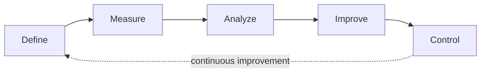

# Six Sigma / Lean Six Sigma

## What it is

**Six Sigma** is a **data-driven** methodology for eliminating defects and reducing variation in processes. Developed at **Motorola** in the 1980s and popularized by **General Electric** under Jack Welch in the 1990s, it uses statistical methods to measure and improve process performance. The name refers to the statistical goal of achieving fewer than **3.4 defects per million opportunities** (DPMO) — a process operating at "six sigma" from the mean.

**Lean Six Sigma** combines Six Sigma's statistical rigor with **Lean** principles (waste elimination, value-stream thinking, flow). Where Six Sigma focuses on **reducing variation**, Lean focuses on **reducing waste**. Together they address both quality and efficiency.

### Where Six Sigma belongs in the knowledge map

Six Sigma is **not strictly project management** — it is a **quality management and process improvement discipline**. However, it belongs in the PM package for three reasons:

1. **Project-based execution:** Every Six Sigma initiative is structured as a project with a charter, timeline, team, and deliverables. Six Sigma Black Belts are, in effect, project managers for improvement initiatives.
2. **PMO governance:** Six Sigma programs are typically governed through PMO or quality management structures, with portfolio-level tracking of improvement projects.
3. **Complementary to PM:** Six Sigma can be applied to improve PM processes themselves (e.g. reducing schedule variance, improving estimation accuracy) or to improve SDLC processes (e.g. reducing defect escape rate, improving CI reliability).

Six Sigma does **not replace** PM, SDLC, or PDLC. It is a **cross-cutting improvement discipline** that can be applied within any of them.

---

## Authoritative sources (external)

| Resource | Executive summary (why it's linked here) |
|----------|------------------------------------------|
| [American Society for Quality — Six Sigma](https://asq.org/quality-resources/six-sigma) | **Practitioner-neutral** overview of Six Sigma tools, DMAIC, belt system, and history from ASQ — the primary professional quality organization. |
| [Wikipedia — Six Sigma](https://en.wikipedia.org/wiki/Six_Sigma) | **Stable overview** of Six Sigma history, methodology, criticism, and adoption — entry point before deeper training material. |
| [Wikipedia — Lean Six Sigma](https://en.wikipedia.org/wiki/Lean_Six_Sigma) | **Overview** of the combined methodology — how Lean waste elimination integrates with Six Sigma variation reduction. |
| [iSixSigma](https://www.isixsigma.com/) | **Community** resource with articles, case studies, tools, and forums — practical Six Sigma and Lean Six Sigma content. |
| [American Society for Quality — Lean](https://asq.org/quality-resources/lean) | **ASQ** overview of Lean principles and tools — the "Lean" half of Lean Six Sigma. |

**Certification:** Six Sigma uses a **belt system** (see below). Certifications are offered by ASQ, IASSC, and various training organizations. There is no single governing body (unlike PMI for PMBOK or PeopleCert for PRINCE2). This document summarizes concepts for adoption, not certification prep.

---

## Core structure

### DMAIC — for existing processes

**DMAIC** is the primary Six Sigma cycle for **improving** an existing process. It is the most commonly used Six Sigma methodology.

| Phase | Goal | Key activities | Key tools |
|-------|------|----------------|-----------|
| **Define** | Identify the problem, scope, and goals | Project charter, stakeholder analysis, process scope, CTQ (Critical to Quality) identification | SIPOC diagram, voice of the customer (VOC), project charter |
| **Measure** | Quantify the current process performance | Data collection plan, baseline measurements, measurement system validation | Process mapping, data collection forms, Gage R&R, control charts |
| **Analyze** | Identify root causes of defects and variation | Statistical analysis, hypothesis testing, root cause identification | Pareto charts, fishbone diagrams, regression analysis, 5 Whys, FMEA |
| **Improve** | Implement and validate solutions | Solution generation, pilot testing, optimization, implementation planning | Design of experiments (DOE), pilot runs, cost-benefit analysis, FMEA |
| **Control** | Sustain the improvement | Control plans, monitoring systems, documentation, handoff to process owner | Control charts, standard operating procedures, process dashboards |

### DMADV — for new processes or products

**DMADV** (also called **Design for Six Sigma / DFSS**) is used when creating a **new** process or product rather than improving an existing one.

| Phase | Goal | Key activities |
|-------|------|----------------|
| **Define** | Define goals aligned with customer needs and business strategy | Market research, project charter, CTQ identification |
| **Measure** | Measure and determine customer needs and specifications | Quality Function Deployment (QFD), benchmarking, capability studies |
| **Analyze** | Analyze process or design options to meet requirements | Concept generation, trade-off analysis, risk assessment |
| **Design** | Design the process or product in detail | Detailed design, simulation, prototyping, optimization |
| **Verify** | Verify the design through testing and validation | Pilot testing, validation against CTQ, handoff to production |

### Belt system

Six Sigma uses a martial-arts-inspired belt hierarchy for practitioner certification and role definition.

| Belt | Role | Typical scope |
|------|------|---------------|
| **White Belt** | Awareness-level participant | Understands Six Sigma concepts; supports Green/Black Belt projects |
| **Yellow Belt** | Team member on Six Sigma projects | Applies basic Six Sigma tools; contributes to DMAIC phases |
| **Green Belt** | Part-time Six Sigma practitioner | Leads smaller improvement projects alongside regular duties; uses core statistical tools |
| **Black Belt** | Full-time Six Sigma practitioner | Leads complex improvement projects; mentors Green Belts; applies advanced statistical analysis |
| **Master Black Belt** | Six Sigma program leader | Trains and mentors Black Belts; drives Six Sigma strategy; acts as organizational change agent |
| **Champion / Sponsor** | Executive supporter | Selects projects, allocates resources, removes barriers; connects improvement to business strategy |

### Statistical foundation

Six Sigma's defining characteristic is its reliance on **statistical methods** rather than opinion or intuition.

| Concept | Meaning |
|---------|---------|
| **Sigma level** | Number of standard deviations between the process mean and the nearest specification limit. Higher = fewer defects. |
| **DPMO** | Defects Per Million Opportunities — the universal metric for comparing process quality. |
| **CTQ** | Critical to Quality — measurable characteristics of a product or process that must meet customer requirements. |
| **Process capability (Cp, Cpk)** | Measures how well a process output fits within specification limits. Cpk > 1.33 is typically acceptable; Cpk > 2.0 = Six Sigma level. |
| **Statistical process control (SPC)** | Using control charts to monitor process stability and detect special-cause variation. |

| Sigma level | DPMO | Yield |
|-------------|------|-------|
| 1σ | 690,000 | 31% |
| 2σ | 308,000 | 69.2% |
| 3σ | 66,800 | 93.3% |
| 4σ | 6,210 | 99.4% |
| 5σ | 230 | 99.98% |
| 6σ | 3.4 | 99.99966% |

---

## Lean Six Sigma: the combined approach

| Lean contribution | Six Sigma contribution | Combined effect |
|-------------------|----------------------|-----------------|
| Waste elimination (7 wastes) | Variation reduction (statistical control) | Faster processes with fewer defects |
| Value-stream mapping | Process capability analysis | Visibility into both flow and quality |
| Pull systems, flow | Root-cause analysis, DOE | Data-driven decisions about what to eliminate and what to optimize |
| Kaizen (continuous improvement) | DMAIC (structured improvement) | Both rapid and rigorous improvement |
| Speed and simplicity | Depth and precision | Lean finds the obvious waste; Six Sigma finds the hidden variation |

**When to use Lean vs Six Sigma vs both:**

| Situation | Best approach |
|-----------|---------------|
| Process is slow but accurate | **Lean** — eliminate waste, improve flow |
| Process is fast but error-prone | **Six Sigma** — reduce variation, improve quality |
| Process is both slow and error-prone | **Lean Six Sigma** — address both waste and variation |
| New process or product design | **DMADV / DFSS** — design quality in from the start |

---

## Mapping to PM.md

| Six Sigma element | PM.md connection |
|-------------------|------------------|
| **Project charter (DMAIC Define)** | Maps to PM Initiating — each Six Sigma initiative begins with a charter defining problem, scope, team, timeline, and expected benefits. |
| **DMAIC as a whole** | Maps to PM process groups: Define = Initiating, Measure + Analyze = Planning, Improve = Executing, Control = Monitoring & Controlling + Closing. |
| **Belt roles** | Black Belt = Project Manager for the improvement initiative. Champion = Sponsor. Green Belt = Team member. |
| **Tollgate reviews** | Between DMAIC phases, tollgate reviews serve the same purpose as PM milestone gates — evidence-based go/no-go decisions. |
| **Control phase** | Maps to PM Closing + ongoing M&C — the improvement is handed over to the process owner with control mechanisms in place. |

---

## Mapping to SDLC and PDLC

### Six Sigma ↔ SDLC

Six Sigma is not an SDLC methodology — it is applied **to** SDLC processes to improve them.

| SDLC concern | Six Sigma application |
|--------------|-----------------------|
| **Defect rate** | DMAIC to identify root causes of production defects: is it code review gaps, test coverage, or specification ambiguity? Measure defect escape rate as DPMO. |
| **CI/CD reliability** | DMAIC to analyze build failures: frequency, root causes, time to fix. SPC to monitor build stability. |
| **Cycle time** | Lean Six Sigma to map the development value stream (story → code → review → test → deploy), identify bottlenecks and waiting time, reduce lead time. |
| **Estimation accuracy** | DMAIC to measure estimation vs actual, identify systematic biases, improve estimation models. |
| **Code quality** | SPC on code metrics (complexity, duplication, test coverage) to detect drift and trigger improvement actions. |
| **Release quality** | DMADV when designing a new CI/CD pipeline or release process — build quality in from the start rather than inspecting it in later. |

### Six Sigma ↔ PDLC

| PDLC concern | Six Sigma application |
|--------------|-----------------------|
| **CTQ → Success metrics** | Six Sigma's CTQ (Critical to Quality) maps to PDLC success metrics. Both start from customer needs and define measurable quality characteristics. |
| **DMADV → New product design** | DMADV's structured approach to designing new processes/products complements PDLC P2 (Validate Solution) — both use evidence-based design validation. |
| **Customer voice** | Six Sigma's Voice of the Customer (VOC) parallels PDLC P1 (Discover Problem) — both use systematic methods to understand customer needs. |
| **Process improvement in P5** | PDLC P5 (Grow) may trigger DMAIC projects to improve operational processes that affect product outcomes (onboarding conversion, support response time). |

### Six Sigma applied to PM itself

Six Sigma can improve **project management processes** — not just the products being delivered:

| PM process | Six Sigma application |
|------------|----------------------|
| **Estimation** | Measure historical estimation accuracy (estimated vs actual); analyze root causes of variance; improve estimation models |
| **Risk management** | Analyze risk register effectiveness: how often do identified risks materialize? How accurate are probability assessments? |
| **Stakeholder satisfaction** | Measure stakeholder satisfaction scores; identify CTQ for stakeholder engagement; improve communications process |
| **Change control** | Measure change request cycle time; analyze bottlenecks in approval process; reduce decision latency |

---

## Anti-patterns

| Anti-pattern | Fix |
|-------------|-----|
| **Six Sigma as religion** | Six Sigma is a tool, not a belief system. Applying DMAIC to a problem that needs creative exploration (PDLC P1–P2) is a category error. Use Six Sigma for process improvement, not product discovery. |
| **Over-statistical for software** | Manufacturing Six Sigma targets (3.4 DPMO) may not translate to software contexts where "defect" definitions are ambiguous and processes are creative. Adapt the statistical rigor to match the domain. |
| **Belt-driven hierarchy** | If belt color becomes more important than actual improvement results, the program has lost its purpose. Belts are training levels, not power structures. |
| **DMAIC for new processes** | DMAIC improves **existing** processes. For new processes or products, use DMADV/DFSS. Using DMAIC on something that does not exist yet is incoherent. |
| **Control without adoption** | If the Control phase produces documentation that nobody follows, the improvement will decay. Control mechanisms must be embedded in actual workflow (dashboards, alerts, checklists), not filed in a folder. |
| **Ignoring cultural resistance** | Six Sigma initiatives often fail not because the analysis is wrong but because the organization resists change. The Champion role exists specifically to address this — do not skip it. |

---

## Six Sigma vs PMI/PMBOK vs PRINCE2

| Dimension | Six Sigma | PMI/PMBOK | PRINCE2 |
|-----------|-----------|-----------|---------|
| **Type** | Quality management / process improvement methodology | Body of knowledge for project management | Process-based project management method |
| **Primary focus** | Reduce defects and variation in processes | Govern project delivery within constraints | Control project delivery through stages |
| **Scope** | Can target any process (PM, SDLC, PDLC, operations) | Project lifecycle | Project lifecycle |
| **Execution model** | DMAIC / DMADV phases with tollgate reviews | Process groups or performance domains | 7 processes with stage boundaries |
| **Statistical rigor** | High — defining characteristic | Low to moderate — EVM, KPIs | Low — tolerances and exception-based |
| **Certification** | Belt system (multiple providers) | PMP, CAPM, PMI-ACP (PMI) | Foundation, Practitioner (PeopleCert) |
| **Complementary** | Yes — Six Sigma improves PM and SDLC processes | Yes — PMBOK governs the delivery that Six Sigma improves | Yes — PRINCE2 governs; Six Sigma improves quality within stages |

---

## Further reading

- [ASQ — Body of Knowledge](https://asq.org/cert/six-sigma-green-belt/bok) — Six Sigma Green Belt body of knowledge from ASQ.
- [PM-SDLC-PDLC Bridge](../PM-SDLC-PDLC-BRIDGE.md) — Three-domain relationship
- Companion: [PMI/PMBOK](pmi-pmbok.md), [PRINCE2](prince2.md)
- SDLC: [Lean Software Development](../../../../sdlc/methodologies/lean.md) — shares philosophical roots with Lean Six Sigma
- PDLC: [Design Thinking](../../../../pdlc/approaches/design-thinking.md) — complementary discovery approach (creative exploration where Six Sigma provides analytical rigor)
