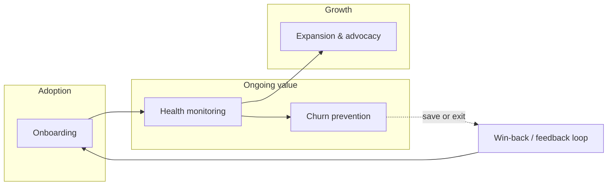

# Customer Success — practice guides (index)

These **project-agnostic** guides support **proactive customer management**: instrumenting journeys, scoring risk before renewal crises, and running retention and win-back with clear metrics. They extend the conceptual body of knowledge in [**CUSTOMER-SUCCESS.md**](../CUSTOMER-SUCCESS.md) (principles, lifecycle, PDLC/SDLC). Use them for topic depth; keep implementation specifics in project docs (footer).

---

## Where practices sit in the customer lifecycle

Deep dives: [**Onboarding**](onboarding-design.md), [**Health scoring**](health-scoring.md), [**Churn prevention**](churn-prevention.md). **Expansion and advocacy** remain in [**CUSTOMER-SUCCESS.md**](../CUSTOMER-SUCCESS.md).

---

## Practice guide index

| Practice guide | Focus |
|----------------|--------|
| [**Onboarding design**](onboarding-design.md) | Time-to-value, guided setup and progressive disclosure, persona-based journeys, milestone definition, in-product vs. human-led onboarding, completion and activation metrics, handoff from sales/marketing. |
| [**Health scoring**](health-scoring.md) | Signal selection (product usage, support, billing, sentiment), model design (rules vs. ML), tiering and thresholds, data contracts with engineering/analytics, alert routing, governance and false-positive management. |
| **Support operations setup** | Tiered support (L1/L2/L3), channel mix, SLA policy and measurement, ticket taxonomy, escalation paths, shift and capacity planning, knowledge base IA, deflection strategy, tooling integrations. |
| **Feedback program design** | NPS / CSAT / CES program architecture, sampling and timing, survey fatigue controls, linking responses to accounts and journeys, VoC synthesis, routing insights to roadmap and closing the loop with respondents. |
| [**Churn prevention**](churn-prevention.md) | Risk signals by segment, tiered interventions (digital, CSM, executive), save offers and commercial levers, win-back and exit interviews, involuntary churn (dunning, payments), experiment design for retention initiatives. |

For lifecycle mapping across SDLC/PDLC, see [**CS-SDLC-PDLC-BRIDGE.md**](../CS-SDLC-PDLC-BRIDGE.md).

---

*Keep project-specific customer success documentation in `docs/product/customer-success/` and support playbooks in `docs/operations/`, not in this file.*
