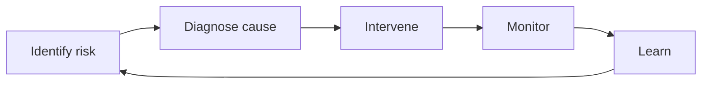
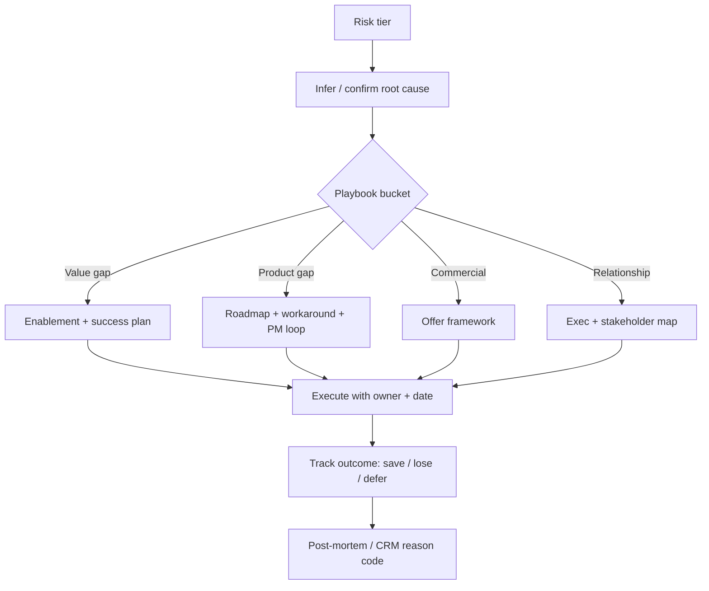

# Churn prevention playbooks and win-back

## Overview

**Churn prevention** is a systematic practice: detect risk early, diagnose root cause, intervene with the right commercial and product levers, monitor outcomes, and learn. It spans **voluntary** churn (choice to leave) and **involuntary** churn (payment and administrative failure). Win-back and exit flows are part of the same system — they capture learning and sometimes recover revenue.

This guide is **project-agnostic**; tune taxonomy, thresholds, and offers to your ethics policy, margin structure, and segment.

---

## Churn taxonomy

| Category | Examples | Detection signal | Prevention approach | Typical save rate (illustrative) |
|----------|----------|------------------|---------------------|----------------------------------|
| **Voluntary — active cancellation** | Customer initiates cancel | Cancel intent, downgrade flow, usage cliff | Value reinstatement, roadmap, exec engagement | Low–moderate; highly context-dependent |
| **Voluntary — competitor switch** | Evaluations, POC mentions | Sales intel, survey, champion change | Differentiation, migration help, commercial package | Moderate when caught early |
| **Voluntary — outgrew / misfit** | Needs beyond product | Usage pattern + explicit feedback | Honest fit discussion; partner or alternate SKU | Often low; sometimes redirect |
| **Voluntary — budget cut** | Cost reduction | Stakeholder messaging, procurement pressure | Commercial flexibility, ROI reframing | Variable |
| **Involuntary — payment failure** | Card decline | Billing events, dunning state | Dunning, retries, alternate payment | Often **higher** than voluntary if fixed quickly |
| **Involuntary — card expiry** | Upcoming expiration | Payment provider signals | Pre-dunning reminders, wallet update | High with good UX |
| **Involuntary — org dissolution** | Bankruptcy, shutdown | Public data, stakeholder silence | Limited; recovery / data handling | Very low |

Save rates vary wildly by segment, product, and **stage of intent**; track your own cohorts.

---

## Churn prevention lifecycle

**Diagnose** before defaulting to discounts — misdiagnosed saves waste margin and train customers to threaten churn.

---

## Early warning system — churn predictors

| Predictor | Why it matters |
|-----------|----------------|
| **Usage decline** | Often precedes explicit intent; leading indicator |
| **Support escalation** | Frustration or unmet expectations |
| **Champion departure** | Loss of internal advocacy |
| **Renewal window without expansion** | Commercial cliff if value not reinforced |
| **Competitor evaluation signals** | RFP, POC language, tooling overlap in data |

Combine signals in **health scoring** (see [health-scoring.md](health-scoring.md)) and qualitative CSM notes.

---

## Intervention playbooks by risk tier

### Green → yellow transition

- Proactive **check-in** tied to milestones, not generic “touching base.”
- Lightweight **success planning** (goals, owners, dates).
- **Feature adoption** push aligned to their JTBD.

### Yellow tier

- **Executive sponsor** engagement (vendor and customer side).
- **Value demonstration**: business review with metrics they care about.
- **Roadmap preview** where appropriate — credibility without over-promising.
- **Training refresher** for new users or new modules.

### Red tier

- **Executive escalation** on both sides.
- **Rescue offer** within commercial guardrails (see save offers below).
- **Onsite or deep workshop** (enterprise) when relationship repair requires it.
- **Custom solutions** only when strategic account and bounded scope.

---

## Intervention decision tree

---

## Save offer framework

| Lever | When to use | Margin impact (typical) |
|-------|-------------|-------------------------|
| **Discount** | Budget pressure; short-term bridge | High direct margin hit; use sparingly |
| **Term extension** | Timing misalignment; needs runway to prove value | Deferred revenue; may preserve LTV |
| **Feature unlock** | Value blocked by tier; low marginal cost | Low incremental cost if already built |
| **Services credit** | Implementation or skill gap | Uses PS capacity; better than blind discount when root cause is adoption |

Defaulting to **discount** trains bad behavior; pair any offer with **mutual commitments** (milestones, references) where policy allows.

---

## Involuntary churn prevention

| Tactic | Purpose |
|--------|---------|
| **Dunning management** | Recover failed payments with clear, respectful cadence |
| **Pre-dunning communication** | Card expiry, invoice upcoming — reduce surprise failures |
| **Payment retry logic** | Transient failures often recover with smart timing |
| **Grace periods** | Avoid hard cutoffs for transient issues; define limits |
| **Alternative payment methods** | ACH, invoicing, regional methods |

**Illustrative recovery rates** (highly variable — measure your own):

| Scenario | Recovery potential |
|----------|--------------------|
| First retry after soft decline | Often strong if UX is clear |
| Expired card with pre-notification | Strong |
| Hard decline / fraud block | Lower until customer updates instrument |
| Long neglect / multiple failures | Drops quickly |

---

## Exit and cancellation flow

- **Exit survey** — Structured reason codes + optional free text; feed product and CS analytics.
- **Save offer timing** — After reason captured; avoid blocking legally required cancel paths.
- **Cooldown periods** — Where appropriate, separate impulse from intent (policy and jurisdiction dependent).
- **Downgrade alternatives** — Cheaper tier or pause vs. full churn.

---

## Win-back campaigns

| Element | Guidance |
|---------|----------|
| **Timing** | Common windows: **30 / 60 / 90** days post-churn; test what fits your sales cycle |
| **Messaging** | Segment by **churn reason** (price vs. product vs. service) |
| **Offers** | Win-back promos within margin rules; sometimes **extended trial** beats permanent discount |
| **Re-onboarding** | Treat returners like partial new users; short path to refreshed value |

---

## Churn analysis

- **Cohort churn curves** — Survival by signup or renewal cohort; spot product or GTM regime changes.
- **Churn reason categorization** — Normalize free text into taxonomies for trending.
- **Revenue impact** — Logo vs. **MRR/ARR** churn; concentration risk.
- **LTV revision** — Update assumptions when retention curves shift.

---

## Metrics

| Metric | Definition / use |
|--------|------------------|
| **Gross churn rate** | Churned revenue or logos / starting base (period) |
| **Net churn rate** | Includes expansion/contraction — growth quality |
| **Logo vs. revenue churn** | Concentration vs. breadth of loss |
| **Save rate by playbook** | Which interventions work; sample size matters |
| **Time-to-churn** | From first risk signal or signup — diagnostic |
| **Win-back conversion rate** | Effectiveness of return campaigns |

---

## Anti-patterns

| Anti-pattern | Why it fails |
|--------------|--------------|
| **Reactive-only** | Misses leading signals; saves are expensive and rare |
| **Discount as default save** | Erodes margin and pricing integrity |
| **Ignoring involuntary churn** | “Silent” churn fixable with billing UX |
| **No churn reason tracking** | Cannot prioritize product or CS investments |

---

## External references

- **Fighting Churn with Data** (Carl Gold) — Measurement, survival analysis, and operational churn thinking.
- **ProfitWell / Paddle** — Retention and pricing research, benchmarks.
- **Baremetrics** — Blog and tooling context on churn and dunning.
- **SaaS churn benchmarks** — Use segment-matched external data cautiously; your cohorts are ground truth.

---

*Keep project-specific customer success documentation in `docs/product/customer-success/` and support playbooks in `docs/operations/`, not in this file.*
