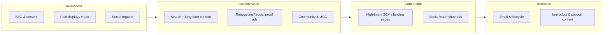

# Marketing channels — index

**Multi-channel marketing** spreads acquisition, consideration, and retention work across complementary surfaces so no single algorithm change or budget cut defines the business. Blueprint guides here are **discipline-level**: how SEO, content, paid media, and social fit the funnel — not campaign copy or channel-specific runbooks for one product.

## Channel guides

| Guide | Focus | Link |
|-------|--------|------|
| **SEO & Content Marketing** | Organic search visibility, intent-aligned content, topic clusters, technical hygiene | [`seo-content.md`](seo-content.md) |
| **Paid & Social Marketing** | Paid acquisition, platform mix, creative iteration, organic social and community | [`paid-social.md`](paid-social.md) |

## Planned channels

| Topic | Notes |
|-------|--------|
| **Email marketing** | Lifecycle, deliverability, compliance — *(planned)* |
| **Referral / affiliate** | Incentives, attribution, fraud — *(planned)* |
| **Developer relations** | Docs, advocates, community as acquisition — *(planned)* |

**Core marketing map:** See [`../MARKETING.md`](../MARKETING.md) for principles, funnel framing, and how channels relate to PDLC.

---

*Keep project-specific marketing plans in `docs/product/marketing/` and GTM documents in `docs/product/`, not in this file.*
