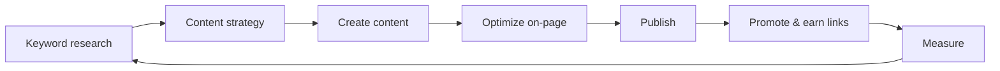
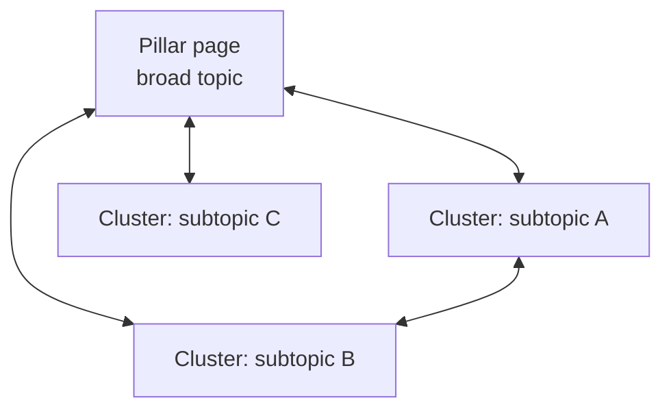

# SEO & Content Marketing

**Overview:** SEO and content marketing earn **organic acquisition** by making the product and its problem space **discoverable in search** and **worth reading or using** before a paywall or signup. Together they compound: technical SEO ensures pages can rank; content supplies the queries and links that sustain visibility.

## SEO fundamentals

| Area | Elements |
|------|----------|
| **On-page** | Title tags, meta descriptions, heading hierarchy (H1–H3), content depth and intent alignment, internal linking, clean URL structure |
| **Technical SEO** | Crawlability, indexability, [Core Web Vitals](../../../engineering/frontend/performance/README.md), structured data, XML sitemap, `robots.txt`, canonicalization |
| **Off-page** | Backlinks, domain/brand authority signals, mentions and citations (including indirect “social proof” effects on discovery) |

## SEO workflow

## Keyword research

**Search intent types**

| Intent | User goal | Typical content |
|--------|-----------|-----------------|
| **Informational** | Learn or compare | Guides, explainers, glossaries |
| **Navigational** | Find a brand or page | Brand pages, login/help hubs |
| **Commercial** | Evaluate options | Comparisons, “best X” with honest criteria |
| **Transactional** | Buy or sign up | Pricing, demos, product-led landing pages |

**Practice notes**

- **Tools:** Ahrefs, SEMrush, and Google Keyword Planner (and Search Console query data) support volume, difficulty, and SERP feature analysis.
- **Head vs long-tail:** Head terms are competitive and vague; long-tail clusters often convert better when intent is explicit.
- **Clustering:** Group keywords by shared intent and parent topic so one pillar can support many related queries without cannibalization.
- **SERP review:** Before writing, inspect the live results page (features, dominant content types, competitors). If Google favors video or forums for a query, match format or choose a different angle.
- **E-E-A-T alignment:** For YMYL-adjacent topics (finance, health, safety), invest in clear authorship, sourcing, and update dates; for all topics, prefer **helpful, people-first** pages over search-engine-first pages.

### Search Console loop

| Step | Action |
|------|--------|
| **Coverage** | Fix crawl errors, excluded URLs that should index, redirect chains |
| **Performance** | Sort queries by impressions with low CTR — improve titles and snippets |
| **Pages** | Find high-impression pages with declining clicks — refresh or consolidate |
| **Enhancements** | Resolve structured data errors; monitor mobile usability |

## Content strategy framework

- **Content pillars:** 3–5 themes that map to ICP jobs, pains, and your differentiation.
- **Topic clusters:** A **pillar page** covers the broad topic; **cluster posts** answer specific sub-queries; internal links flow authority and help users (and crawlers) navigate depth.
- **Editorial calendar:** Balance evergreen depth, launch beats, and refresh cycles; tie each asset to a primary keyword cluster and CTA.

### Content types

| Type | Role |
|------|------|
| Blog posts | Velocity, trends, commentary |
| Guides & tutorials | Informational intent, trust |
| Case studies | Proof, commercial intent |
| Whitepapers / reports | Lead nurture, authority |
| Video / podcasts | Reach, embeddable snippets |
| Tools / calculators | Link magnets, product-adjacent utility |

## Topic cluster model

## Technical SEO checklist

| Item | Notes |
|------|--------|
| **Core Web Vitals** | LCP, INP, CLS — see [`frontend/performance`](../../../engineering/frontend/performance/README.md) |
| **Mobile-first indexing** | Responsive layouts, tap targets, parity of critical content |
| **Structured data (JSON-LD)** | Product, Article, FAQ, HowTo where accurate — avoid misleading markup |
| **Canonical URLs** | One preferred URL per logical page; handle params and duplicates |
| **`hreflang`** | Per-locale URLs for true international equivalents |
| **JavaScript SEO** | Prefer SSR/SSG or verified client rendering; test with URL Inspection and rendered HTML |

## Content measurement

| Signal | Why it matters |
|--------|----------------|
| Organic traffic & landing pages | Volume and which topics pull users |
| Keyword rankings (clusters) | Visibility vs competitors for priority intents |
| CTR from SERPs | Title/meta relevance and snippet quality |
| Dwell time / engagement | Proxy for satisfaction (use with segment context) |
| Conversions from organic | Revenue tie-back; assisted paths in analytics |
| **Content decay** | Rankings/traffic slide when SERPs or freshness shift — schedule refreshes |

**Segmentation:** Compare organic performance by **locale, device, and landing template** (blog vs docs vs marketing page). A sitewide “SEO is up” can hide a collapsing docs cluster or a mobile UX regression that only shows in Search Console URL groups.

**Refresh triggers:** Material competitor updates, new product capabilities that obsolete old copy, broken outbound links, stale statistics, and query shifts (e.g. new “AI” modifier in the SERP) are all valid reasons to republish with a clear changelog for readers.

## Content distribution

| Mode | Examples |
|------|----------|
| **Owned** | Blog, docs, newsletter, in-app help |
| **Earned** | PR, guest posts, podcast appearances, community mentions |
| **Paid amplification** | Sponsored distribution of best performers — not a substitute for intent alignment |

## Documentation as marketing

For developer and API products, **docs, references, and tutorials** are often the **highest-intent organic surfaces**. Treat them like product: clear IA, searchable headings, code samples, versioning, and changelog SEO (what broke, what shipped) reduce support load and capture “how do I…” queries competitors miss.

**Collaboration:** SEO and content should pair with **engineering and support** — the best FAQ entries often come from repeated tickets; the best tutorials from onboarding observation. Publish **canonical** answers on owned URLs and link to them from the product so help content does not fragment across forums only.

## Internal linking discipline

| Practice | Rationale |
|----------|-----------|
| **Descriptive anchor text** | Helps users and clarifies topical relationships |
| **Depth links** | Point to specific sections or tools, not only homepages |
| **Orphan detection** | Pages with no internal inlinks struggle to rank and to be discovered |
| **Hub maintenance** | Pillar pages should periodically list new cluster content |

## Anti-patterns

| Anti-pattern | Risk |
|--------------|------|
| Keyword stuffing | Quality penalties, poor UX |
| Thin or duplicate content | No unique value; crawl budget waste |
| Link schemes | Manual actions; reputational damage |
| Ignoring search intent | Traffic without conversion |
| No refresh strategy | Decay erodes compounding returns |

## External references

- [Google Search Central](https://developers.google.com/search) — guidelines, Search Console, structured data
- [Ahrefs Blog](https://ahrefs.com/blog/) — SEO and content research depth
- [Moz: The Beginner's Guide to SEO](https://moz.com/beginners-guide-to-seo) — foundational framing
- [web.dev: SEO](https://web.dev/learn/seo/) — technical and UX-aligned SEO

**Index:** [`channels/README.md`](README.md) · **Marketing map:** [`../MARKETING.md`](../MARKETING.md)

---

*Keep project-specific marketing plans in `docs/product/marketing/` and GTM documents in `docs/product/`, not in this file.*
