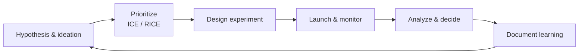

# Growth engineering — index

**Growth engineering** is the practice of improving acquisition, activation, retention, revenue, and referral through **systematic experimentation**, **sound instrumentation**, and **honest metrics** — not one-off hacks. It overlaps with marketing operations and product analytics but emphasizes **closed-loop tests** with pre-registered success criteria and **guardrails** (support load, refunds, trust). Blueprint material here is **framework-level**; operational runbooks, experiment tickets, and dashboards belong in `docs/product/marketing/` or platform docs.

**Relationship to channels:** Acquisition levers (SEO, paid, social) live under [`../channels/`](../channels/README.md); this folder focuses on **funnel mechanics**, prioritization, and experimentation discipline once traffic exists or loops are designed.

## Guides

| Guide | Focus |
|-------|--------|
| [**Funnel optimization**](funnel-optimization.md) | AARRR framing, stage levers, growth process, testing culture, guardrails |

## Planned / stub topics

| Topic | Focus |
|-------|--------|
| **A/B testing infrastructure** | Randomization units, sample size and power, sequential testing, SRM checks, feature flags, holdouts, and ethical guardrails |
| **Referral programs** | Loop design, K-factor limitations, incentive economics, invite UX, tracking implementation, fraud and abuse — *(planned)* |
| **Retention engineering** | Cohort curves, churn drivers, habit formation, lifecycle messaging coordination, win-back experiments — *(planned)* |
| **Activation optimization** | Time-to-value, aha-moment definition, onboarding experiments, empty states, checklist and progressive disclosure |

When a topic is still *(planned)*, use [`funnel-optimization.md`](funnel-optimization.md) for the overlapping AARRR framing and experiment hygiene until a dedicated guide lands.

**Core marketing map:** See [`../MARKETING.md`](../MARKETING.md) for how growth fits channels, positioning, and analytics.

**Suggested reading order**

1. [`../MARKETING.md`](../MARKETING.md) — principles and funnel vocabulary  
2. [`funnel-optimization.md`](funnel-optimization.md) — stage metrics, loops, and experiment rigor  
3. [`../channels/README.md`](../channels/README.md) — where acquisition tactics are indexed  

---

*Keep project-specific marketing plans in `docs/product/marketing/` and GTM documents in `docs/product/`, not in this file.*
