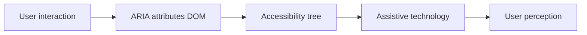
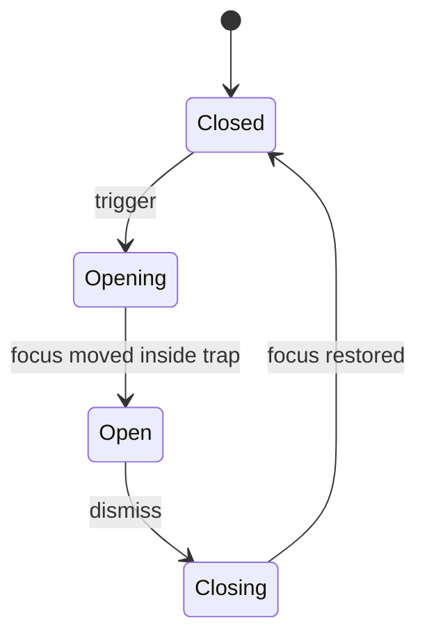

# WAI-ARIA patterns and widget guide

**Purpose:** Project-agnostic guidance for using **WAI-ARIA** to make custom widgets and dynamic content understandable to assistive technologies — with emphasis on **native HTML first**, keyboard parity, and testing.

---

## Overview

ARIA (Accessible Rich Internet Applications) **extends** the accessibility tree when native HTML cannot express behavior or state. It does **not** fix bad UX or missing keyboard support. Correct patterns come from the **WAI-ARIA Authoring Practices Guide (APG)** and platform accessibility APIs.

---

## First rule of ARIA

> If you can use a native HTML element or attribute with the needed semantics and behavior, **do so** — do not repurpose elements and add ARIA.

| Situation | Prefer | ARIA when |
|-----------|--------|-----------|
| Clickable action | `<button>` or `<a href>` | Rare custom requirements (with full keyboard + role) |
| Text input | `<input>`, `<textarea>`, `<select>` | Combobox patterns per APG |
| Expandable section | `
` / `
` | Design constraints and APG accordion pattern |
| Checkbox / radio | `<input type="checkbox|radio">` | Custom visuals only if semantics + keyboard match |

---

## ARIA roles taxonomy (selected)

| Category | Roles (examples) | Typical use |
|----------|-------------------|-------------|
| **Landmarks** | `banner`, `navigation`, `main`, `contentinfo`, `complementary`, `search` | Page regions — prefer semantic elements (`<header>`, `<nav>`, `<main>`) |
| **Widgets** | `button`, `tab`, `dialog`, `combobox`, `listbox`, `tree`, `grid` | Custom components |
| **Document structure** | `heading`, `list`, `img`, `region` | When native equivalent missing or role clarifies |

---

## States and properties (selected)

| Attribute | Purpose | Values / notes | Common mistakes |
|-----------|---------|----------------|-----------------|
| `aria-expanded` | Disclosure open/closed | `true` / `false` | On wrong element; not synced with UI |
| `aria-selected` | Selected item in set | `true` / `false` | Used outside correct container role |
| `aria-checked` | Toggle / checkbox state | `true` / `false` / `mixed` | Duplicates native checkbox |
| `aria-disabled` | Not operable | `true` | Focusable disabled without `tabindex="-1"` pattern |
| `aria-hidden` | Remove from AT tree | `true` | On focusable descendants |
| `aria-live` | Dynamic updates | `off`, `polite`, `assertive` | Over-assertive announcements |
| `aria-label` | Accessible name | string | Replacing visible text unnecessarily |
| `aria-labelledby` | Name from IDs | IDREFs | Missing or duplicate IDs |
| `aria-describedby` | Extra description | IDREFs | Pointing to hidden long text users need |

---

## ARIA communication flow

---

## Common widget patterns (APG-aligned)

### Accordion

| Concern | Practice |
|---------|----------|
| **Role** | Header controls associated region — prefer native `
` / `
` when design allows |
| **`aria-expanded`** | On the header `button` (or equivalent) for each panel |

| Key | Action (typical APG-style accordion) |
|-----|--------------------------------------|
| **Tab** | Move through accordion headers (and other focusables) |
| **Enter / Space** | Toggle expanded/collapsed for focused header |
| **Down / Up** (optional) | When implemented as a composite widget, move between headers without leaving the accordion |

### Dialog / modal

| Concern | Practice |
|---------|----------|
| **Role** | `dialog` or `alertdialog` |
| **`aria-modal="true"`** | When focus must stay inside |
| **Focus** | Initial focus inside; **trap** while open; **return** focus to trigger on close |

### Tabs

| Concern | Practice |
|---------|----------|
| **Roles** | `tablist`, `tab`, `tabpanel` |
| **`aria-selected`** | On active tab |
| **Keyboard** | Arrow keys between tabs; activation (automatic or manual per APG pattern) |

### Combobox

| Concern | Practice |
|---------|----------|
| **Roles** | `combobox` + `listbox` popup (pattern-dependent) |
| **`aria-expanded`** | Popup visibility |
| **`aria-activedescendant`** | When focus stays on input while highlighting options |

### Menu

| Concern | Practice |
|---------|----------|
| **Roles** | `menu` / `menubar`, `menuitem` |
| **`aria-haspopup`** | On opener when it opens menu |
| **Keyboard** | Arrows, Escape, typeahead per APG |

### Table with interactive cells (`grid`)

| Concern | Practice |
|---------|----------|
| **Role** | `grid` when cell navigation/editing like spreadsheet |
| **Roving `tabindex`** | One tab stop; arrows move active cell |
| **Editing** | Announce changes; preserve name/role/value |

---

## Live regions

| Attribute | When to use |
|-----------|-------------|
| `aria-live="polite"` | Non-urgent updates (save confirmation, new list items) |
| `aria-live="assertive"` | Urgent errors — **sparingly** |
| `aria-live="off"` | Default; suppress unnecessary chatter |
| `aria-atomic="true"` | Announce whole region on change |
| `aria-relevant` | Control which mutations are announced (`additions`, `text`, `removals`, `all`) |

---

## Dialog lifecycle (state)

---

## Testing ARIA

| Method | Use for |
|--------|---------|
| **Accessibility tree** (Firefox, Chrome DevTools) | Name, role, value, live regions |
| **axe** | Invalid ARIA, prohibited roles, color contrast |
| **Screen readers** | Announcement order, verbosity, keyboard |

---

## Common ARIA mistakes

| Mistake | Why it hurts |
|---------|--------------|
| Redundant ARIA on native elements | Conflicts; unpredictable AT |
| Wrong role for behavior | Misleading mental model |
| Roles without keyboard | Not operable — fails WCAG |
| `aria-hidden` on focused elements | Focused ghost controls |
| `aria-label` duplicating visible text | Drift when copy changes |

---

## Anti-patterns

- **ARIA decorating** — adding `role` without keyboard events and focus management.
- **`aria-label` on large non-interactive containers** — obscures structure; prefer headings/landmarks.
- **`role="presentation"` abuse** — stripping semantics from content users need.

---

## External references

- [WAI-ARIA 1.2](https://www.w3.org/TR/wai-aria-1.2/) — specification.
- [WAI-ARIA Authoring Practices Guide (APG)](https://www.w3.org/WAI/ARIA/apg/) — patterns and keyboard models.
- [MDN: ARIA](https://developer.mozilla.org/en-US/docs/Web/Accessibility/ARIA) — developer docs.
- [A11y Style Guide](https://a11y-style-guide.com/style-guide/) — examples and checklists.

*Keep project-specific accessibility audits in docs/product/ and remediation plans in docs/development/, not in this file.*
