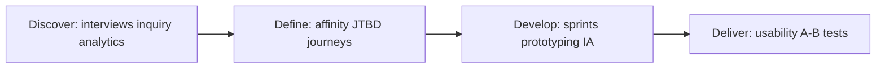

# UX Design techniques (blueprint)

**Purpose:** Deep, **project-agnostic** guides for core UX research and design techniques — purpose, when to use, execution, and interpreting results.

**Evidence-based design:** UX techniques are **methods for reducing uncertainty**, not taste. Match generative vs evaluative and attitudinal vs behavioral methods to the question; document what would change your mind. Pair this folder with project artifacts in **`docs/design/research/`**.

**Audience:** Teams adopting [`blueprints/disciplines/product/ux-design/`](../README.md). **Core knowledge:** [`UX-DESIGN.md`](../UX-DESIGN.md). **Bridge:** [`UX-SDLC-PDLC-BRIDGE.md`](../UX-SDLC-PDLC-BRIDGE.md).

---

## Design phases and techniques

---

## How to use this folder

- **Discovery and evaluation:** [`user-research.md`](user-research.md) — method choice, planning, synthesis, repository habits, usability testing.
- **Behavior and patterns:** [`interaction-design.md`](interaction-design.md) — principles, navigation and input, feedback, responsive and gesture expectations.

The double diamond and cross-cutting summaries in [`UX-DESIGN.md`](../UX-DESIGN.md) frame how these techniques fit the wider UX body of knowledge.

---

## Technique guides

| Technique | Focus | Deep guide |
|-----------|-------|------------|
| **User research** | Taxonomy, planning, ethics, synthesis, repository, usability testing | [`user-research.md`](user-research.md) |
| **Interaction design** | Principles, navigation/input/feedback, responsive & gestures, system patterns | [`interaction-design.md`](interaction-design.md) |
| **User interviews** | Semi-structured generative interviews | *[`UX-DESIGN.md`](../UX-DESIGN.md)* |
| **Usability testing** | Tasks, metrics, SUS, moderation | [`user-research.md`](user-research.md#usability-testing-specifics) |
| **Design sprints** | Time-boxed collaborative design | *[`UX-DESIGN.md`](../UX-DESIGN.md)* |
| **A/B experimentation** | Hypotheses, power, guardrails | [`user-research.md`](user-research.md#quantitative-methods) |
| **Heuristic evaluation** | Expert review, severity | *[`UX-DESIGN.md`](../UX-DESIGN.md)* |
| **Card sorting / tree testing** | IA validation | [`user-research.md`](user-research.md#qualitative-methods) |
| **Journey mapping** | Touchpoints, pain, opportunities | [`user-research.md`](user-research.md#synthesis-methods) |
| **Design critique** | Structured feedback | *[`UX-DESIGN.md`](../UX-DESIGN.md)* |
| **Prototyping** | Fidelity, tools, testing | [`interaction-design.md`](interaction-design.md#interaction-design-process) |

*Keep project-specific accessibility audits in docs/product/ and remediation plans in docs/development/, not in this file.*
