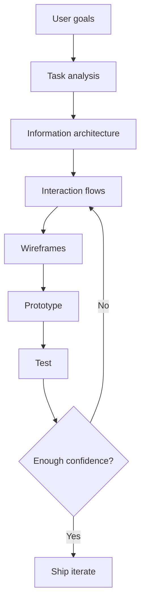
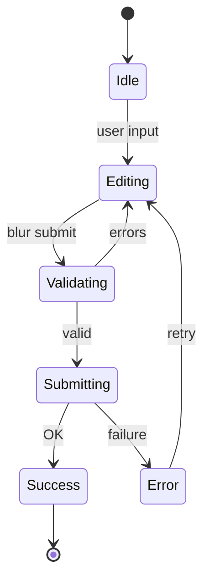
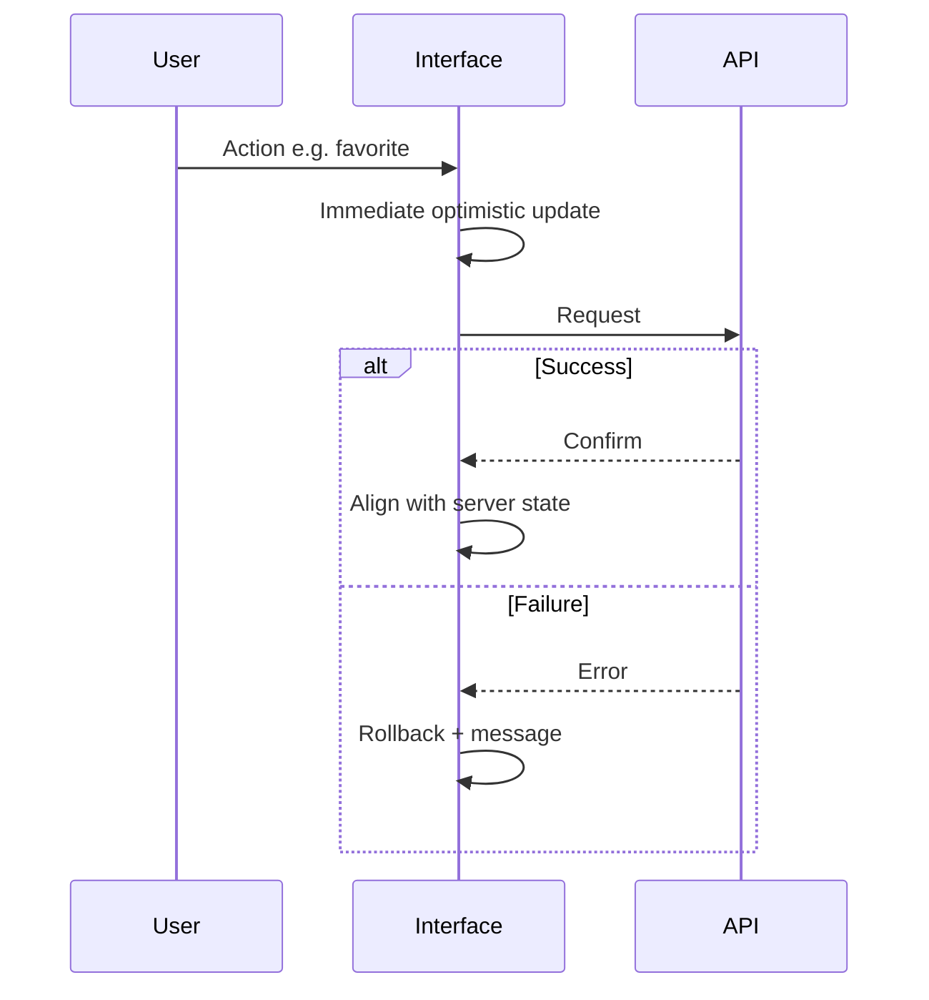

# Interaction design patterns and principles

**Purpose:** Project-agnostic guidance for designing **how** users accomplish goals — predictable behavior, clear feedback, and patterns that scale across platforms and design systems.

---

## Overview

Interaction design (IxD) defines the **behavior** of an interface: states, transitions, errors, navigation, and input. It sits between user research (what people need) and visual design (how it looks). Strong IxD reduces **cognitive load**, prevents errors, and makes systems **learnable** and **efficient**.

---

## Interaction design principles

| Principle | Definition | Example | If violated |
|-----------|------------|---------|-------------|
| **Visibility** | Important options and system state are discoverable | Primary actions visible on screen; settings findable | Users miss features or feel “stuck” |
| **Feedback** | The system acknowledges actions and progress | Button pressed state; toast after save | Uncertainty, double submits, distrust |
| **Constraints** | Limits guide valid actions | Disabled submit until form valid; date picker ranges | Errors, frustration |
| **Mapping** | Controls relate clearly to their effects | Vertical slider matches “up = more” | Wrong mental model, mistakes |
| **Consistency** | Similar problems have similar solutions | Same gesture means “back” everywhere | Slower learning, errors |
| **Affordance (Gibson/Norman)** | Perceived possibilities for action | Handle suggests pulling | Users do not try the right action |
| **Signifiers** | Perceptible cues that indicate affordances | Label “Menu”, chevron on expandable | Mystery meat UI |

---

## Interaction design process

---

## Navigation patterns

| Pattern | Type | When to use | Platform notes |
|---------|------|-------------|----------------|
| **Top bar / app bar** | Global | Few primary sections; branding and key actions | Web + desktop; combine with overflow on small widths |
| **Sidebar / rail** | Global | Many sections; persistent wayfinding | Desktop-first; collapse to drawer on mobile |
| **Breadcrumbs** | Local | Deep hierarchies; “where am I?” | Web; less common in native mobile |
| **Tabs** | Local | Peer views of same object or section | OS conventions for scrollable vs fixed tabs |
| **Steppers / wizard** | Local | Linear multi-step tasks | Mobile: one step per screen; clear back/save |
| **In-page anchors / “related”** | Contextual | Long pages; cross-links within task | Ensure focus management for a11y |

---

## Input patterns

| Pattern | Guidance |
|---------|----------|
| **Forms** | Progressive disclosure; inline validation; smart defaults from context |
| **Search** | Autocomplete; filters and facets for large sets; empty and no-results states |
| **Selection** | Checkbox (multi), radio (single in set), toggle (binary on/off), dropdown (many options, single), date picker (known format + keyboard fallback) |
| **Direct manipulation** | Drag-and-drop with clear handles; gestures documented and consistent |

---

## Feedback patterns

| Pattern | Use when |
|---------|----------|
| **Skeleton** | Layout known; content loading |
| **Spinner** | Short indeterminate waits |
| **Progress bar** | Determinate long operations |
| **Success / error** | Completed or failed actions — pair errors with recovery |
| **Empty states** | No data yet — explain and offer next step |
| **Transitions / micro-interactions** | Orientation (not decoration only); respect reduced motion |

---

## Form submission state diagram

---

## Responsive design patterns

- **Fluid grids** and relative units — reduce fixed-pixel fragility.
- **Breakpoints** — align to content and tasks, not only device brands.
- **Container queries** — component-level responsiveness where supported.
- **Responsive images** — `srcset`, sizes, art direction when needed.
- **Mobile-first vs desktop-first** — mobile-first forces priority; desktop-first suits dense pro tools — document the choice.

---

## Gesture design (expectations)

| Gesture | iOS | Android | Web |
|---------|-----|---------|-----|
| **Tap** | Primary activation | Primary activation | Click equivalent |
| **Swipe** | Back (edge), lists | Back, dismiss | Often custom — document |
| **Pinch** | Zoom | Zoom | Maps/media — browser defaults |
| **Long press** | Context menus, peek | Context, selection | Right-click parity limited |
| **Drag** | Reorder, drop | Reorder, drop | HTML5 DnD + fallbacks |

Prefer **platform HIG** defaults; when diverging, teach in UI.

---

## Optimistic UI (sequence)

---

## Design system component patterns

| Component | Role |
|-----------|------|
| **Button hierarchy** | Primary / secondary / tertiary / destructive — one primary per view |
| **Modal / dialog** | Focused decisions; escape and focus trap |
| **Toast / snackbar** | Lightweight confirmation; do not block critical path |
| **Drawer / side sheet** | Filters, secondary tasks |
| **Bottom sheet** | Mobile actions and short forms |
| **Command palette** | Power users; searchable actions |

---

## Accessibility in interaction design

- **Focus management** — visible focus, logical order, return focus after modal close.
- **Keyboard navigation** — all actions reachable; no keyboard traps.
- **Screen readers** — names, roles, states; live regions for async updates.
- **Motion** — `prefers-reduced-motion` alternatives.

---

## Anti-patterns

- **Mystery meat navigation** — icons or regions without labels.
- **Modal abuse** — blocking dialogs for non-critical messages.
- **Infinite scroll** without search, filters, or “back to top” / pagination fallback.
- **Breaking the browser back button** — SPA routes must match user expectations.

---

## External references

- *About Face* — Cooper et al. (goal-directed design).
- *Don’t Make Me Think* — Steve Krug (usability and clarity).
- [Material Design](https://m3.material.io/) — patterns and motion.
- [Apple Human Interface Guidelines](https://developer.apple.com/design/human-interface-guidelines/) — platform conventions.
- [Laws of UX](https://lawsofux.com/) — psychological principles in concise form.

*Keep project-specific accessibility audits in docs/product/ and remediation plans in docs/development/, not in this file.*
