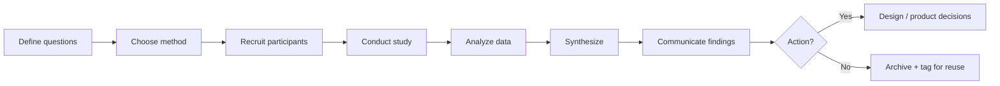
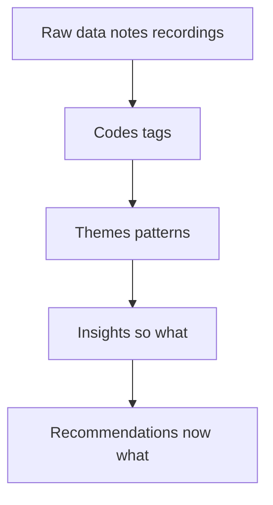

# User research methods and practices

**Purpose:** Project-agnostic guidance for understanding users through systematic inquiry — choosing methods, planning ethically, synthesizing findings, and turning evidence into design decisions.

---

## Overview

User research grounds product decisions in **observed and reported behavior**, not assumptions. It spans generative work (discovering needs and mental models) and evaluative work (testing whether designs work). Good research is **planned**, **transparent about limitations**, and **connected to action** — insights that never influence design or strategy waste participant time and team trust.

---

## Research method taxonomy (2×2)

| | **Attitudinal** (what people say they believe, prefer, or would do) | **Behavioral** (what people actually do) |
|---|------------------------------------------------------------------------|------------------------------------------|
| **Qualitative** | **Examples:** interviews, diary studies (self-report), focus groups, card-sort explanations | **Examples:** contextual inquiry, moderated usability tests, think-aloud sessions, ethnographic observation |
| **Quantitative** | **Examples:** attitude surveys, NPS-style scales, preference polls | **Examples:** analytics, A/B tests, task success rates, click-stream analysis, eye-tracking metrics |

Use the matrix to **pair methods**: qualitative behavioral observation explains *why* quantitative behavioral data shows a drop-off; attitudinal surveys at scale complement deep interviews.

---

## Qualitative methods

| Method | Description | When to use | Typical sample | Primary outputs | Effort |
|--------|-------------|-------------|----------------|-----------------|--------|
| **User interviews** | One-on-one structured or semi-structured conversations | Exploring mental models, goals, vocabulary; early discovery | 5–12 per segment | Themes, quotes, journey hypotheses | Medium |
| **Contextual inquiry** | Observation + interview in the user’s real environment | Workflow-heavy domains; understanding tools and interruptions | 4–8 | Task models, environmental constraints | High |
| **Diary studies** | Participants log experiences over days or weeks | Habits, infrequent events, longitudinal sentiment | 8–20 | Patterns over time, triggers | High |
| **Card sorting** | Users group labels into categories | IA labels, navigation groupings | 15–30 (quant) or 5–8 (detailed) | Category model, disagreements | Low–medium |
| **Tree testing** | Find items in a text-only hierarchy | Validate IA without visual design | 30–50+ for stats; smaller for pilots | Findability %, wrong paths | Low–medium |
| **Focus groups** | Facilitated group discussion | Exploring group norms, reactions to concepts — **not** for usability | 2–4 groups × 6–8 | Themes, vocabulary, concerns | Medium |

---

## Quantitative methods

| Method | Description | When to use | Typical sample | Primary outputs | Effort |
|--------|-------------|-------------|----------------|-----------------|--------|
| **Surveys** | Structured questionnaires at scale | Segment sizing, satisfaction, feature prioritization | 100+ for stable proportions; more for subgroups | Distributions, correlations | Low–medium |
| **A/B testing** | Randomized exposure to variants | Validate specific UI or copy changes with measurable goals | Powered by MDE and baseline rate | Lift, guardrails | Medium–high |
| **Analytics** | Instrumented product usage | Funnels, retention, feature adoption | Full population or sampled | Trends, segments, anomalies | Ongoing |
| **Task completion rates** | Success/fail on defined tasks (lab or unmoderated) | Benchmark usability; compare designs | 20–40+ per variant for stable rates | % success, paths | Medium |
| **Click-stream analysis** | Sequences of clicks or navigation paths | Diagnose confusion, loops, abandonment | Large event volume | Paths, drop-off points | Medium |
| **Eye tracking** | Gaze position and fixation metrics | Packaged goods, dense UIs, ad/layout research | Small N + overlays | Heatmaps, fixation order | High |

---

## Research process (flowchart)

---

## Research planning

- **Research questions:** Separate **learning goals** (“What frustrates users when onboarding?”) from **methods** (“Run 8 interviews”). One study should answer a small set of aligned questions.
- **Recruitment:** Write **screeners** for behavior and context (not just demographics). Decide **sampling**: convenience vs quota vs random — document bias. Include edge cases when risk is high (compliance, safety, money).
- **Ethics:** **Informed consent** (recording, data use, withdrawal). **Fair incentives** proportional to burden. Extra care for **vulnerable populations** (minors, health, financial distress) — involve legal/review boards when required. Store PII according to policy; de-identify synthesis artifacts.

---

## Interview techniques

| Style | Structure | Pros | Cons |
|-------|-----------|------|------|
| **Structured** | Fixed question order and wording | Comparable across sessions; easy for novices | Miss emergent themes |
| **Semi-structured** | Guide with core topics + probes | Balance consistency and depth | Needs skilled moderators |
| **Unstructured** | Minimal script; exploratory | Rich for novel domains | Hard to compare; time-consuming |

**Probing:** **5 Whys** — chain “why” to root causes (watch for fatigue). **Laddering** — link features to consequences to values. **Think-aloud** — ask users to verbalize during tasks (evaluative); avoid leading the narrative.

---

## Synthesis methods

- **Affinity diagramming** — cluster observations into themes bottom-up.
- **Journey mapping** — stages, touchpoints, emotions, pain points, opportunities.
- **Persona development** — behavioral archetypes from patterns (not stereotypes).
- **Empathy mapping** — says/thinks/does/feels for a scenario.
- **Jobs-to-be-done** — circumstances, struggles, desired outcomes (“hire” the product).

---

## Insight synthesis funnel

---

## Research repository

Democratize access so teams do not re-ask the same questions. Use a **tagging taxonomy** (topic, segment, product area, method, date). **Atomic research** stores bite-sized findings with evidence links so they compose into larger narratives. Tools such as **Dovetail** and **EnjoyHQ** support search, highlights, and insight libraries; spreadsheets work for small teams if discipline is maintained.

---

## Usability testing specifics

| Dimension | Options | Notes |
|-----------|---------|-------|
| **Moderation** | Moderated vs unmoderated | Moderated: probes and clarifications. Unmoderated: scale and speed; write tasks very carefully |
| **Setting** | Remote vs in-person | Remote widens geography; in-person suits physical products or sensitive contexts |
| **Tasks** | Realistic goals, clear success criteria, avoid leading hints | Pilot tasks before full run |
| **Protocol** | Think-aloud | Explain once; stay neutral; note where users struggle |
| **SUS** | System Usability Scale — 10 items, 0–100 score | Compare over time or to industry benchmarks with caution |

---

## Research deliverables

| Deliverable | Contents | Best for |
|-------------|----------|----------|
| **Personas** | Goals, behaviors, frustrations (evidence-backed) | Alignment, scenario writing |
| **Journey maps** | Stages, emotions, opportunities | Service design, prioritization |
| **Empathy maps** | Per scenario | Workshops, quick shared understanding |
| **Insight reports** | Questions, method, findings, limitations, recommendations | Stakeholders, decisions |
| **Video highlights** | Short clips with consent | Empathy building |
| **Design principles** | Durable heuristics from research | Critique and tradeoffs |

---

## Anti-patterns

- **Leading questions** (“Don’t you think this is easier?”) — biases responses.
- **Confirmation bias** — only citing data that supports a preferred solution.
- **Testing with colleagues** — false confidence; not representative users.
- **Research without action** — no owner, no decision, no follow-up erodes trust.

---

## External references

- *Just Enough Research* — Erika Hall (pragmatic research for teams).
- [NN/g: User Research Methods](https://www.nngroup.com/topic/user-research/) — methods encyclopedia and courses.
- *Interviewing Users* — Steve Portigal (moderation and field practice).

*Keep project-specific accessibility audits in docs/product/ and remediation plans in docs/development/, not in this file.*
