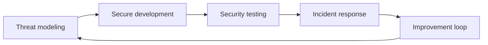

# Security practices (blueprint)

**Purpose:** Deep, **project-agnostic** guides for core security practices. Each practice describes its principles, methodology, tooling, and integration with the development lifecycle.

**Audience:** Teams adopting [`blueprints/disciplines/security/`](../README.md); project-specific security configuration and findings stay in **`docs/security/`**.

---

## Why these practices matter

Security practices are **proactive defense**: they turn “hope we are safe” into **repeatable activities** that catch design flaws early, validate implementations continuously, and ensure the organization can **respond and learn** when something goes wrong. Together they connect **architecture**, **delivery**, and **operations** so security is owned by the whole team, not isolated in a late gate.

The loop closes when incidents and test findings **feed** updated threat assumptions, requirements, and detection — documented at the project level in **`docs/security/`**, **`docs/security/threat-models/`**, and **`docs/adr/`** as appropriate.

---

## Practice guides

| Practice | Guide | Focus |
|----------|-------|-------|
| **Threat modeling** | [`threat-modeling.md`](threat-modeling.md) | STRIDE, PASTA, LINDDUN, attack trees, DFDs, risk rating, tools, SDLC integration |
| **Secure code review** | — | Review checklists by language/framework, common vulnerability patterns, reviewer training |
| **Security testing** | [`security-testing.md`](security-testing.md) | SAST, SCA, DAST, IAST, CI/CD, container/IaC scanning, vuln lifecycle, metrics |
| **Penetration testing** | [`security-testing.md`](security-testing.md#penetration-testing) | Scope, rules of engagement, PTES / OWASP Testing Guide, reporting, remediation tracking |
| **Incident response** | [`incident-response.md`](incident-response.md) | IR plan, NIST lifecycle, roles, containment, comms, tabletops, metrics |
| **Supply chain security** | — | SBOM generation, dependency management, artifact signing, SLSA framework adoption |
| **Secrets management** | — | Vault patterns, cloud-native secret stores, rotation policies, secret injection, audit |

---

**Core knowledge:** [`SECURITY.md`](../SECURITY.md) — principles, OWASP, authentication, cryptography, S-SDLC.

**Bridge:** [`SEC-SDLC-PDLC-BRIDGE.md`](../SEC-SDLC-PDLC-BRIDGE.md) — how Security maps to delivery and product lifecycles.

---

*Keep project-specific security documentation in docs/security/, threat models in docs/security/threat-models/, and security decisions in docs/adr/, not in this file.*
