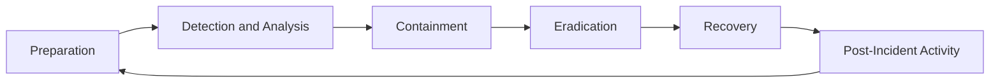
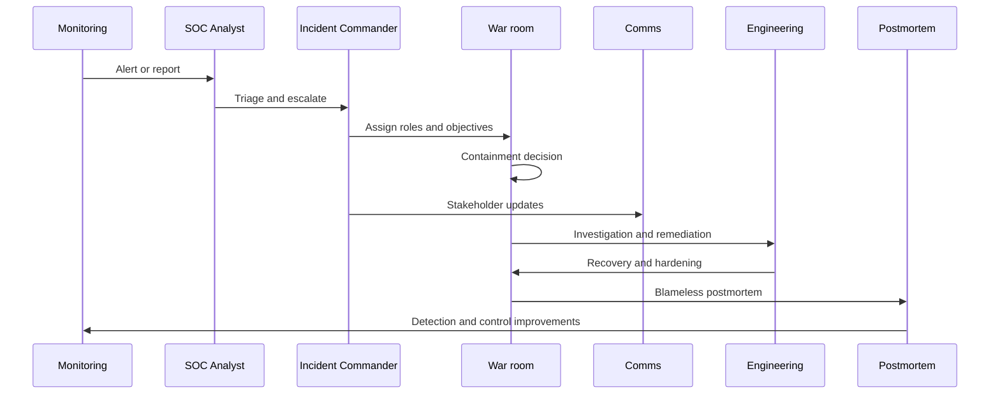

# Security incident response

**Purpose:** A **project-agnostic** blueprint for preparing, detecting, containing, and learning from **security incidents** with clear roles, communications, and evidence handling.

**Audience:** Security operations, engineering leadership, legal/compliance, and communications stakeholders.

---

## Overview

Incident response (IR) is how an organization **limits harm**, **restores trust**, and **improves** after a security event. A strong program combines **written plans**, **rehearsed playbooks**, **instrumented detection**, and **blameless learning** — not heroics under pressure.

---

## Incident classification

| Severity | Definition (typical) | Examples | Response SLA (indicative) | Communication | Escalation |
|----------|----------------------|----------|---------------------------|---------------|------------|
| **Critical** | Active compromise of prod, large-scale data exposure, ransomware in progress | Domain admin compromise, widespread data exfiltration | Minutes to engage IC | Exec + legal + comms + customer/regulator path as required | C-level, 24/7 bridge |
| **High** | Confirmed breach limited scope, critical vuln exploited, major service impact from attack | Single tenant data access, successful auth bypass in prod | Under 1 hour | Security + engineering leadership + legal triage | Director+ |
| **Medium** | Suspicious activity unconfirmed, limited asset, contained issue | Possible account takeover, isolated malware on endpoint | Same business day | Team leads + security | Manager+ |
| **Low** | Policy violations, noise, near-misses | Phishing reported no creds lost, scan noise | Next business day | Team channel / ticket | On-call security |

Calibrate SLAs and **regulatory triggers** (e.g., GDPR breach assessment) with counsel — this table is a template, not legal advice.

---

## NIST incident response lifecycle

**Post-incident activity** feeds **preparation** through updated controls, training, and detection rules.

---

## IR plan components (preparation)

| Component | Contents |
|-----------|----------|
| **Roles and responsibilities** | Roster, backups, delegation rules |
| **Contact lists** | On-call, vendors, cloud support, law enforcement liaison |
| **Communication templates** | Internal status, customer holding statements, regulator outlines |
| **Legal / PR coordination** | When counsel approves external messaging; privilege considerations |
| **Evidence preservation** | Log retention, imaging steps, chain-of-custody form |
| **Tabletop schedule** | Quarterly critical scenarios, annual full-scale exercise |

---

## IR team roles

| Role | Responsibilities | Skills |
|------|------------------|--------|
| **Incident Commander (IC)** | Objectives, scope, approvals, resource allocation | Crisis leadership, technical literacy |
| **Security Analyst** | Triage alerts, hypothesis testing, IOC hunting | SIEM, endpoint, cloud logging |
| **Forensics Lead** | Disk/memory capture, timeline, malware analysis | Forensic tools, evidence handling |
| **Communications Lead** | Status updates, stakeholder alignment | Clear writing under pressure |
| **Legal Counsel** | Regulatory duties, privilege, contracts | Privacy and breach law |
| **Engineering Lead** | Patches, isolations, service recovery | System architecture, change management |

---

## Detection and analysis — IoC types

| Category | Examples | Collection |
|----------|----------|------------|
| **Network** | IPs, domains, TLS cert anomalies, beaconing | Firewall, DNS, NIDS, proxy logs |
| **Host** | File hashes, registry keys, persistence | EDR, OS audit, integrity monitoring |
| **Application** | Failed logins, privilege spikes, odd API sequences | App logs, WAF, IdP |
| **Behavioral** | Lateral movement, impossible travel, data staging | UEBA, correlation rules, baselines |

**SIEM correlation** and **threat intelligence** (TI feeds, ISACs) accelerate triage; tune alerts to **actionable** scenarios.

---

## Critical incident response flow (sequence)

---

## Containment strategies

| Incident type | Short-term containment | Long-term containment / eradication |
|---------------|------------------------|-------------------------------------|
| **Malware** | Isolate host; block C2 at network | Reimage; patch vector; EDR policy updates |
| **Data breach** | Revoke tokens; block exfil paths | Fix root cause; encryption; DLP tuning |
| **Credential compromise** | Force reset; revoke sessions | MFA enforcement; password policy; hunt for reuse |
| **DDoS** | Mitigation provider; rate limits | Architecture hardening; upstream filtering |
| **Insider threat** | Suspend access; preserve logs | HR/legal process; least-privilege redesign |

---

## Evidence preservation

- **Chain of custody:** who collected, when, where stored, integrity hashes  
- **Forensic imaging:** bit-for-bit copies; write blockers; documented procedures  
- **Log preservation:** centralized, tamper-resistant storage; **legal hold** on deletion  
- **Timeline reconstruction:** SIEM queries, EDR storylines, mail logs — tools vary by stack (e.g., **Volatility**, **Autopsy**, **KAPE** for endpoint forensics)

---

## Communication plan

| Stakeholder | Typical trigger |
|-------------|-----------------|
| **Engineering / SRE** | Any confirmed incident affecting systems |
| **Security leadership** | Medium+ or regulatory touch |
| **Executive / board** | High/Critical or reputational risk |
| **Customers** | Contractual commitment or material impact |
| **Regulators** | Jurisdiction-specific (e.g., GDPR **72-hour** assessment clock for many personal-data breaches; **HIPAA** breach notification rules for covered entities) |

Use **pre-approved templates** and **single narrative owner** to avoid contradictory statements.

---

## Recovery and lessons learned

- Restore services with **verified clean** builds where appropriate  
- Enhance **monitoring** and **detection** for observed TTPs  
- Run a **blameless postmortem**: timeline, root cause, contributing factors, **action items with owners**  
- Track improvements in the same system as other engineering work  

---

## Tabletop exercises

| Aspect | Guidance |
|--------|----------|
| **Scenario design** | Realistic for your stack; inject comms and legal twists |
| **Frequency** | At least annual full exercise; quarterly focused drills |
| **Participants** | IC, security, eng, legal, comms as applicable |
| **Facilitation** | Pre-read, timed injects, clear success criteria |
| **Outcomes** | Document gaps, update runbooks, assign remediation |

---

## Incident response tools

| Category | Examples |
|----------|----------|
| **SIEM** | Splunk, Elastic, Microsoft Sentinel |
| **SOAR** | Palo Alto XSOAR, Tines, Shuffle |
| **Forensics** | Volatility, Autopsy, KAPE |
| **Paging / coordination** | PagerDuty, Opsgenie |

---

## Metrics

| Metric | Meaning |
|--------|---------|
| **MTTD** | Mean time to **detect** |
| **MTTA** | Mean time to **acknowledge** |
| **MTTC** | Mean time to **contain** |
| **MTTR** | Mean time to **resolve** (define consistently) |
| **Incident frequency** | Trends by category |
| **Postmortem completion rate** | % incidents with closed action items |

---

## Anti-patterns

| Anti-pattern | Risk |
|--------------|------|
| **No IR plan** | Chaotic response; evidence loss |
| **Hero-dependent response** | Bus factor; inconsistent outcomes |
| **Blame culture** | Hides facts; weak learning |
| **No postmortems** | Repeated failures |
| **Forensic evidence destruction** | Legal and regulatory exposure |

---

## External references

- NIST SP 800-61 — Computer Security Incident Handling Guide  
- SANS Incident Response materials and posters  
- *Incident Management for Operations* (O’Reilly)  
- [PagerDuty incident response documentation](https://response.pagerduty.com/)

---

*Keep project-specific security documentation in docs/security/, threat models in docs/security/threat-models/, and security decisions in docs/adr/, not in this file.*
