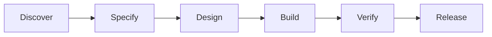

# Documentation design principles

Standards for all Markdown source files and generated documentation across the blueprint framework.

## 0. Multi-surface documentation architecture

Blueprint `.md` files are the **single source of truth**. They feed three documentation surfaces, each with a distinct lens:

| Surface | Lens | Audience | Repo |
|---------|------|----------|------|
| **GitHub Wiki** | Pure engineering quick reference | Developers using blueprints day-to-day | `blueprints` |
| **blueprints.forgesdlc.com** | Engineering framework — how to use blueprints as an agentic development bootstrap | Engineers, architects, team leads | `blueprints` |
| **forgesdlc.com** | Forge SDLC methodology product — business value, adoption | CTOs, managers, methodology coaches | `forgesdlc` |

No full-page copies between surfaces — only **cross-references** with short executive or engineering summaries around a link.

### Content metadata (frontmatter)

Every `.md` file should declare its tier and surface targeting:

```yaml
---
tier: 201
surfaces:
  - blueprints.forgesdlc.com
  - forgesdlc.com
  - wiki
cross_refs:
  forgesdlc.com: "See [adoption guide](https://forgesdlc.com/adopt) for business context"
  blueprints.forgesdlc.com: "Framework setup: [Getting Started](https://blueprints.forgesdlc.com/getting-started)"
---
```

| Field | Required | Values | Purpose |
|-------|----------|--------|---------|
| `tier` | Yes | `101`, `201`, `301` | Content depth level |
| `surfaces` | No | List of `blueprints.forgesdlc.com`, `forgesdlc.com`, `wiki` | Which surfaces include this file. Defaults to all. |
| `cross_refs` | No | Map of surface → markdown link text | Cross-reference callouts rendered by the generator |

### 101 / 201 / 301 tiering

Each surface organizes content by depth:

| Tier | Name | Characteristics |
|------|------|----------------|
| **101** | Introduction | Self-contained, no prerequisites. "What is this? When do I use it?" |
| **201** | Practical | References 101 concepts without re-explaining. How-to guides, integration patterns. |
| **301** | Advanced | Assumes 201 knowledge. Deep analysis, extension points, policy rationale. |

Guidelines:
- Every new `.md` file must declare its tier in frontmatter
- 101 content must be understandable without reading anything else
- 201 content can link to 101 for background
- 301 content can assume 201 knowledge and link freely
- Each surface's navigation makes the tier progression discoverable

### Cross-referencing policy

| From → To | Policy |
|-----------|--------|
| GitHub Wiki → forgesdlc.com | Mention sparingly — "blueprints can be used with any methodology; when paired with ForgeSDLC there is additional value" |
| blueprints.forgesdlc.com → forgesdlc.com | Link freely for methodology context |
| blueprints.forgesdlc.com → GitHub Wiki | Link freely for reference detail |
| forgesdlc.com → blueprints.forgesdlc.com | Link when technical depth is needed |
| forgesdlc.com → GitHub Wiki | Minimal |

## 1. Every Markdown file gets an HTML page

Every `.md` source file under `blueprints/` **must** have a corresponding HTML page generated by `generator/build-handbook.py`. This includes body-of-knowledge documents, bridge documents, approach/technique guides, policy files, and templates.

## 2. Human-friendly presentation

Raw Markdown is the source of truth, but the HTML handbook must present content in a way that is **immediately useful to a human reader**:

| Element | When to use |
|---------|-------------|
| **Tables** | Comparisons, role matrices, RACI charts, artifact inventories |
| **Mermaid diagrams** | Process flows, lifecycle mappings, relationship graphs, architecture layers |
| **Code examples** | CLI commands, configuration snippets, API shapes |
| **Callout boxes** | Key takeaways, warnings, cross-references to other areas |
| **Numbered steps** | Procedures, adoption guides, ceremony agendas |

When authoring Markdown, prefer visual structures over long prose paragraphs. A table or diagram communicates faster than a wall of text.

**Summary tables must link to detail pages.** When a page introduces concepts (glossary terms, chapters, sub-areas), every table row must include a "Detail" or "More" column with links to the pages that explain the concept in depth. A reader should never hit a dead end at a summary table.

## 3. Diagram-first authoring

Mermaid diagrams are authored directly in the `.md` source as fenced code blocks:

~~~markdown

~~~

This renders natively on GitHub and is automatically converted to interactive diagrams in the HTML handbook. Every body-of-knowledge document and bridge document should include at least one diagram showing the key flow or relationship.

**Showcase SVG diagram templates** (the static thumbnails used in the kitchensink diagram gallery and similar grids) should use a **consistent vertical artboard**—typically about **280px height** in `viewBox`, with content letterboxed or padded so wide flows do not collapse into a thin strip next to taller chart thumbs. Match **title line** styling (cyan accent `#06B6D4`, 12px bold) and **card-like corners** (`rx` ~8 on primary boxes) to the Data Charts templates. The canonical set lives in **forgesdlc-kitchensink** at `assets/svg/`; the **Diagram gallery** page in the kitchensink showcase is the reference for how thumbs render in a bento grid.

## 4. CSS framework and fonts

All handbook pages use a consistent visual stack:

- **CSS**: Bootstrap 5.3 (CDN) — no Tailwind CSS
- **Display / headings**: Proxima Nova Black (900 weight), Montserrat Black fallback — class `.font-display`
- **Body text**: Open Sans — via `--bs-body-font-family`
- **Code / monospace**: Courier New — via `--font-mono`

Font imports:

```html
<link href="https://fonts.googleapis.com/css2?family=Open+Sans:ital,wght@0,400;0,600;0,700;1,400&family=Montserrat:wght@900&display=swap" rel="stylesheet" />
<link href="https://fonts.cdnfonts.com/css/proxima-nova-2" rel="stylesheet" />
```

## 5. Page layout pattern

Every handbook page follows the Bootstrap 5 sidebar + main content pattern established by the SDLC handbook:

- **Dark sidebar** (`bg-dark`) with chapter/section navigation, visible on `lg+` breakpoints
- **Offcanvas mobile nav** for small screens
- **Main content area** (`bg-body-tertiary`) with max-width constraint
- **Sticky "On this page" ToC** on the right side for long pages
- **Breadcrumbs** showing the path from handbook root
- **Previous / Next** navigation at the bottom
- **"Source of truth" banner** linking back to the canonical `.md` file
- **Footer** with last-updated date and framework credit

## 6. Portal navigation

Every HTML handbook page must include the shared top navigation bar via:

```html
<script src="<relative-path>/docs/assets/portal-nav.js" data-root="<relative-path>"></script>
```

The `data-root` attribute is the relative path from the current page to the blueprints root directory. Use `generator/inject-portal-nav.py` to automate injection.

## 7. Markdown is the source of truth

- Edit Markdown first, then regenerate HTML with `generator/build-handbook.py`
- Never edit generated HTML directly — changes will be overwritten on next build
- Hand-maintained HTML pages (e.g. existing SDLC handbook) are protected by the builder's skip list
- Each generated page includes a "Canonical source" banner linking to its `.md` file

## 8. Template rendering

Files ending in `.template.md` are rendered as HTML pages with a prominent banner:

> **Template** — Copy this file into your project and fill in the sections. Do not edit the blueprint original.

Template pages show the template structure with placeholder text, helping users understand what to fill in.

## 9. Human-readable link text

Links in Markdown source **must** use descriptive, human-readable text — never raw file paths or URIs as visible names.

| Bad | Good |
|-----|------|
| `` [`blueprints/sdlc/`](../sdlc/README.md) `` | `[SDLC handbook](../sdlc/README.md)` |
| `` [`DEVOPS.md`](https://forgesdlc.com/discipline-devops.html) `` | `[DevOps body of knowledge](https://forgesdlc.com/discipline-devops.html)` |
| `` [`practices/README.md`](practices/README.md) `` | `[Practices overview](practices/README.md)` |

The reader should understand where a link goes without seeing the URL. The builder automatically rewrites `.md` hrefs to their corresponding HTML handbook pages, and replaces path-like link text with the target page's title — but well-authored source should not rely on this fallback.

When the builder detects link text that looks like a file path (contains `/`, ends with `.md`, or starts with `blueprints`), it substitutes the target document's H1 heading. Prefer writing the intended display name in the source to keep Markdown readable on GitHub as well.

## 10. Link targets: Markdown source files

Cross-references between blueprint areas link to the `.md` source files. The generator automatically rewrites these to the corresponding HTML page in the website output:

| Example |
|---------|
| `[SDLC overview](../sdlc/README.md)` |
| `[DevOps body of knowledge](../disciplines/engineering/devops/README.md)` |

The builder resolves `.md` hrefs to their corresponding website slugs during generation.

## 11. Consistent naming

HTML files follow a flat naming convention derived from the source path:

| Source path | HTML output |
|-------------|-------------|
| `README.md` | `index.html` |
| `DEVOPS.md` | `devops.html` |
| `practices/ci-cd.md` | `practices-ci-cd.html` |
| `practices/README.md` | `practices.html` |
| `templates/WBS.template.md` | `templates-wbs-template.html` |

## 12. Build workflow

The builder automatically:
- **Rewrites `.md` links** to corresponding `docs/*.html` handbook pages (adjusting relative paths for the `docs/` subdirectory)
- **Humanizes path-like link text** — replaces raw file paths with the target document's H1 title

```bash
# Generate HTML for a single area
python3 generator/build-handbook.py disciplines/engineering/devops

# Generate HTML for all areas
python3 generator/build-handbook.py --all

# Inject portal navigation into new pages
python3 generator/inject-portal-nav.py
```

After generation, the output lands in `website/` ready for deployment. Commit the `.md` source changes; the generated HTML in `website/` is rebuilt by CI.
