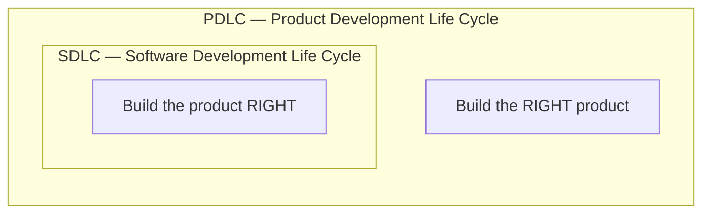
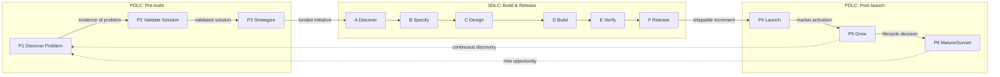
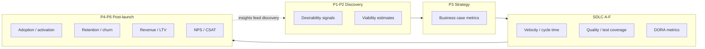
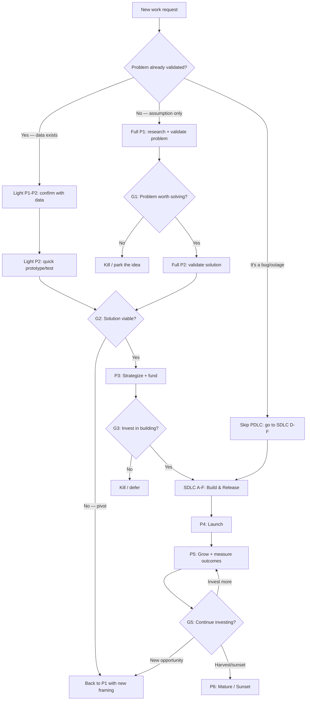

# PDLC ↔ SDLC bridge

## Purpose

This document closes the **understanding gap** between two complementary lifecycles:

- **PDLC** (Product Development Life Cycle) — "Are we building the **right product**?"
- **SDLC** (Software Development Life Cycle) — "Are we building the product **right**?"

Both are necessary. Neither is sufficient alone. This bridge explains how they relate, where they overlap, how artifacts flow between them, and what happens when one is practiced without the other.

**Canonical sources:** [`PDLC.md`](PDLC.md) (this package) · [`SDLC.md`](../sdlc/SDLC.md) (sibling package).

---

## Document map

| Section | Contents |
|---------|----------|
| [1. The core distinction](#1-the-core-distinction) | Side-by-side comparison: scope, ownership, metrics, risk, failure modes |
| [2. Phase alignment](#2-phase-alignment) | How PDLC P1–P6 maps to SDLC A–F — diagrams and handoff points |
| [3. Role mapping](#3-role-mapping) | Who owns what across both lifecycles |
| [4. Artifact handoffs](#4-artifact-handoffs) | What crosses from PDLC into SDLC and back |
| [5. Metrics — two lenses](#5-metrics--two-lenses) | Outcome metrics (PDLC) vs output metrics (SDLC) |
| [6. Decision framework](#6-decision-framework--when-to-emphasize-what) | Situational guidance: greenfield, increment, sunset, startup vs enterprise |
| [7. Worked example](#7-worked-example) | End-to-end scenario through every phase |
| [8. Anti-patterns](#8-anti-patterns) | Common failures when the bridge is missing |
| [9. External references](#9-external-references) | Curated links with executive summaries |

---

## 1. The core distinction

SDLC is **nested inside** PDLC. A team can execute SDLC flawlessly — shipping on time, with quality, and with clean CI — and still fail if it built something nobody needs. PDLC ensures the **what** and **why** are validated before and measured after the **how**.

### Comparison table

| Dimension | SDLC | PDLC |
|-----------|------|------|
| **Core question** | How do we build this correctly? | Should we build this at all? |
| **Scope** | Requirements → design → code → test → deploy | Problem validation → strategy → build → launch → grow → sunset |
| **Primary owner** | Engineering / delivery team | Product manager / product trio |
| **Timeline** | Sprint / iteration / release cycle | Product lifetime (months to years) |
| **Success metric** | Velocity, defect rate, DORA, CI pass rate | Adoption, retention, NPS, revenue, LTV |
| **Risk focus** | Technical risk (bugs, performance, security) | Market risk (desirability, viability, feasibility) |
| **Input** | Validated requirements / backlog items | Market signal, user pain, business opportunity |
| **Output** | Shippable software increment | Validated product delivering measurable outcomes |
| **Failure mode** | Ship late, ship buggy | Ship the wrong thing, ship and forget |
| **Governance** | DoD, CI gates, code review, phase exits | Stage gates (go/kill/pivot), outcome reviews |
| **Artifacts** | Specs, code, tests, release notes | Research synthesis, experiments, vision, metrics dashboards |
| **End state** | Deployed to production | Product retired or repositioned |

### When one exists without the other

| Scenario | What happens |
|----------|-------------|
| **SDLC without PDLC** | Team ships efficiently but builds features nobody uses. High velocity, low impact. The **build trap**. |
| **PDLC without SDLC** | Team validates brilliant ideas but can't deliver them reliably. Great strategy, broken execution. |
| **Both practiced** | Validated problems become well-built products that deliver measurable outcomes. |

---

## 2. Phase alignment

### The full lifecycle

### Phase-by-phase alignment

| PDLC Phase | Maps to SDLC | Relationship |
|------------|-------------|--------------|
| **P1 Discover Problem** | — | **Upstream** of SDLC. No engineering commitment yet. Product trio validates that a problem exists. |
| **P2 Validate Solution** | — | **Upstream** of SDLC. Prototypes and experiments, not production code. Tech Lead contributes feasibility, not implementation. |
| **P3 Strategize** | — | **Upstream** of SDLC. Outputs become SDLC Phase A inputs: validated problem, solution concept, success metrics, resources. |
| — | **A Discover** | Receives P3 outputs. PM becomes **Owner** per [`SDLC.md`](../sdlc/SDLC.md) §1. Backlog items created from validated intent. |
| — | **B Specify** | Acceptance criteria reflect P3 success metrics, not just functional requirements. |
| — | **C Design** | Informed by P2 feasibility assessment and architectural constraints surfaced during validation. |
| — | **D Build** | Standard SDLC delivery. Product trio stays engaged via C1 Align and C4 Inspect ceremonies. |
| — | **E Verify** | Tests validate against **outcome criteria** (P3 metrics) alongside technical correctness. |
| — | **F Release** | Shippable increment produced. Crosses back to PDLC Phase P4. |
| **P4 Launch** | **F Release** (partial overlap) | SDLC Release = artifact is deployable. PDLC Launch = artifact reaches market with GTM activation. Release is necessary but not sufficient for launch. |
| **P5 Grow** | **A Discover** (continuous loop) | Growth insights feed back into SDLC as iteration backlog items. In Dual-Track teams, P1–P2 for the **next** initiative run concurrently with current SDLC delivery. |
| **P6 Mature / Sunset** | — | **Downstream** of SDLC. Strategic lifecycle decisions — not delivery concerns. May trigger final SDLC cycles for migration tooling or deprecation. |

### Where they overlap

The boundary between PDLC and SDLC is not a hard wall — it's a **gradient**:

- **SDLC Phase A (Discover)** overlaps with **PDLC P3 (Strategize)**: both involve prioritization, but P3 asks "should we build this?" while Phase A asks "how do we break this into deliverable work?"
- **SDLC Phase F (Release)** overlaps with **PDLC P4 (Launch)**: release is a technical event; launch is a market event. In simple products, they are the same moment. In complex products, release may precede launch by weeks (beta periods, staged rollouts).
- **PDLC P5 (Grow)** feeds **SDLC Phase A** continuously: growth insights become backlog items, creating a loop rather than a one-way flow.

---

## 3. Role mapping

### Across the full lifecycle

| Phase(s) | Primary roles | SDLC equivalent | Blueprint archetype |
|----------|---------------|------------------|---------------------|
| **P1–P2** (Discovery) | Product Manager, UX Researcher, Designer, Tech Lead | — (upstream of SDLC) | **Demand & value** (extended with design + feasibility) |
| **P3** (Strategize) | Product Manager, GTM Lead, Finance/Exec sponsor | **Owner** (when entering SDLC) | **Demand & value** + **Steer & govern** |
| **A–F** (SDLC) | Owner, Implementer | Owner, Implementer per [`SDLC.md`](../sdlc/SDLC.md) §1 | **Build & integrate**, **Assure & ship**, **Flow & improvement** |
| **P4** (Launch) | GTM Lead, Product Manager, Support Lead, Marketing | — (downstream of SDLC) | **Demand & value** (market-facing) |
| **P5** (Grow) | Product Manager, Data/Analytics, Growth Engineer | **Owner** (for iteration backlog) | **Demand & value** + **Assure & ship** (metrics) |
| **P6** (Sunset) | Product Manager, Exec sponsor, Support Lead | — | **Steer & govern** + **Demand & value** |

### The product trio

The **product trio** (PM + Designer + Tech Lead) is the cross-functional unit that co-owns discovery. Their involvement shifts across the lifecycle:

| Lifecycle stage | PM focus | Designer focus | Tech Lead focus |
|----------------|----------|----------------|-----------------|
| **P1 Discover** | Problem prioritization, stakeholder alignment | User research support, empathy mapping | Domain feasibility, data availability |
| **P2 Validate** | Hypothesis framing, experiment design | Prototyping, usability testing | Feasibility spikes, architecture constraints |
| **P3 Strategize** | Vision, OKRs, business case | Solution refinement, UX strategy | Technical roadmap, risk assessment |
| **SDLC A–F** | Owner (priorities, acceptance) | UI/UX spec support | Technical leadership, code review |
| **P4–P5** | Outcome measurement, iteration priority | UX iteration, feedback synthesis | Performance, scalability, experimentation infrastructure |

---

## 4. Artifact handoffs

### PDLC → SDLC (entering build)

These artifacts cross from **P3 Strategize** into **SDLC Phase A (Discover)**:

| Artifact | From (PDLC) | To (SDLC) | Example |
|----------|-------------|-----------|---------|
| **Validated problem statement** | P1 research synthesis | Phase A: backlog item / epic description | "Enterprise users lose 3h/week to manual report generation — validated via 12 interviews and usage analytics showing 67% of users export to Excel for manipulation." |
| **Validated solution concept** | P2 prototype + test results | Phase A–B: story acceptance criteria | "Drag-and-drop report builder with template library — 8/10 usability test participants completed core task in <2min." |
| **Personas** | P1 persona validation | Phase B: story context, edge cases | "Power Analyst persona: builds 10+ reports/week, needs bulk operations and keyboard shortcuts." |
| **Success metrics** | P3 metrics definition | Phase B–E: acceptance criteria, test targets | "Target: 40% adoption in first quarter, 70% D30 retention, NPS >40." |
| **Feasibility assessment** | P2 tech lead evaluation | Phase C: design constraints, ADRs | "Requires new query engine — current ORM cannot handle dynamic aggregation. ADR needed." |
| **Competitive context** | P1 landscape analysis | Phase B–C: feature parity decisions | "Competitor X has scheduling but no templates; Competitor Y has templates but no real-time collaboration." |

### SDLC → PDLC (exiting build)

These artifacts cross from **SDLC Phase F (Release)** into **PDLC Phase P4 (Launch)**:

| Artifact | From (SDLC) | To (PDLC) | Example |
|----------|-------------|-----------|---------|
| **Shippable increment** | Phase F: deployed artifact | P4: GTM activation | "v2.3.0 deployed to staging; feature-flagged for beta group." |
| **Release notes** | Phase F: `docs/release/` | P4: customer comms, marketing | "New: Report Builder with 12 templates, drag-and-drop layout, scheduled delivery." |
| **Known limitations** | Phase E–F: documented exceptions | P4: support playbook, FAQ | "Bulk operations limited to 50 reports in v1; pagination in next release." |
| **Technical documentation** | Phase D: API docs, guides | P4: developer-facing launch content | "REST API endpoints for report CRUD; webhook for completion events." |

### PDLC → SDLC (feedback loop)

These artifacts flow from **P5 Grow** back into **SDLC Phase A**:

| Artifact | From (PDLC) | To (SDLC) | Example |
|----------|-------------|-----------|---------|
| **Usage analytics** | P5 metrics dashboard | Phase A: prioritized backlog items | "Template usage: 3 of 12 templates account for 89% of usage. Deprioritize niche templates; invest in top-3 customization." |
| **Experiment results** | P5 experiment log | Phase A: validated improvements | "A/B test: guided wizard improved onboarding completion from 34% to 61%. Ship wizard as default." |
| **User feedback** | P5 NPS/CSAT, support tickets | Phase A: bug reports, feature requests | "NPS detractor theme: 'export is slow for large reports.' Investigate query optimization." |
| **Churn analysis** | P5 retention data | Phase A: retention-focused stories | "D7 drop-off correlates with users who never create a second report. Add 'next steps' prompt after first report." |

---

## 5. Metrics — two lenses

SDLC and PDLC use fundamentally different metrics. Neither set replaces the other.

### Comparison

| Lens | Category | Metrics | Measured when | Owner |
|------|----------|---------|---------------|-------|
| **SDLC** | Throughput | Velocity, cycle time, lead time | During delivery (A–F) | Engineering |
| **SDLC** | Quality | Defect rate, test coverage, CI pass rate | During delivery (D–F) | Engineering |
| **SDLC** | Operational | Deployment frequency, MTTR, change failure rate (DORA) | Release + operations | Engineering + DevOps |
| **PDLC** | Desirability | Interview signal, concept test score, sign-up intent | P1–P2 | PM, UX Research |
| **PDLC** | Viability | TAM/SAM, unit economics, willingness-to-pay | P2–P3 | PM, Finance |
| **PDLC** | Adoption | Activation rate, onboarding completion, DAU/MAU | P4–P5 | PM, Data/Analytics |
| **PDLC** | Retention | D1/D7/D30 retention, churn rate, cohort curves | P5 | Data/Analytics |
| **PDLC** | Satisfaction | NPS, CSAT, support volume/sentiment | P5 | PM, Support |
| **PDLC** | Revenue | ARR/MRR, LTV, CAC, payback period | P5–P6 | PM, Finance |
| **PDLC** | Health | Maintenance cost ratio, competitive gap | P6 | PM, Executive |

### Which metrics matter when

### The metrics trap

A common failure is measuring only one lens:

| Trap | Symptom | Fix |
|------|---------|-----|
| **SDLC metrics only** | "We shipped 47 stories this sprint!" — but adoption is flat | Add PDLC outcome metrics; connect delivery to P3 success criteria |
| **PDLC metrics only** | "NPS is great!" — but releases take 6 months and are buggy | Add SDLC delivery metrics; ensure engineering health enables product velocity |
| **Vanity metrics** | "1M page views!" — but 95% bounce in <10 seconds | Use **actionable** metrics tied to user value (retention, task completion, revenue) |

---

## 6. Decision framework — when to emphasize what

Not every situation needs equal investment across all phases. Use this guide to calibrate effort.

### By product maturity

| Situation | PDLC emphasis | SDLC emphasis | Reasoning |
|-----------|---------------|---------------|-----------|
| **Greenfield product** (new market, new idea) | **Heavy P1–P3**: extensive discovery, multiple validation cycles, formal stage gates | **Standard A–F**: normal delivery once validated | High uncertainty demands heavy validation before committing engineering |
| **Feature on mature product** | **Light P1–P2**: problem likely known from P5 data; quick validation | **Standard A–F**: normal delivery | Lower uncertainty; existing product provides usage data as evidence |
| **Technical platform / infrastructure** | **Light P1**: internal stakeholders are the "users"; needs are more knowable | **Heavy A–F**: architecture, performance, reliability are the product | Technical risk outweighs market risk |
| **Maintenance / bug fix** | **Skip P1–P3**: problem is already manifest (bug, outage) | **Focused D–F**: fix, test, release | No validation needed; the problem is the bug |
| **Sunset / EOL** | **Heavy P6**: migration, communications, customer transition | **Minimal A–F**: only if migration tooling needed | Investment is in responsible retirement, not new capability |

### By organizational context

| Context | Recommendation |
|---------|----------------|
| **Startup (pre-product-market fit)** | PDLC-heavy: iterate P1→P2 rapidly (Lean Startup). Minimize SDLC ceremony — speed of learning matters more than process maturity. |
| **Startup (post-product-market fit)** | Balance: PDLC P5 (growth) drives priorities; invest in SDLC maturity (CI/CD, testing) to sustain velocity as team grows. |
| **Enterprise (single product)** | Both mature: formal stage gates (P1–P3), established SDLC, structured P5 analytics. Risk: over-process — keep gates lightweight. |
| **Enterprise (portfolio)** | Add portfolio-level PDLC: lifecycle stage assessment across products, investment allocation, sunset coordination. SAFe portfolio Kanban may help. |

### Decision flowchart

---

## 7. Worked example

**Scenario:** A B2B SaaS company's analytics show that user onboarding completion dropped from 72% to 51% over two quarters. The product team investigates.

### P1 — Discover problem

The product trio runs **8 user interviews** with recent sign-ups who did not complete onboarding, plus **3 interviews** with users who did. They also pull **funnel analytics** and **support ticket analysis**.

**Findings:**
- Users get stuck at the "Connect Data Source" step (38% drop-off at this step alone)
- The connector setup requires API credentials that most users don't have immediately
- Competitors offer a "sample data" mode that lets users explore the product before committing to integration

**Problem statement:** "New users cannot experience the product's core value during onboarding because the mandatory data source connection requires technical credentials they don't have at sign-up time. This causes 38% of users to abandon onboarding at Step 3."

**Artifacts produced:** Research synthesis (interview notes + analytics), updated persona (added "non-technical buyer" variant), competitive landscape note.

**Gate G1 decision: GO** — Problem is validated with quantitative and qualitative evidence. 38% drop-off at one step is high-impact.

### P2 — Validate solution

The team generates **three solution hypotheses:**

1. **Sample dataset** — pre-loaded data so users can explore without connecting their own source
2. **Guided connector wizard** — step-by-step flow with in-app help for finding API credentials
3. **Deferred connection** — let users skip data connection and set it up later via email prompt

They build **Figma prototypes** for all three and run **usability tests** with 6 participants each.

**Experiment log:**

| Hypothesis | Method | Result | Decision |
|------------|--------|--------|----------|
| Sample dataset lets users reach "aha moment" without own data | 6 usability tests with Figma prototype | 5/6 completed onboarding; avg time 4min (vs 12min current) | **Pursue** — strongest signal |
| Guided wizard reduces drop-off at Step 3 | 6 usability tests | 3/6 completed; users still needed to leave app to find credentials | **Park** — helps but doesn't solve root cause |
| Deferred connection keeps users in flow | 6 usability tests | 4/6 completed onboarding but 2/4 never returned to connect data | **Combine** — useful as fallback alongside sample data |

**Feasibility assessment (Tech Lead):** Sample dataset is low technical risk — needs a seeded dataset per account, ~2 sprints. Deferred connection needs email trigger infrastructure (existing).

**Gate G2 decision: GO** — Sample dataset (primary) + deferred connection (secondary) validated for desirability, feasibility, and viability.

### P3 — Strategize

**Product vision update:** "Every new user experiences the product's core value within 5 minutes of sign-up."

**Success metrics:**
- Onboarding completion rate: 51% → 75% within 8 weeks of launch
- Time to first "aha moment" (first report generated): 12min → 5min
- D7 retention for new users: 34% → 50%

**Go-to-market:** No external marketing needed — this is an onboarding improvement. Internal announcement to Support and Sales. Update help docs.

**Stage-gate review:** VP Product approves. Two engineers allocated for 3 sprints.

**Gate G3 decision: GO** — Funded, staffed, metrics defined.

### SDLC A–F — Build & Release

The validated intent enters the delivery process:

- **Phase A:** Epic created: "Sample Data Onboarding" (M2E4). Stories: seed data generation (M2E4S1), onboarding flow update (M2E4S2), deferred connection email (M2E4S3), analytics instrumentation (M2E4S4).
- **Phase B:** Acceptance criteria for each story reference P3 success metrics. "M2E4S2: User can generate first report using sample data within 3 clicks of sign-up."
- **Phase C:** ADR for sample data architecture (per-account vs shared read-only dataset). Decision: shared read-only — simpler, no storage cost.
- **Phase D:** Implementation across 2 sprints. CI green. Product trio reviews via Sprint Review (C4 Inspect).
- **Phase E:** Integration tests verify onboarding flow completion. Acceptance criteria met.
- **Phase F:** Feature-flagged release to 10% of new sign-ups (canary).

### P4 — Launch

- **Canary results** (1 week, 10%): onboarding completion 73% (vs 51% control). No critical bugs.
- **Expand to 50%**: completion 71%. Stable.
- **GA rollout**: feature flag removed. Support team briefed. Help docs updated.
- **Monitoring baseline**: dashboards tracking completion rate, time-to-aha, D7 retention by cohort.

### P5 — Grow

**Week 4 metrics:**
- Onboarding completion: 51% → 74% (target: 75%) — nearly there
- Time to first report: 12min → 4.5min (target: 5min) — exceeded
- D7 retention: 34% → 44% (target: 50%) — improving but below target

**Experiment:** A/B test adding a "personalize your sample data" step (pick industry template). Hypothesis: personalized data increases perceived relevance and improves D7 retention.

**Result:** Personalized sample data group shows D7 retention of 52%. Ship as default.

**Week 8 metrics:** All three success metrics met. Initiative considered successful.

**Iteration backlog items fed back to SDLC Phase A:** "Allow users to transition seamlessly from sample data to own data" (new story from P5 insights), "Add sample data for 3 new industry verticals" (from user feedback).

### Summary of artifacts produced

| Phase | Key artifacts |
|-------|--------------|
| P1 | Research synthesis, persona update, competitive note, problem statement |
| P2 | 3 prototypes, experiment log (3 experiments), feasibility assessment |
| P3 | Vision update, success metrics, stage-gate review |
| A–F | Epic + 4 stories, ADR, code, tests, release notes |
| P4 | Rollout plan, support brief, monitoring baseline |
| P5 | Metrics dashboards, A/B experiment, iteration backlog items |

---

## 8. Anti-patterns

| Anti-pattern | Description | Symptom | Fix |
|-------------|-------------|---------|-----|
| **Build trap** | SDLC without PDLC discovery. Team ships features based on stakeholder requests or competitor copying without validating the underlying problem. | High velocity, flat adoption. Roadmap is a feature factory. "We shipped 200 stories this quarter!" but NPS is declining. | Add P1–P2 before committing engineering. Require evidence of problem (not just opinion) at Gate G1. |
| **Research trap** | Infinite PDLC discovery without SDLC commitment. Team runs interview after interview, prototype after prototype, but never ships. | "We need one more round of validation." Months pass. Competitors ship. Analysis paralysis. | Time-box P1–P2. Set explicit gate criteria: what evidence is "enough"? Use Lean Startup's "minimum viable experiment" principle. |
| **Launch and forget** | SDLC → P4 Launch with no P5 Grow. Product ships, team moves to next project, nobody measures outcomes. | "It's live!" becomes the end state. No adoption data. No iteration. Success is defined as "shipped." | Define P3 success metrics **before** build. Staff P5 measurement and iteration as part of the initiative, not an afterthought. |
| **Metric theater** | Measuring outputs (stories shipped, features released) instead of outcomes (adoption, retention, revenue). SDLC metrics masquerade as product success. | "We're at 98% velocity target!" while churn increases. Dashboards show activity, not impact. | Separate SDLC metrics (delivery health) from PDLC metrics (product health). Report both. Tie team goals to outcome metrics. |
| **Waterfall discovery** | P1→P2→P3 run as a single, sequential "requirements phase" taking months before any SDLC work begins. | 6-month "discovery phase" followed by 6-month "build phase." Late feedback. Assumptions stale by launch. | Adopt Dual-Track Agile: run discovery and delivery in parallel. Keep P1–P2 cycles short (1–2 weeks per experiment). See [`https://forgesdlc.com/pdlc-approaches-dual-track-agile.html`](https://forgesdlc.com/pdlc-approaches-dual-track-agile.html). |
| **Missing product trio** | PM works alone on P1–P3 without Designer or Tech Lead. Discovery lacks design rigor or technical grounding. | Designs are infeasible. Technical constraints discovered during build. Prototypes don't test usability. | Establish the product trio (PM + Designer + Tech Lead) as the co-owning unit for all P1–P3 work. Tech Lead attends user interviews. Designer frames experiments. |
| **Zombie product** | Product should be in P6 (sunset) but nobody makes the call. Maintenance drains engineering capacity from growth products. | 20% of engineering time maintains products with declining usage. "We can't sunset it — 3 customers still use it." | Run quarterly lifecycle assessments. Set explicit criteria for sunset (e.g. <X% revenue, <Y active users, maintenance cost > Z% of revenue). |

---

## 9. External references

Curated links with executive summaries. See also [`approaches/REFERENCE-LINKS.md`](approaches/REFERENCE-LINKS.md) for approach-specific URLs.

| Topic | URL | Executive summary (why it's linked here) |
|-------|-----|----------------------------------------|
| Marty Cagan — Inspired | https://www.svpg.com/inspired-how-to-create-tech-products-customers-love/ | **Foundational text** on product management in tech: discovery, product trio, outcome-driven development — the philosophical anchor for PDLC thinking. |
| Teresa Torres — Continuous Discovery Habits | https://www.producttalk.org/2021/08/continuous-discovery-habits/ | **Practical framework** for weekly discovery habits: opportunity solution trees, interview cadence, experiment design — operationalizes P1–P2 as continuous practice. |
| Eric Ries — The Lean Startup | http://theleanstartup.com/ | **Build-Measure-Learn** loop and validated learning — the canonical reference for hypothesis-driven product development and P2 validation experiments. |
| Melissa Perri — Escaping the Build Trap | https://melissaperri.com/book | **Diagnosis and cure** for organizations that confuse shipping features with creating value — directly addresses the SDLC-without-PDLC anti-pattern. |
| Robert Cooper — Stage-Gate | https://www.stage-gate.com/ | **Decision gates** for product development: go/kill/pivot criteria — the source framework for PDLC stage gates G1–G5. |
| Jeff Gothelf — Lean UX | https://www.jeffgothelf.com/lean-ux-book/ | **Integrating UX** into Agile delivery: hypotheses, experiments, outcomes — bridges P2 validation with SDLC iteration. |
| DORA — State of DevOps | https://dora.dev/ | **Delivery metrics** research (deployment frequency, lead time, MTTR, change failure rate) — the SDLC side of the metrics comparison in §5. |
| Reforge — Growth Series | https://www.reforge.com/growth-series | **Growth frameworks** for post-launch: acquisition, activation, retention, revenue, referral — deepens P5 Grow beyond basic analytics. |
| ProductPlan — Product Lifecycle | https://productplan.com/glossary/product-lifecycle/ | **Lifecycle stages** (introduction, growth, maturity, decline) — context for P6 Mature / Sunset investment decisions. |
| Mind the Product | https://www.mindtheproduct.com/ | **Community hub** for product management: articles, conferences, frameworks — neutral background for PDLC vocabulary and practices. |

---

## Related reading (this blueprint)

| Doc | Why |
|-----|-----|
| [`PDLC.md`](PDLC.md) | Phases, artifacts, exit criteria, metrics framework |
| [`SDLC.md`](../sdlc/SDLC.md) | Delivery phases A–F, DoD, CI/CD |
| [`approaches/README.md`](approaches/README.md) | PDLC approach guides (Dual-Track, Stage-Gate, Design Thinking, …) |
| [`roles-archetypes.md`](../sdlc/methodologies/roles-archetypes.md) | Five delivery archetypes and methodology mapping |
| [`ceremony-foundation.md`](../sdlc/methodologies/ceremonies/ceremony-foundation.md) | C1–C6 intent types |
| [`methodology-bridge.md`](../sdlc/methodologies/ceremonies/methodology-bridge.md) | How Scrum/Kanban/phased/XP map to ceremony intents |
