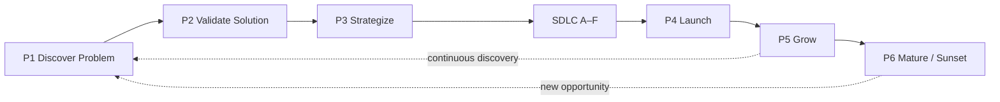

# Product development lifecycle (PDLC)

This describes a **generic** product lifecycle — from validating that a problem is worth solving, through delivery (via [`SDLC.md`](../sdlc/SDLC.md) phases A–F), to post-launch growth and eventual sunset. It defines **which product artifacts** to produce at each stage and **who** is accountable.

**How PDLC relates to SDLC:** SDLC answers "are we building the product right?" — phases, DoD, CI/CD, ceremonies. PDLC answers "are we building the right product?" — problem validation, strategy, go-to-market, outcome measurement. SDLC sits **inside** PDLC as the Build & Release engine. See [`PDLC-SDLC-BRIDGE.md`](PDLC-SDLC-BRIDGE.md) for the full mapping, diagrams, and worked example.

**Discipline bridges:** Cross-cutting disciplines each have a bridge mapping their practices to PDLC P1–P6 and SDLC A–F — see [`BRIDGES.md`](../BRIDGES.md) for the full index, or jump to a specific discipline: [BA](../disciplines/product/ba/BA-SDLC-PDLC-BRIDGE.md) · [PM](../disciplines/governance/pm/PM-SDLC-PDLC-BRIDGE.md) · [Testing](../disciplines/engineering/testing/TESTING-SDLC-PDLC-BRIDGE.md) · [Architecture](../disciplines/engineering/software-architecture/ARCH-SDLC-PDLC-BRIDGE.md) · [DevOps](../disciplines/engineering/devops/DEVOPS-SDLC-PDLC-BRIDGE.md) · [Big Data](../disciplines/data/bigdata/BIGDATA-SDLC-PDLC-BRIDGE.md) · [Data Science](../disciplines/data/data-science/DS-SDLC-PDLC-BRIDGE.md).

**Approaches depth (Dual-Track, Stage-Gate, Lean Startup, Design Thinking, …):** see [`approaches/README.md`](approaches/README.md) — full guides with external links and adoption notes.

**Path examples** below use a common `docs/product/` layout; adjust names if your tree differs.

---

## 1. Roles

Product lifecycle work involves different accountabilities than delivery. These roles **can overlap** with SDLC roles (one person may hold both), but the **concerns** are distinct.

| Role | Responsibility |
|------|----------------|
| **Product Manager** | Owns the **product vision**, prioritizes **outcomes** over outputs, decides what problems to solve and when to pivot, sunset, or invest. |
| **UX Researcher** | Generates **evidence** about user needs, behaviors, and pain points through qualitative and quantitative research. |
| **Designer** | Translates validated problems into **solution concepts** — prototypes, wireframes, interaction models — for validation before build. |
| **Tech Lead** | Assesses **feasibility**, estimates technical risk, identifies architectural constraints that shape product strategy. |
| **Data / Analytics** | Defines and measures **outcome metrics** (adoption, retention, revenue); runs experiments; surfaces insights for iteration. |
| **Go-to-Market Lead** | Plans **launch**, positioning, pricing, and channel strategy; owns post-launch market activation. |

**Product Trio:** The PM + Designer + Tech Lead form the **product trio** — a cross-functional unit that co-owns discovery decisions. This maps to the **Demand & value** archetype in [`roles-archetypes.md`](../sdlc/methodologies/roles-archetypes.md), extended to include design and feasibility perspectives.

**SDLC handoff:** When work enters SDLC Phase A (Discover / prioritize), the PM becomes (or hands off to) the **Owner** in [`SDLC.md`](../sdlc/SDLC.md) §1. The Implementer role in SDLC maps to delivery engineering, not product discovery.

---

## 2. Phases & product obligations

### Phase overview

**Continuous discovery:** In mature teams, P1–P2 run **in parallel** with SDLC delivery (Dual-Track Agile — see [`https://forgesdlc.com/pdlc-approaches-dual-track-agile.html`](https://forgesdlc.com/pdlc-approaches-dual-track-agile.html)). The sequential diagram shows logical dependency; real cadence overlaps.

---

### Phase P1 — Discover problem

**Goal:** Validate that a **real, meaningful problem** exists for a specific audience before investing in solutions.

**Activities:** User interviews, market research, competitive analysis, data mining (usage analytics, support tickets, churn analysis), persona refinement, problem framing.

**Artifacts (typical)**

| Artifact | Action |
|----------|--------|
| **Problem statement** | Clear articulation of who has the problem, what it costs them, and how you know. |
| **Research synthesis** | Summary of user interviews, survey data, market signals — evidence, not opinion. |
| **Persona validation** | Updated or confirmed personas in `docs/product/personas/`. Existing personas challenged against new evidence. |
| **Competitive landscape** | How alternatives address (or fail to address) the same problem. |
| **Opportunity assessment** | Size of the opportunity (TAM/SAM/SOM or equivalent); urgency and frequency of the problem. |

**Exit:** The team has **evidence** (not just intuition) that a meaningful, underserved problem exists for a defined audience. Stakeholders agree the problem is worth exploring solutions for.

**Approaches that help here:** [Design Thinking](https://forgesdlc.com/pdlc-approaches-design-thinking.html) (Empathize + Define), [Opportunity Solution Trees](https://forgesdlc.com/pdlc-approaches-opportunity-solution-trees.html), [Lean Startup](https://forgesdlc.com/pdlc-approaches-lean-startup.html) (problem interviews).

---

### Phase P2 — Validate solution

**Goal:** Generate and **test** solution ideas to find one that addresses the validated problem — before committing engineering capacity.

**Activities:** Ideation workshops, rapid prototyping, usability testing, feasibility spikes, concept testing, fake-door tests, concierge MVPs, Wizard-of-Oz experiments.

**Artifacts (typical)**

| Artifact | Action |
|----------|--------|
| **Solution hypotheses** | Explicit statements: "We believe [solution] will [outcome] for [audience] because [evidence]." |
| **Prototype(s)** | Low-fidelity (paper, Figma, clickable mock) or high-fidelity depending on risk level. |
| **Experiment log** | Each experiment: hypothesis, method, sample, results, decision (pivot/persevere). Use [`templates/EXPERIMENT-LOG.template.md`](templates/EXPERIMENT-LOG.template.md). |
| **Feasibility assessment** | Tech Lead's evaluation: technical risk, dependencies, estimated complexity, architectural fit. |
| **Usability evidence** | Test results showing whether users can achieve goals with the proposed solution. |

**Exit:** At least one solution concept has **evidence** of desirability (users want it), viability (business case exists), feasibility (team can build it), and usability (users can use it). The team is ready to commit strategy and resources.

**Approaches that help here:** [Design Thinking](https://forgesdlc.com/pdlc-approaches-design-thinking.html) (Ideate + Prototype + Test), [Lean Startup](https://forgesdlc.com/pdlc-approaches-lean-startup.html) (Build-Measure-Learn), [Stage-Gate](https://forgesdlc.com/pdlc-approaches-stage-gate.html) (Gate 2: business case).

---

### Phase P3 — Strategize

**Goal:** Commit organizational resources — budget, people, timeline — to the validated solution. Define success metrics and go-to-market approach.

**Activities:** Product vision writing, OKR/goal setting, roadmap creation, success metric definition, pricing/positioning analysis, go-to-market planning, stakeholder alignment, resource allocation.

**Artifacts (typical)**

| Artifact | Action |
|----------|--------|
| **Product vision** | Why this product exists, for whom, and what world it creates. Use [`templates/PRODUCT-VISION.template.md`](templates/PRODUCT-VISION.template.md). Store in `docs/product/vision/`. |
| **Success metrics** | Measurable outcomes (adoption rate, retention, NPS, revenue target, time-to-value). Use [`templates/PRODUCT-METRICS.template.md`](templates/PRODUCT-METRICS.template.md). |
| **Roadmap** | High-level phased plan — what ships when, which outcomes each phase targets. Links to optional `docs/ROADMAP.md` from [`SDLC.md`](../sdlc/SDLC.md). |
| **Go-to-market plan** | Launch strategy, channels, positioning, pricing. Use [`templates/GO-TO-MARKET.template.md`](templates/GO-TO-MARKET.template.md). |
| **Stage-gate review** | Formal go/kill/pivot decision with criteria. Use [`templates/STAGE-GATE-REVIEW.template.md`](templates/STAGE-GATE-REVIEW.template.md). |

**Exit:** Initiative is **funded**, **staffed**, and **prioritized**. Success metrics are defined. The product trio is ready to hand validated intent into SDLC Phase A (Discover / prioritize).

**Handoff to SDLC:** At this point, the validated problem, solution concept, personas, success metrics, and high-level scope cross into [`SDLC.md`](../sdlc/SDLC.md) Phase A — where they become backlog items, WBS entries, and story specifications. See [`PDLC-SDLC-BRIDGE.md`](PDLC-SDLC-BRIDGE.md) §4 for the artifact handoff table.

---

### SDLC Phases A–F — Build & Release

**Goal:** Turn validated product intent into **shippable software** — with quality, traceability, and governance.

This is the domain of [`blueprints/sdlc/`](../sdlc/README.md). PDLC does not redefine these phases:

| SDLC Phase | PDLC relevance | Detail |
|------------|----------------|--------|
| **A Discover** | Receives validated problem + solution from P3. PM becomes Owner. | [SDLC Phase A](../sdlc/SDLC.md#phase-a--discover--prioritize) |
| **B Specify** | Acceptance criteria reflect P3 success metrics. | [SDLC Phase B](../sdlc/SDLC.md#phase-b--specify) |
| **C Design** | Architectural decisions informed by P2 feasibility assessment. | [SDLC Phase C](../sdlc/SDLC.md#phase-c--design-lightweight) |
| **D Build** | Implementation of validated solution. | [SDLC Phase D](../sdlc/SDLC.md#phase-d--build) |
| **E Verify** | Tests validate against P3 success criteria, not just technical correctness. | [SDLC Phase E](../sdlc/SDLC.md#phase-e--verify) |
| **F Release** | Shippable increment hands back to PDLC Phase P4 (Launch). | [SDLC Phase F](../sdlc/SDLC.md#phase-f--release) |

**During SDLC:** The product trio stays engaged through ceremonies (C1 Align, C4 Inspect) — they do not disappear until launch. In Dual-Track teams, discovery for the **next** initiative (P1–P2) runs in parallel with current delivery.

---

### Phase P4 — Launch

**Goal:** Make the product (or feature) **available** to the target market and activate go-to-market.

**Activities:** Beta program management, GA rollout, marketing activation, sales enablement, support team training, documentation publishing, announcement comms.

**Artifacts (typical)**

| Artifact | Action |
|----------|--------|
| **Launch checklist** | Completeness check: docs, support, marketing, legal, monitoring. |
| **Rollout plan** | Phased rollout strategy (internal → beta → GA), feature flags, rollback criteria. |
| **Support playbook** | Known issues, FAQ, escalation paths for support team. |
| **Announcement** | Blog post, changelog, email, in-app notification — appropriate to audience. |
| **Monitoring baseline** | Dashboards for P5 metrics established and baselined pre-launch. |

**Exit:** Product is available to the intended audience. Monitoring is active. Support can handle inquiries.

---

### Phase P5 — Grow

**Goal:** Drive **adoption**, measure **outcomes**, and iterate based on real-world usage data.

**Activities:** Analytics review, A/B testing, funnel optimization, retention analysis, feature iteration, user feedback synthesis, expansion plays (new segments, upsell), NPS/CSAT surveys.

**Artifacts (typical)**

| Artifact | Action |
|----------|--------|
| **Metrics dashboard** | Live tracking of P3 success metrics: adoption, retention, engagement, revenue, NPS. Use [`templates/PRODUCT-METRICS.template.md`](templates/PRODUCT-METRICS.template.md). |
| **Experiment log** | Ongoing A/B tests and iterations: hypothesis → result → decision. |
| **Iteration backlog** | Improvements flowing from data back into SDLC Phase A (continuous loop). |
| **Growth report** | Periodic summary: what's working, what's not, strategic recommendations. |

**Exit:** Product health targets are met (adoption, retention, revenue within acceptable range), **or** the team makes a strategic decision — **pivot** (back to P1 with new evidence), **invest** (more P5 iteration), or **harvest** (transition to P6).

**Feedback loop:** Insights from P5 are the **primary input** to continuous discovery (P1). In Dual-Track teams, this loop runs continuously. See [`https://forgesdlc.com/pdlc-approaches-dual-track-agile.html`](https://forgesdlc.com/pdlc-approaches-dual-track-agile.html).

---

### Phase P6 — Mature / Sunset

**Goal:** Manage the product through **maturity** (stable, profitable, declining investment) and eventual **retirement** when the product no longer justifies maintenance.

**Activities:** Lifecycle stage assessment, maintenance-mode optimization, harvest/invest/divest decisions, sunset planning, customer migration, EOL communications, resource reallocation.

**Artifacts (typical)**

| Artifact | Action |
|----------|--------|
| **Lifecycle assessment** | Current stage (growth / maturity / decline), investment recommendation, competitive position. |
| **Sunset plan** | Timeline, migration path, customer communications, data retention, support wind-down. Use [`templates/SUNSET-PLAN.template.md`](templates/SUNSET-PLAN.template.md). |
| **Migration guide** | For customers moving to a replacement product or alternative. |
| **EOL communications** | Announcement timeline, FAQ, support commitment during transition. |
| **Post-mortem** | What worked, what didn't, lessons for future products. Feeds organizational learning. |

**Exit:** Product is **retired** (removed from market, support ended, data handled per policy) **or** **repositioned** (back to P1 with a new problem framing that extends the product's life).

---

## 3. Definition of Done (product initiative)

A product initiative is **done** when:

1. The target **outcome** (P3 success metrics) is either **achieved**, **explicitly accepted** at current levels, or the initiative is **pivoted/cancelled** with documented reasoning.
2. The **experiment log** captures validation evidence from P1–P2 and iteration evidence from P5.
3. The **product vision** and **metrics dashboard** reflect the current state.
4. **SDLC** delivery obligations are met per [`SDLC.md`](../sdlc/SDLC.md) §3 (story DoD) and §4 (epic DoD).
5. If sunset: **migration**, **communications**, and **data handling** are complete per the sunset plan.

---

## 4. Stage gates (decision points)

Between PDLC phases, explicit **go/kill/pivot** decisions prevent wasted investment. These complement (do not replace) SDLC phase exits.

| Gate | Between | Key question | Evidence required | Detail |
|------|---------|--------------|-------------------|--------|
| **G1** | P1 → P2 | Is the problem worth solving? | Research synthesis, opportunity size, strategic fit | [Phase P1](#phase-p1--discover-problem) |
| **G2** | P2 → P3 | Does a viable solution exist? | Validation evidence (desirability + feasibility + viability) | [Phase P2](#phase-p2--validate-solution) |
| **G3** | P3 → SDLC | Should we invest in building this? | Business case, funded resources, defined success metrics | [Phase P3](#phase-p3--strategize) |
| **G4** | SDLC → P4 | Is it ready to launch? | Shippable increment, GTM plan, support readiness | [Phase P4](#phase-p4--launch) |
| **G5** | P5 → P6 | Should we continue investing? | Outcome metrics vs targets, competitive position, strategic fit | [Phase P5](#phase-p5--grow) |

Use [`templates/STAGE-GATE-REVIEW.template.md`](templates/STAGE-GATE-REVIEW.template.md) to document gate decisions.

See [`https://forgesdlc.com/pdlc-approaches-stage-gate.html`](https://forgesdlc.com/pdlc-approaches-stage-gate.html) for the full Stage-Gate framework.

---

## 5. Metrics framework

PDLC uses **outcome metrics** (did users/business benefit?) alongside SDLC's **output metrics** (did we ship correctly?).

| Category | Metrics | Owner | Phase(s) |
|----------|---------|-------|----------|
| **Desirability** | User interview signal, concept test results, sign-up intent | UX Researcher, PM | P1, P2 |
| **Viability** | TAM/SAM, unit economics, willingness-to-pay | PM, GTM Lead | P2, P3 |
| **Feasibility** | Technical risk score, dependency count, spike results | Tech Lead | P2, P3 |
| **Adoption** | Activation rate, onboarding completion, DAU/MAU | Data/Analytics | P4, P5 |
| **Engagement** | Feature usage, session depth, core action frequency | Data/Analytics | P5 |
| **Retention** | D1/D7/D30 retention, churn rate, cohort curves | Data/Analytics | P5 |
| **Satisfaction** | NPS, CSAT, support ticket volume/sentiment | PM, Support | P5 |
| **Revenue** | ARR/MRR, LTV, CAC, payback period | PM, GTM Lead | P5, P6 |
| **Health** | Maintenance cost ratio, competitive gap, strategic alignment | PM | P6 |

**SDLC metrics** (velocity, defect rate, DORA, CI pass rate) remain in [`SDLC.md`](../sdlc/SDLC.md) §7 and are complementary. See [`PDLC-SDLC-BRIDGE.md`](PDLC-SDLC-BRIDGE.md) §5 for the full comparison.

---

## 6. Review cadence (suggested)

| Cadence | Activity |
|---------|----------|
| **Weekly (during discovery)** | Product trio sync: research progress, experiment results, blockers. |
| **Per stage gate** | Go/kill/pivot decision with stakeholders; evidence reviewed against gate criteria. |
| **Monthly (during growth)** | Metrics review: adoption, retention, engagement trends; iteration priorities. |
| **Quarterly** | Lifecycle stage assessment: growth / maturity / decline signals; investment recommendation. |
| **Per sunset milestone** | Migration progress, customer communications, resource reallocation tracking. |

---

*Keep product-specific context in `docs/product/` (or equivalent), not in this file.*
