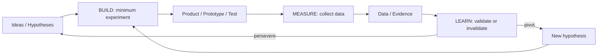

# Lean Startup

## What it is

**Lean Startup** is a methodology for developing products under conditions of **extreme uncertainty**. Created by Eric Ries (building on Steve Blank's Customer Development), it replaces traditional planning with a **Build-Measure-Learn** feedback loop that maximizes validated learning while minimizing wasted effort.

The core insight: the biggest risk in product development is not building it wrong (an SDLC problem) — it's building something **nobody wants** (a PDLC problem). Lean Startup addresses this by treating every product idea as a **hypothesis** to be tested with real evidence, not a plan to be executed.

---

## Authoritative sources (external)

| Resource | Executive summary (why it's linked here) |
|----------|------------------------------------------|
| [The Lean Startup — Eric Ries](http://theleanstartup.com/) | **Canonical text** defining Build-Measure-Learn, MVP, validated learning, pivot/persevere — the philosophical anchor for hypothesis-driven product development. |
| [Steve Blank — Customer Development](https://steveblank.com/category/customer-development/) | **Precursor framework**: Customer Discovery → Customer Validation → Customer Creation → Company Building — the business-model-validation layer underneath Lean Startup. |
| [Lean UX — Jeff Gothelf](https://www.jeffgothelf.com/lean-ux-book/) | **UX integration** of Lean Startup principles into Agile teams — hypotheses, experiments, outcomes over outputs. Bridges Lean Startup with design practice and SDLC iteration. |
| [Running Lean — Ash Maurya](https://leanstack.com/running-lean-book) | **Practitioner playbook** for applying Lean Startup systematically — Lean Canvas, experiment design, metrics that matter. |

---

## Core structure

### The Build-Measure-Learn loop

**Direction of execution:** Build → Measure → Learn.
**Direction of planning:** Learn → Measure → Build — decide what you need to **learn** first, then what to **measure**, then what to **build** to get that measurement.

### Key concepts

| Concept | Definition | PDLC connection |
|---------|-----------|-----------------|
| **Hypothesis** | A falsifiable statement: "We believe [action] will [outcome] for [audience] because [reason]." | P1–P2: every experiment starts with a hypothesis |
| **Minimum Viable Product (MVP)** | The smallest thing you can build/do to test a specific hypothesis. Not a "version 1" — a **learning vehicle**. | P2: validation experiments |
| **Validated learning** | Evidence that confirms or refutes a hypothesis — not opinions, not vanity metrics | P2 exit criteria |
| **Pivot** | A structured course correction: change one element of the strategy while preserving what you've learned | Gate G2 "pivot" decision |
| **Persevere** | Evidence supports the hypothesis — continue on current path | Gate G2 "go" decision |
| **Innovation accounting** | Measuring progress toward validated learning, not just activity | P3 success metrics definition |

### Types of MVPs / experiments

Not all MVPs require code. Choose based on what you need to learn:

| Experiment type | What it tests | Cost | Speed | PDLC phase |
|----------------|---------------|------|-------|------------|
| **Problem interview** | Does the problem exist? How painful is it? | Very low | Hours | P1 |
| **Solution interview** | Does the proposed solution resonate? | Very low | Hours | P1–P2 |
| **Landing page / fake door** | Would users sign up / click to use this? | Low | Days | P2 |
| **Concierge MVP** | Can we deliver value manually before automating? | Low | Days | P2 |
| **Wizard of Oz** | Does the experience work if we fake the backend? | Medium | Weeks | P2 |
| **Paper / Figma prototype** | Can users navigate and complete core tasks? | Low | Days | P2 |
| **Coded MVP** | Does the full solution deliver value in production? | High | Weeks | P2–SDLC |

---

## Mapping to PDLC phases

| PDLC phase | Lean Startup activity |
|------------|----------------------|
| **P1 Discover Problem** | **Problem interviews** and **Customer Discovery** (Blank) — validate that the problem exists and matters |
| **P2 Validate Solution** | **Build-Measure-Learn** loops: MVP experiments, usability tests, concept validation — validate that the solution addresses the problem |
| **P3 Strategize** | **Innovation accounting**: define success metrics, establish baseline, set targets that indicate product-market fit |
| **SDLC A–F** | Build the validated solution. Lean Startup's "Build" phase for production (vs experiments) |
| **P4 Launch** | **Customer Creation** (Blank) — test go-to-market channels, pricing, positioning |
| **P5 Grow** | **Ongoing Build-Measure-Learn**: A/B tests, feature experiments, retention optimization. Pivot/persevere at product level. |
| **P6 Mature / Sunset** | **Pivot or end**: evidence-driven decision to reposition or retire the product |

### Pivot types

When evidence says "don't persevere," these structured pivots preserve learning:

| Pivot type | What changes | Example |
|-----------|-------------|---------|
| **Customer segment** | Target audience | B2C → B2B for same product |
| **Customer need** | Problem being solved | Analytics → reporting (adjacent need discovered in interviews) |
| **Platform** | Delivery mechanism | Mobile app → browser extension |
| **Business model** | Revenue approach | Subscription → freemium + marketplace |
| **Channel** | Distribution | Direct sales → self-serve |
| **Technology** | Implementation approach | Custom engine → open-source integration |
| **Zoom-in** | A single feature becomes the product | Dashboard widget → standalone dashboard product |
| **Zoom-out** | The product becomes a feature of something larger | Standalone tool → integrated platform module |

---

## Anti-patterns

| Anti-pattern | Fix |
|-------------|-----|
| **MVP = crappy v1** | MVP is a **learning tool**, not a bad product. It's the minimum thing that tests a **specific hypothesis**. Some MVPs have no code at all. |
| **Vanity metrics** | Measuring page views, downloads, or sign-ups without connection to value delivery. Use **actionable** metrics: activation, retention, revenue per user. |
| **Pivot avoidance** | Ignoring evidence because the team is emotionally invested. Set pivot criteria **before** running experiments. If criteria are not met, pivot. |
| **Hypothesis-free experiments** | Running A/B tests without stating what you expect and why. Every experiment needs: hypothesis, method, success criteria, sample size. |
| **Premature scaling** | Growing before validating product-market fit. "We need more users!" is not validated learning — it's hope. |

---

## Further reading

- [Design Thinking](design-thinking.md) — Complementary: adds empathy-first problem framing before hypothesis generation
- [Opportunity Solution Trees](opportunity-solution-trees.md) — Visual structure for organizing hypotheses and experiments
- [Stage-Gate](stage-gate.md) — Complementary: provides organizational governance for Lean Startup experiments
- [PDLC-SDLC Bridge](../PDLC-SDLC-BRIDGE.md) — How validated learning crosses into delivery
