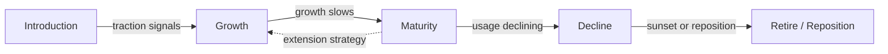

# Product Lifecycle Management (PLM)

## What it is

**Product Lifecycle Management** is a strategic discipline that manages products differently at each stage of their market life — from launch through growth, maturity, and eventual decline or retirement. Unlike PDLC phases P1–P3 (which focus on getting a product **to market**) and SDLC (which focuses on **building** it), PLM focuses on what happens **after launch** and how investment decisions change over time.

PLM answers questions that neither SDLC nor early PDLC phases address:
- Should we invest more in this product or harvest cash flow?
- When should we start planning a successor or sunset?
- How do we manage a portfolio of products at different lifecycle stages?
- What signals indicate a product has moved from growth to maturity?

---

## Authoritative sources (external)

| Resource | Executive summary (why it's linked here) |
|----------|------------------------------------------|
| [ProductPlan — Product Lifecycle](https://productplan.com/glossary/product-lifecycle/) | **Clear overview** of the four lifecycle stages with strategic implications — good starting reference for teams new to PLM thinking. |
| [Harvard Business Review — Exploit the Product Life Cycle](https://hbr.org/1965/11/exploit-the-product-life-cycle) | **Classic HBR article** (Theodore Levitt, 1965) that established PLM as a strategic concept — still relevant for understanding the investment logic behind lifecycle decisions. |
| [ProductPlan — How to End-of-Life a Product](https://productplan.com/learn/how-to-end-of-life-product/) | **Practical checklist** for product retirement — communications, migration, support wind-down. Directly informs P6 sunset planning. |
| [Mind the Product](https://www.mindtheproduct.com/) | **Community hub** for product management — articles and case studies on lifecycle decisions, portfolio management, and sunset strategies. |

---

## Core structure

### The four lifecycle stages

| Stage | Revenue | Investment | Competition | Strategic focus |
|-------|---------|-----------|-------------|-----------------|
| **Introduction** | Low, growing slowly | High (development, marketing, onboarding) | Few competitors | Achieve product-market fit; drive awareness and trial |
| **Growth** | Accelerating | High (scaling, features, go-to-market) | New entrants appearing | Capture market share; build competitive moat; scale operations |
| **Maturity** | Stable or slowly declining | Moderate (maintenance, optimization) | Established competitors | Maximize profitability; defend position; extend lifecycle |
| **Decline** | Decreasing | Low (maintenance only) | Competitors leaving or consolidating | Harvest cash; plan sunset; migrate customers |

### Investment strategies by stage

| Stage | Strategy | PDLC phases active | Example actions |
|-------|----------|-------------------|-----------------|
| **Introduction** | **Invest to learn** | P4 Launch + P5 Grow (early) | Feature iteration, onboarding optimization, channel experiments, customer success |
| **Growth** | **Invest to scale** | P5 Grow (peak) | Platform scaling, international expansion, enterprise features, self-serve |
| **Maturity** | **Optimize and extend** | P5 Grow (maintenance) | Cost optimization, integration ecosystem, adjacent use cases, pricing optimization |
| **Decline** | **Harvest or sunset** | P6 Mature / Sunset | Reduce investment, sunset planning, customer migration, resource reallocation |

### Lifecycle extension strategies

Before accepting decline, consider whether the lifecycle can be extended:

| Strategy | Description | Example |
|----------|-------------|---------|
| **Repositioning** | New market or use case for existing product | Developer tool repositioned as enterprise platform |
| **Feature refresh** | Major capability addition that reignites growth | Adding AI-powered features to a mature analytics product |
| **Market expansion** | New geographies or segments | Launching in APAC after saturating US/EU |
| **Platform play** | Opening APIs / ecosystem to third parties | CRM becomes a platform with marketplace |
| **Pricing innovation** | New pricing model that unlocks new segments | Enterprise-only → freemium tier for SMBs |

---

## Mapping to PDLC phases

PLM primarily operates in PDLC phases P5–P6, with feedback loops to P1:

| PDLC phase | PLM role |
|------------|---------|
| **P1–P3** | Not directly involved — PLM thinking starts at or after launch |
| **P4 Launch** | **Introduction stage** begins — baseline metrics, early traction monitoring |
| **P5 Grow** | Spans **Introduction → Growth → Maturity** — investment strategy shifts as stage changes |
| **P6 Mature / Sunset** | **Maturity → Decline → Retirement** — lifecycle assessment, harvest/sunset decisions |
| **P1 (feedback)** | Decline signals may trigger **new** P1 discovery for a successor product |

### Signals for stage transitions

| Transition | Signals |
|------------|---------|
| Introduction → **Growth** | Product-market fit achieved; organic growth appearing; unit economics improving; retention stabilizing |
| Growth → **Maturity** | Growth rate declining; market share plateauing; customer acquisition cost rising; feature requests becoming incremental |
| Maturity → **Decline** | Usage metrics declining; churn increasing; competitors gaining share; maintenance cost exceeding innovation investment; strategic relevance diminishing |

---

## Sunset planning

When a product enters decline and extension strategies are exhausted or unwarranted, sunset planning begins. See [`templates/SUNSET-PLAN.template.md`](../templates/SUNSET-PLAN.template.md).

### Sunset checklist

| Area | Actions |
|------|---------|
| **Stakeholders** | Identify all affected groups: customers, partners, internal teams, regulators |
| **Timeline** | Set clear dates: announcement, feature freeze, support end, data deletion |
| **Communications** | Advance notice (typically 6–12 months for enterprise); FAQ; direct outreach to top accounts |
| **Migration** | Provide migration path (to successor product, alternative, or data export); migration tooling and support |
| **Data** | Define data retention, export, and deletion policies per regulatory requirements |
| **Support** | Phase down: full support → critical-only → read-only access → shutdown |
| **Financial** | Revenue impact modeling; contract obligations; refund policies |
| **Engineering** | Decommission infrastructure; archive code; update internal documentation |

---

## Anti-patterns

| Anti-pattern | Fix |
|-------------|-----|
| **Zombie product** | Product in decline but nobody makes the sunset call. Engineering maintains it indefinitely, draining capacity from growth products. Set explicit sunset criteria and review quarterly. |
| **Premature sunset** | Killing a product too early — before lifecycle extension strategies are considered. Evaluate repositioning, feature refresh, and market expansion before sunsetting. |
| **Silent death** | Product fades without formal sunset — customers discover it broken or abandoned. Always execute a formal sunset plan with communications and migration support. |
| **One-size-fits-all investment** | Same investment level regardless of lifecycle stage. Introduction needs heavy investment in learning; maturity needs optimization; decline needs cost reduction. |

---

## Further reading

- [PDLC.md — P5 and P6](../PDLC.md) — Phase details for Grow and Mature/Sunset
- [Stage-Gate](stage-gate.md) — Gate G5 (continue investing?) maps to lifecycle stage decisions
- [PDLC-SDLC Bridge](../PDLC-SDLC-BRIDGE.md) — Where PLM sits in the full lifecycle
- [Lean Startup](lean-startup.md) — Pivot decision framework applies to lifecycle extension vs sunset
