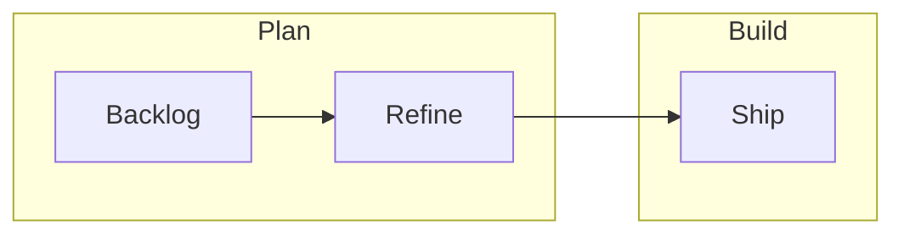
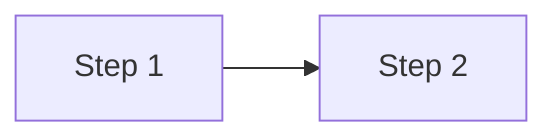

# Forge design system (Kitchen Sink)

This handbook uses the **Forge design system** from the shared [forgesdlc-kitchensink](https://github.com/autowww/forgesdlc-kitchensink) repository: Bootstrap&nbsp;5 dark theme, design tokens, Python **components** and **layouts**, HTML **transforms**, and reusable **SVG diagram templates**.

## Where it lives

| Piece | Role |
|--------|------|
| `forge-theme.css` | Blueprints handbook look (nav, ToC, prose, callouts) |
| `docs-theme.css` | Optional chapter-style pages |
| `forge-theme.js` | Theme behavior |
| `components/` (Python) | `handbook_page()`, callouts, nav fragments, table transforms |
| `assets/svg/` | Diagram archetypes (flows, charts, boards) |

Build copies CSS/JS and SVGs into `website/assets/` when you run `generator/build-handbook.py`.

## Design tokens (summary)

- **Background:** deep space (`#0A0E17` family)  
- **Accents:** cyan (`#06B6D4`), amber (`#F59E0B`)  
- **Fonts:** Inter (body), JetBrains Mono (code), Space Mono (labels)

Use semantic HTML and existing component classes from the generator rather than ad-hoc styles.

## Page layouts

Kitchen Sink defines full-page **layouts** (showcase, handbook, product, landing, …). The blueprints site uses **`handbook_page`**: sidebar + article + optional right ToC. See the Kitchen Sink **Page Layouts** documentation for schematics and live previews.

## Diagram templates (examples)

Below are a few SVG templates shipped with Kitchen Sink. They illustrate the visual language for methodology docs; replace placeholders with your own labels.


**Reference:** the Kitchen Sink repo includes a built **diagram gallery** under `showcase/` (run `python3 generator/build-showcase.py` locally, or see [forgesdlc-kitchensink](https://github.com/autowww/forgesdlc-kitchensink) for sources).

## Authoring guidance

1. Prefer **Mermaid** in Markdown for diagrams that change often; use **SVG templates** for stable figures.  
2. Put shared figures in blueprint `docs/assets/` *or* rely on copied Kitchen Sink `assets/template-*.svg` after build.  
3. Keep tables and headings so **`transforms`** (e.g. table wrappers) can run consistently.

## Mermaid style (Forge)

- **Live catalog:** the Kitchen Sink showcase **Mermaid diagram examples** page (`mermaid-examples.html` in the KS repo’s built `showcase/`) is the reference for grammar coverage and how diagrams render with the Forge theme. **Static SVG archetypes** and per-template **Mermaid parallels** live on the **Diagram templates** page (`diagrams.html`).  
- **Readability:** prefer `flowchart` / `subgraph` with short quoted titles, decision nodes `{question?}`, and enough intermediate steps that GitHub and the handbook show the same story.  
- **Minimal vs rich:** hub READMEs may keep a tiny overview diagram; methodology and bridge pages should use richer structure (subgraphs, loops, gates) when the prose is multi-phase.

Handbook build turns ` ```mermaid ` fences into the same `.forge-diagram` + `.mermaid` wrapper as the showcase. Example:



### Click-to-expand (lightbox)

Use a **` ```mermaid-expand `** fence when you want the diagram to open full-size in the Forge lightbox after Mermaid renders (same `openDiagramModal` behavior as `render_mermaid_block(..., expandable=True)` in Python). The handbook and forgesdlc.com product layout inject the modal shell whenever the page includes any Mermaid.

````markdown

````

GitHub and other Markdown viewers may not treat `mermaid-expand` as Mermaid; keep a **` ```mermaid `** copy in the same doc for portability if needed, or rely on the HTML site as the interactive view.

### Previews “like” the diagram catalog (authored flows)

The Kitchen Sink **diagram gallery** (`diagrams.html`) pairs **static SVG thumbs**, **per-key legends**, and optional **Mermaid parallels** — that full behavior needs `showcase.js` and is aimed at the KS showcase. For handbook pages:

| Approach | Use when |
|----------|-----------|
| **Archetype reference** | You only need “which shape matches my story?” — link to the hosted **Diagram templates** / **Mermaid examples** pages (or the static `template-*.svg` images below). |
| **Companion still** | You want a thumbnail in prose **and** live Mermaid — add an image line above the fence, e.g. `` or an export from Mermaid Live / a KS template, and keep the fenced Mermaid as the editable source. |

### Consuming the catalog in another repository

1. Add **forgesdlc-kitchensink** as a **submodule** (or vendor the pieces you need).  
2. Copy **`assets/svg/template-*.svg`** (and theme CSS/JS) in your site build the same way **blueprints-website** and **forgesdlc** do.  
3. **Python:** import **`handbook_page`**, **`render_mermaid_block`**, **`apply_all`** / **`convert_mermaid_blocks`** from Kitchen Sink `components` with your `PYTHONPATH` set like the existing generators.  
4. **Interactive catalog** (clickable thumbs + `DIAGRAM_DETAILS` legend): either ship **`showcase.js`** + modal markup on that page only, or **link out** to the published KS showcase instead of duplicating JS.  
5. **Catalog keys** (`linear`, `orgchart`, …) and filenames are defined in **`generator/pages/_diagram_gallery.py`** (`_FAMILIES`); **`DIAGRAM_DETAILS`** in **`js/showcase.js`** is still maintained alongside that list (not generated from one file yet).

## Related links

- [Documentation structure](./DOCUMENTATION-STRUCTURE.md) — how SDLC docs are organized  
- Maintenance (generator / CI) — see `sdlc/docs/MAINTENANCE.md` in the blueprints repository  
